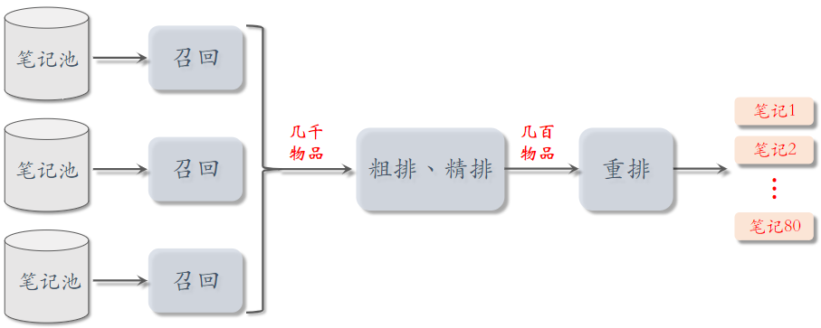
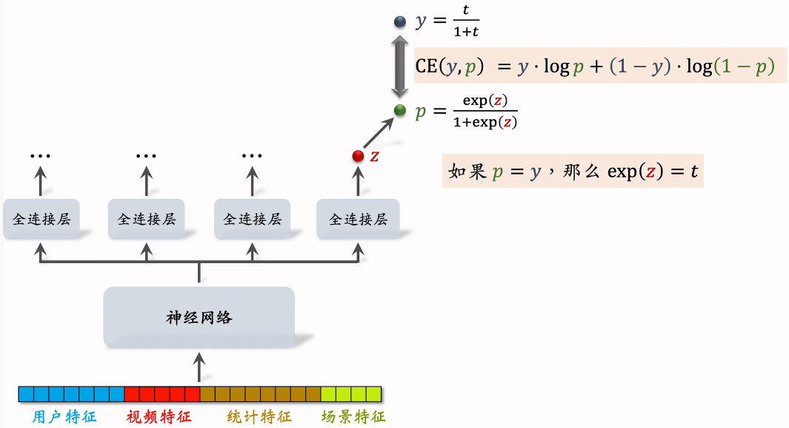
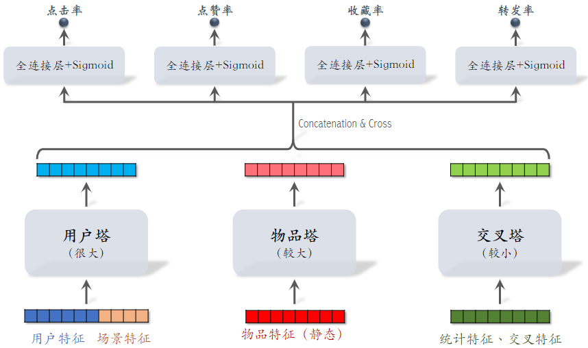
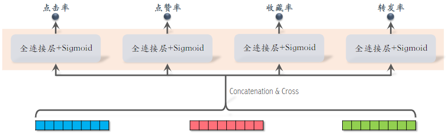

# 3.排序

# 1.多目标排序模型

本节内容集中在粗排和精排，它们的原理基本相同。

## 1.1用户—笔记的交互

排序的主要依据是**用户对笔记的兴趣**，而兴趣都反映在 **用户—笔记** 的交互中。

对于每篇笔记，系统记录：

- 曝光次数（number of impressions）
- 点击次数（number of clicks）
- 点赞次数（number of likes）
- 收藏次数（number of collects）
- 转发次数（number of shares）
- 点击率 = 点击次数 / 曝光次数
- 点赞率 = 点赞次数 / 点击次数
- 收藏率 = 收藏次数 / 点击次数
- 转发率 = 转发次数 / 点击次数

**排序的依据**

- 排序模型预估点击率、点赞率、收藏率、转发率等多种分数（使用机器学习方法）
- 融合这些预估分数（比如加权和，权重是做AB测试调出来的）
- 根据融合的分数做排序、截断

## 1.2多目标模型

### （1）模型结构

排序模型输入是各种各样的特征，然后输入神经网络，神经网络可以是最简单的神经网络也可以是复杂的结构，输出一个向量，最后一个激活函数是sigmoid，四个神经网络分别输出点击率、点赞了、收藏了和转发率，都是实数，介于0\~1之间，后续的排序，主要使用这四个值。

- 用户特征：用户ID，用户画像
- 物品特征：物品ID，物品画像，作者信息
- 统计特征：用户统计特征，物品统计特征，比如，**用户在过去30天内曝光了多少篇笔记、点击了多少篇笔记、点赞了多少篇笔记；如候选物品30天内曝光了多少次；**
- "场景特征" 是随着用户请求传过来的，包含当前时间，用户所在的地点

- 统计特征包括"用户统计特征"和"物品统计特征"

### （2）模型训练

预估：是模型的预测值

目标：是用户的真实行为，被记录下来

训练：让预估值接近真实目标值

总的损失函数： 把四个损失函数的加权和作为总损失；对损失函数求梯度，做梯度下降更新参数。

$$
\sum_{i=1}^{4} \alpha_{i} \cdot \operatorname{CrossEntropy}\left(y_{i}, p_{i}\right)
$$

**困难：类别不平衡**，即正样本数量显著少于负样本

- 每 100 次曝光，约有 10 次点击、90 次无点击
- 每 100 次点击，约有 10 次收藏、90 次无收藏
- 注：不是小红书的真实数据

**解决方案：负样本降采样**（down-sampling）

- 保留一小部分负样本
- 让正负样本数量平衡，节约计算量

## 1.3 预估值校准

做了降采样后训练出的预估点击率会大于真实点击率。

正样本、负样本数量为 $n_+$和$n_-$，负样本数量通常远大于正样本悬殊

对负样本做降采样，抛弃一部分负样本，这样会使正负样本差距不太

使用 $\alpha \cdot n_-$ 个负样本， $\alpha \in (0,1)$是采样率，$\alpha$越小，负样本越少，模型对点击率的高估会越严重。

由于负样本变少，预估点击率大于真实点击率

### 预估值校准

真实点击率：$p_{\text {true }}=\frac{n_{+}}{n_{+}+n_{-}}$（期望）

预估点击率： $p_{\text {pred }}=\frac{n_{+}}{n_{+}+\alpha \cdot n_{-}}$（期望）

由上面两个等式可得校准公式：

$$
p_{\text {true }}=\frac{\alpha \cdot p_{\text {pred }}}{\left(1-p_{\text {pred }}\right)+\alpha \cdot p_{\text {pred }}}
$$

参考文献：1. Xinran He et al. Practical lessons from predicting clicks on ads at Facebook. In the 8th International Workshop on Data Mining for Online Advertising.

在线上做排序时，首先让模型预估点击率 $p_{pred}$，然后做校准，最后拿校准之后的结果作为排序的依据。

# 2.Multi-gate Mixture-of-Experts (MMoE) 专家神经网络

## 2.1 MMoE

模型的输入是一个向量，包括用户特征、物品特征、统计特征和场景特征，向量输入神经网络，这**三个神经网络结构相同，都是由全连接层，但不共享参数**，三个神经网络各输出一个向量，这三个**神经网络叫做专家**，专家网络的个数是超参数，实践中通常用4个和8个。

把特征向量输入左侧的神经网络，再通过 Softmax 输出，**输出元素个数为专家网络个数，分别对应三个专家神经网络**，之后可以用输出的三个元素作为权重，对$x_1$, $x_2$,$ x_3$做加权平均。

把特征向量输入左侧的神经网络，再通过 Softmax 输出三个向量，也是后续做加权平均的权重。

将$p_1$, $p_2,$ $p_3$权重于$x_1$,$x_2$, $x_3$加权平均后的向量，输入一个神经网络，可以由一个或多个全连接层，可以输出点击率的预估。

将$q_1$, $q_2$, $q_3$权重于$x_1$,$x_2$, $x_3$加权平均后的向量，输入另一个神经网络，可以输出另一个指标的预估。

## 2.2极化现象（Polarization）

专家神经网络在实践中的问题：**softmax会发生极化**。如图中，左侧使用第三号神经网络，右侧使用第二号神经网络，而第一号神经网络未用到。不会对专家网络做融合，失去了MMoE的优势，不希望这种情况出现。

解决极化问题

- 如果有n个“专家”，那么每个softmax的输入和输出都是n维向量。
- 在训练时，对 softmax 的输出使用 **dropout**
  - Softmax 输出的n个数值被mask的概率都是10%
  - 每个“专家”被随机丢弃的概率都是 10%
  - 由于每个“专家”都可能被丢弃，神经网络就会尽量避免极化的发生

**参考文献**

- Google 的论文\[1] 提出 MMoE 模型
- YouTube 的论文\[2] 提出极化问题的解决方案

1. Jiaqi Ma et al. Modeling Task Relationships in Multi-task Learning with Multi-gate Mixture-of-Experts. In KDD, 2018.
2. Zhe Zhao et al. Recommending What Video to Watch Next: A Multitask Ranking System. In RecSys, 2019.

PS：**并不一定用上 MMoE 就一定有提升**。造成的原因可能是实现不够好或不适用于特定业务。

# 3.预估分数的融合

**简单的加权和**

$$
p_{\text {click }}+w_{1} \cdot p_{\text {like }}+w_{2} \cdot p_{\text {collect }}+\cdots
$$

- $p_{\text {click }}$：预估点击率
- $p_{\text {like }}$：预估点赞率

**点击率乘以其他项的加权和**：有实际意义，两者相乘，就是曝光之后，点赞的概率。

$$
p_{\text {click }} \cdot\left(1+w_{1} \cdot p_{\text {like }}+w_{2} \cdot p_{\text {collect }}+\cdots\right)
$$

- $p_{\text {click }}$：预估点击率
- $p_{\text {like }}$：预估点赞率

**海外某短视频 APP 的融分公式**

$$
\left(1+w_{1} \cdot p_{\text {time }}\right)^{\alpha_{1}} \cdot\left(1+w_{2} \cdot p_{\text {like }}\right)^{\alpha_{2}} \quad \ldots
$$

- $p_{\text {time }}$：播放时长

**国内某短视频 APP （老铁）的融分公式**

- 根据预估时长$p_{\text {time }}$，对n篇候选视频做排序；
- 如果某视频排名第$r_{\text {time }}$，则它得分$\frac{1}{r_{\text {time }}^{\alpha}+\beta}$，预估播放时长越长，排名就越靠前，最终得分就越高。
- 对点击、点赞、转发、评论等预估分数做类似处理
- 最终融合分数：&#x20;

$$
\frac{w_{1}}{r_{\text {time }}^{\alpha_{1}}+\beta_{1}}+\frac{w_{2}}{r_{\text {click }}^{\alpha_{2}}+\beta_{2}}+\frac{w_{3}}{r_{\text {like }}^{\alpha_{3}}+\beta_{3}}+\cdots
$$

- 公式特点在于 —— 使用预估的排名

**某电商的融分公式**

- 电商的转化流程：曝光 → 点击 → 加购物车 → 付款
- 模型预估：$p_{\text {click}}$，$p_{\text {cart}}$，$p_{\text {pay
  }}$
- 最终融合分数：

$$
p_{\text {click }}^{\alpha_{1}} \times p_{\text {cart }}^{\alpha_{2}} \times p_{\text {pay }}^{\alpha_{3}} \times price ^{\alpha_{4}}
$$

# 4.视频播放建模

## 4.1视频播放时长

### （1）**图文 vs. 视频** 排序区别

- 图文笔记排序的主要依据：点击、点赞、收藏、转发、评论......
- 视频排序的依据还有**播放时长**和**完播**
- **对于视频来说，播放时长与完播的重要性大于点击**
- 直接用回归拟合播放时长效果不好。建议用 YouTube 的时长建模\[1]

参考文献：1.Paul Covington, Jay Adams, & Emre Sargin. Deep Neural Networks for YouTube Recommendations. In RecSys, 2016.

### （2）建模

将多个特征输入神经网络，被所有任务共享；神经网络之上，有多个全连接层，每个全连接层对应一个目标，比如点击、点赞、播放时长等。

最右边全连接的输出对应播放时长，输出的实数为$z$，预测值为$p$，让$p$拟合$y$，$y$是我们自己定义的，其中$t$为用户实际观看时长，t越大，y也越大。

它们的交叉熵作为损失函数：$\operatorname{CE}(y, p)=y \cdot \log p+(1-y) \cdot \log (1-p)$

**总结视频播放时长建模**

- 把最后一个全连接层的输出记作$z$。设$p=sigmoid(z)$
- 实际观测的播放时长记作$t$。（如果没有点击，则t=0）
- 做训练：最小化交叉熵损失：实践中，将分母$(1+t)$去掉也可以

$$
-\left(\frac{t}{1+t} \cdot \log p+\frac{1}{1+t} \cdot \log (1-p)\right)
$$

- 做推理：把$exp(z)$作为播放时长的预估。
- 把$exp(z)$作为融分公式中的一项。

## 4.2视频完播

### （1）回归方法

例：视频长度 10 分钟，实际播放 4 分钟，则实际播放率为 𝑦 = 0.4

做训练时，让预估播放率p拟合y：（y的大小再0\~1之间）

$$
\operatorname{loss}=y \cdot \log p+(1-y) \cdot \log (1-p)
$$

线上预估完播率，模型输出$p=0.73$，意思是预计播放73%

## （2）二元分类方法

- 自定义完播指标，比如完播 80%
- 例：视频长度 10 分钟，播放 > 8 分钟作为正样本，播放 < 8 分钟作为负样本
- 做二元分类训练模型：播放 > 80% vs  播放 < 80%
- 线上预估完播率， 模型输出p=0.73，意思是：

$$
\mathbb{P}( 播放 >80 \%)=0.73
$$

**实际中不能直接把预估的完播率用到融分公式（why？）**

- 因为视频越长，完播率越低
- **所以直接使用预估完播率，会有利于短视频，而对长视频不公平**
- 线上预估完播率，然后做调整：反应用户对视频的兴趣，且对长短视频公平

$$
p_{\text {finish }}=\frac{\text { 预估完播率 }}{f(\text { 视频长度 })}
$$

- 把$p_{\text {finish }}$作为融分公式中的一项

# 5.排序模型的特征

## 5.1特征

### （1）**用户画像（User Profile）**

- 用户 ID（在召回、排序中做 embedding）。用户 ID 本身不携带任何信息，但模型学到的 ID embedding 对召回和排序有很重要的影响
- 人口统计学属性：性别、年龄
- 账号信息：新老、活跃度......。模型需要专门针对 **新用户** 和 **低活跃 **用户做优化
- 感兴趣的类目、关键词、品牌

### （2）**物品画像（Item Profile）**

- 物品 ID（在召回、排序中做 embedding）
- 发布时间（或者年龄）
- GeoHash（经纬度编码）、所在城市
- 标题、类目、关键词、品牌......
- 字数、图片数、视频清晰度、标签数......。**反映笔记的质量**
- 内容信息量、图片美学......。**算法打的分数**，事先用人工标注的数据训练 NLP 和 CV 模型，然后用模型打分。可以作为排序模型的特征

### （3）用户统计特征

- 用户最近 30 天（7 天、1 天、1 小时）的曝光数、点击数、点赞数、收藏数......
- 划分各种时间粒度，可以反映用户的 实时、短期、中长期 兴趣
- 按照笔记图文/视频分桶。（比如最近 7 天，该用户对图文笔记的点击率、对视频笔记的点击率）。**反映用户对两类笔记的偏好**
- 按照笔记类目分桶。（比如最近 30 天，用户对美妆笔记的点击率、对美食笔记的点击率、对科技数码笔记的点击率）。**反映用户对哪个类目更感兴趣**

### （4）笔记统计特征

- 笔记最近 30 天（7 天、1 天、1 小时）的曝光数、点击数、点赞数、收藏数......。**划分时间粒度，可以提前发现哪些笔记过时了**
- 按照用户性别分桶、按照用户年龄分桶......
- 作者特征：受欢迎程度和品质特征
  - 发布笔记数
  - 粉丝数
  - 消费指标（曝光数、点击数、点赞数、收藏数）

### （5）场景特征（Context）

- 用户定位 GeoHash（经纬度编码）、城市
- 当前时刻（分段，做 embedding）。**一个人在同一天不同时刻的兴趣是变化的**；而且可以反推用户是在上班路上、公司、家里
- 是否是周末、是否是节假日
- 手机品牌、手机型号、操作系统。安卓用户和苹果用户的 点击率、点赞率 等数据差异很大

## 5.2特征处理

**离散特征：****做 embedding**

- 用户 ID、笔记 ID、作者 ID
- 类目、关键词、城市、手机品牌

**连续特征：****做分桶，变成离散特征**

- 年龄、笔记字数、视频长度

**连续特征：****其他变换**

- 曝光数、点击数、点赞数等数值做 $log(1+x)$，解决异常值。
- 转化为点击率、点赞率等值，并做平滑，去掉偶然性。

**特征覆盖率**

- 很多特征无法覆盖 100% 样本
- 例：很多用户不填年龄，因此用户年龄特征的覆盖率远小于 100%
- 例：很多用户设置隐私权限，APP 不能获得用户地理定位，因此场景特征有缺失
- **提高特征覆盖率，可以让精排模型更准**
- **想各种办法提高特征覆盖率，并考虑特征缺失时默认值如何设置**

## 5.3数据服务

1. 用户画像（User Profile）
2. 物品画像（Item Profile）
3. 统计数据

- 用户请求发送到主服务器，主服务器首先做召回，发送给找回服务器
- 用户画像数据库压力小（每次只读 1 个用户），物品画像数据库压力非常大（每次读几千个物品）
- 工程实现时，**用户画像中的特征可以很多很大，但尽量不往物品画像中塞很大的向量**
- 由于用户和物品画像较为**静态**，甚至可以把用户和物品画像缓存在排序服务器本地，加速读取
- 收集了排序所需特征后，将特征打包发给 TF Serving，Tensorflow 给笔记打分并把分数返回排序服务器
- 排序服务器依据融合的分数、多样性分数、业务规则等给笔记排序，并把排名最高的几十篇返回主服务器

# 6.粗排

前面介绍的模型主要用于精排，本节介绍怎么做粗排。

## 6.1粗排 vs 精排

**粗排**

- 给几千篇笔记打分
- 单次推理代价必须小
- 预估的准确性不高

**精排**

- 给几百篇笔记打分
- 单次推理代价很大
- 预估的准确性更高

### （1）精排模型

- **前期融合**：先对所有特征做 concatenation，再输入神经网络，这个网络叫 shared bottom，意思是它被多个任务共享
- 把神经网络的输出分成多个头，经过全连接层，得到点击率、点赞率等。
- 线上推理代价大：如果有n篇笔记，整个大模型要做n次推理。
- 精排模型的代价，主要在神经网络。

### （2）粗排模型（双塔模型）

- **后期融合**：把用户、物品特征分别输入不同的神经网络，不对用户、物品特征做融合
- 线上计算量小：
  - 用户塔只需要做一次线上推理，计算用户表征 a
  - 物品表征b事先存储在向量数据库中，物品塔在线上不做推理
- 后期融合模型不如前期融合模型准确，预估准确性不如精排模型
- 后期融合模型用于召回，前期融合模型用于精排

## 6.2粗排的三塔模型

小红书粗排用的三塔模型，效果介于双塔和精排之间。

参考文献：Zhe Wang et al. COLD: Towards the Next Generation of Pre-Ranking System. In DLP-KDD, 2020.

- 交叉特征：用户特征与物品特征做交叉
- 对 3 个塔输出的向量做 Concatenation 和 Cross（交叉）得到 1 个向量，然后连接多个全连接层，预估不同指标。
- **与前期融合在最开始对各类特征做融合不同，三塔模型在塔输出的位置做融合**

- 有n个物品，模型上层需要做n次推理
- 粗排推理的大部分计算量在模型上层
- 这个环节无法利用缓存节省计算量
- 三塔模型节省的是对物品推理的计算量

### 三塔模型的推理

- 从多个数据源取特征：
  - 1 个用户的画像、统计特征
  - n个物品的画像、统计特征
- **用户塔**：只做 1 次推理
- **物品塔**：未命中缓存时需要做推理，几千次物品做粗排，物品塔只需几十次推理
- **交叉塔**：必须做 n次推理，
- **上层网络**：做n次推理，给n个物品打分

粗排模型大部分的计算量在上层网络，所以设计理念就是尽量减少推理的计算量，使得模型可以线上对几千篇笔记打分

