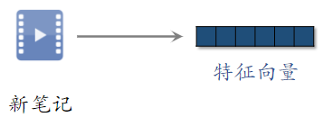
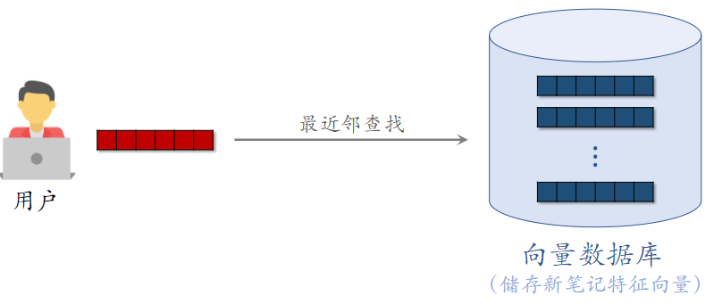
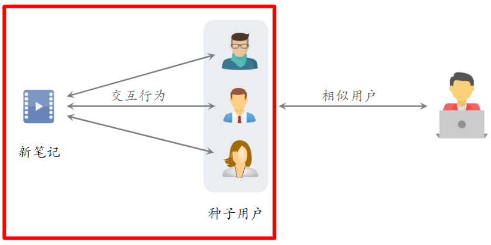
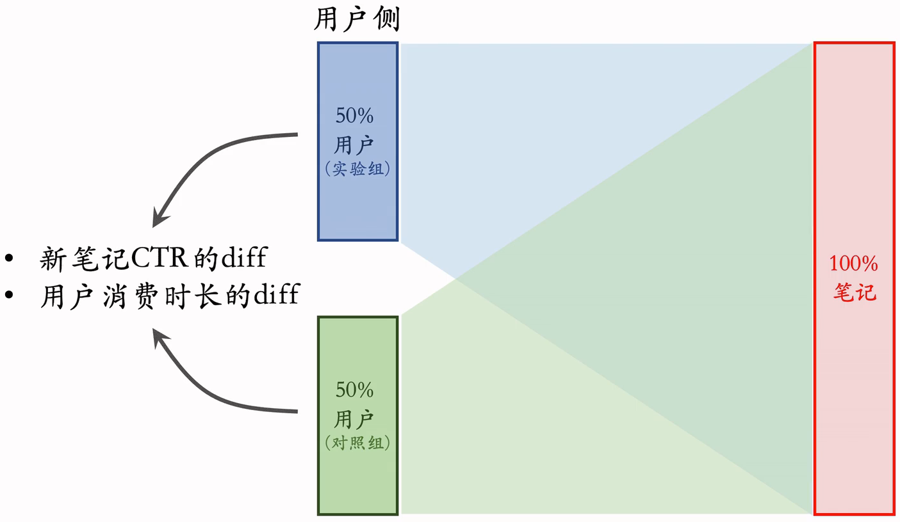
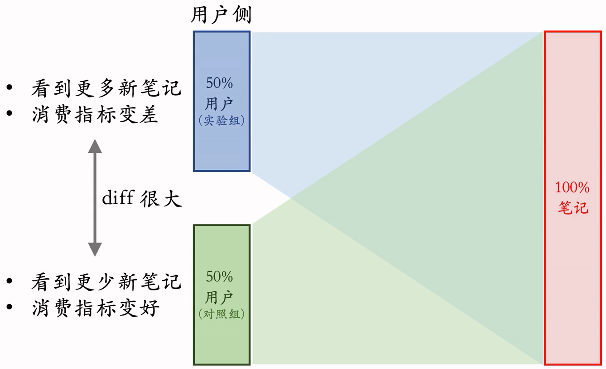
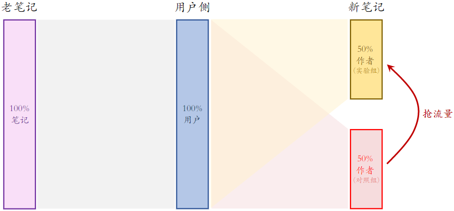
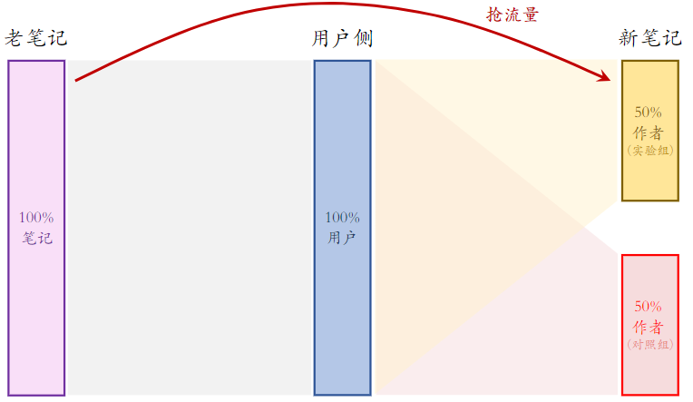

# 7.物品冷启动

# 1.评价指标

很少有 UGC 能让冷启动达到天花板。

## 1.1物品冷启动

- 小红书上用户新发布的笔记
- B站上用户新上传的视频
- 今日头条上作者新发布的文章

此处主要考虑** UGC（User Generated Content）** 的物品冷启动；与 UGC 相反的是 **PGC（Platform Generated Content）**，例如网飞、腾讯视频。UGC 冷启比 PGC 更难，因为用户上传的内容良莠不齐，而且量大。

- 思考：为什么要特殊对待新笔记？

### （1）新笔记需要冷启动的原因

- **新笔记缺少与用户的交互**，导致推荐的难度大、效果差
- 扶持新发布、低曝光的笔记，可以增强作者发布意愿

### （2）优化冷启的目标

1. 精准推荐：克服冷启的困难，把新笔记推荐给合适的用户，不引起用户反感
2. **激励发布**：流量向低曝光新笔记倾斜，激励作者发布
3. **挖掘高潜**：通过初期小流量的试探，找到高质量的笔记，给与流量倾斜

### （3）评价指标

- 作者侧指标：反映用户的发布意愿；对低曝光扶持的越好，作者侧指标就越高。
  - 发布渗透率、人均发布量；
- 用户侧指标：反映推荐是否精准，是否会引起用户反感
  - 新笔记指标：新笔记的点击率、交互率
  - 大盘指标：消费时长、日活、月活
- 内容侧指标：反映冷启是否能挖掘优秀笔记
  - 高热笔记占比

作者侧和用户侧指标基本都在用，内容侧指标选用

## 1.2作者侧指标

- 发布渗透率、人均发布量反映出作者的发布积极性
- 冷启的重要优化目标是促进发布，增大内容池
- **新笔记获得的曝光越多，首次曝光和交互出现得越早，作者发布积极性越高**

### （1）发布渗透率（penetration rate）

**衡量用户的发布积极性**。

- **发布渗透率 = 当日发布人数 / 日活人数**
- 发布一篇或以上，就算一个发布人数
- 例：
  - 当日发布人数 = 100 万
  - 日活人数 = 2000 万
  - 发布渗透率 = 100 / 2000 = 5%

### （2）人均发布量

- **人均发布量 = 当日发布笔记数 / 日活人数**
- 例：
  - 每日发布笔记数 = 200 万
  - 日活人数 = 2000 万
  - 人均发布量 = 200 / 2000 = 0.1

## 1.3用户侧指标

### （1）新笔记的消费指标

**新笔记的点击率、交互率**

- 问题：曝光的基尼系数很大。即少量头部新笔记推送准确，但大部分新笔记的推送不准，综合下来点击率、交互率也很高
- 少数头部新笔记占据了大部分的曝光

**分别考察高曝光、低曝光新笔记**

- 高曝光（占比低，推荐简单）：比如 >1000 次曝光
- 低曝光（占比高，推荐难）：比如 <1000 次曝光

### （2）大盘消费指标（不区分新老笔记）

- **优化冷启时，不是为了提升大盘指标，而是确保新策略不显著伤害大盘指标**
- 大盘的消费时长、日活、月活
- 大力扶持低曝光新笔记会发生什么？
  - 作者侧发布指标变好
  - 用户侧大盘消费指标变差（损害用户体验）

## 1.4内容侧指标

高热笔记占比

- 高热笔记：前 30 天获得 1000+ 次点击
- 高热笔记占比越高，说明冷启阶段挖掘优质笔记的能力越强

### 总结

- 作者侧指标：发布渗透率、人均发布量
- 用户侧指标：新笔记消费指标、大盘消费指标
- 内容侧指标：高热笔记占比
- 冷启动的优化点
  - 优化全链路（包括召回和排序）
  - 流量调控（流量怎么在新物品、老物品中分配）

# 2.简单的召回通道

## 2.1召回的难点

**召回的依据**

- ✔ 自带图片、文字、地点
- ✔ 算法或人工标注的标签
- ❌ 没有用户点击、点赞等信息。这些信息可以反映笔记的质量，以及哪类用户喜欢该笔记
- ❌ 没有笔记 ID embedding。ID embedding 是从用户和笔记的交互中学习出来的；缺少这个特征，召回和排序都不准确。

**冷启召回的困难**

- 缺少用户交互，还没学好笔记 ID embedding，导致双塔模型效果不好，后续会影响排序，让排序模型也不准确。
- 双塔模型是推荐系统中最重要的召回通道，没有之一
- 缺少用户交互，导致 ItemCF 不适用

**itemCF不使用于物品冷启动**：根据笔记和用户的交互，来判断两个物品的相似度。

**召回通道**

- ❌** ItemCF 召回（不适用）**
- ❔ **双塔模型（改造后适用）**
- ✔ 类目、关键词召回（适用）；刚刚发布时，是最有用的指标，等一段事件后，会失效。
- ✔ 聚类召回（适用）
- ✔ Look-Alike 召回（适用）

## 2.2 双塔模型

物品ID（笔记ID）是物品塔中最重要的特征。新笔记还没有embedding向量，直接中双塔模型的物品塔做embedding，效果不是很好。

### （1）ID Embedding

**改进方案 1：新笔记使用 default embedding**

- 物品塔做 ID embedding 时，让所有新笔记共享一个 ID，而不是用自己真正的 ID
- Default embedding：共享的 ID 对应的 embedding 向量
- 学出来的 Default embedding 比随机初始化一个 ID embedding 要好；
- 到下次模型训练的时候，新笔记才有自己的 ID embedding 向量

**改进方案 2：利用相似笔记 embedding 向量**

- 查找 top k 内容最相似的高曝笔记
- 把 k 个高曝笔记的 embedding 向量取平均，作为新笔记的 embedding
- 之所以用 高爆笔记，是因为它们的 embedding 通常学得比较好

### （2）多个向量召回池

多个召回池，让新笔记有更多曝光机会

- 1 小时新笔记
- 6 小时新笔记
- 24 小时新笔记
- 30 天笔记

所有召回池共享同一个双塔模型，那么多个召回池不增加训练的代价

## 2.3类目召回

### （1）用户画像

- 感兴趣的**类目**：美食、科技数码、电影......
- 感兴趣的**关键词**：纽约、职场、搞笑、程序员、大学......

### （2）基于类目的召回

- **系统维护类目索引**：类目 → 笔记列表（按时间倒排）
- 用类目索引做召回：用户画像 → 类目 → 笔记列表
- 取回笔记列表上前 k 篇笔记（即最新的 k 篇）

### （3）基于关键词的召回

- 系统维护关键词索引：关键词 → 笔记列表（按时间倒排）
- 根据用户画像上的**关键词**做召回

### （4）缺点

**缺点 1：****只对刚刚发布的新笔记有效**

- 取回某 类目/关键词 下最新的 k 篇笔记
- 发布几小时之后，就再没有机会被召回
- 所以应该在用户高频使用软件的时间段发布内容

**缺点 2：****弱个性化，不够精准**

## 2.4总结

- ❌ ItemCF 召回（**不适用**）
- ❔ 双塔模型（**改造后适用**）
- ✔ 类目、关键词召回（**适用**）
- ✔ 聚类召回（**适用**）
- ✔ Look-Alike 召回（**适用**）

# 3.聚类召回

## 3.1聚类召回

### （1）基本思想

- 如果用户喜欢一篇笔记，那么他会喜欢内容相似的笔记
- 事先训练一个神经网络，基于笔记的类目和图文内容，把笔记映射到向量
- 对笔记向量做聚类，划分为 1000 cluster，记录每个 cluster 的中心方向（k-means 聚类，用余弦相似度）

### （2）聚类索引

- 一篇新笔记发布之后，用神经网络把它映射到一个特征向量
- 从 1000 个向量（对应 1000 个 cluster）中找到最相似的向量，作为新笔记的 cluster
- 索引：**cluster → 笔记 ID 列表（按时间倒排）**

### （3）线上召回

- 给定用户 ID，找到他的 last-n 交互的笔记列表，把这些笔记作为种子笔记，去召回相似的笔记
- 把每篇种子笔记映射到向量，寻找最相似的 cluster（知道了用户对哪些 cluster 感兴趣）
- 从每个 cluster 的笔记列表中，取回最新的 $m$篇笔记
- 最多取回$mn$篇新笔记 （n表示保留n条用户行为记录，包括点赞、收藏、转发等；m表示每篇种子笔记召回m条新笔记）
- 聚类召回与类目召回的缺点相同：**只对刚发布的新笔记有效**

## 3.2内容相似度模型

聚类召回通过内容相似度模型来把笔记映射到向量。

CNN提取图片特征，得到一个向量；用BERT提取文字特征，得到另一个向量。把两个向量拼接，输入FC，得到笔记的特征向量。

- 左右两个用的神经网络的参数是相同的
- CNN 和 BERT 可以用预训练模型，全连接层是随机初始化后训练出来的

## 3.3训练内容相似度模型

给定用户 ID，找到他的 last-n 交互的笔记列表，把这些笔记作为种子笔记

训练方式和双塔模型类似，输入特征为三元组`<正样本笔记，种子笔记，负样本笔记>`

**基本思想**：鼓励$\cos \left(\mathbf{a}, \mathbf{b}^{+}\right)$大于$\cos \left(a, b^{-}\right)$

Triplet hinge loss：$L\left(\mathbf{a}, \mathbf{b}^{+}, \mathbf{b}^{-}\right)=\max \left\{0, \cos \left(\mathbf{a}, \mathbf{b}^{-}\right)+m-\cos \left(\mathbf{a}, \mathbf{b}^{+}\right)\right\}$

Triplet logistic loss：$L\left(\mathbf{a}, \mathbf{b}^{+}, \mathbf{b}^{-}\right)=\log \left(1+\exp \left(\cos \left(\mathbf{a}, \mathbf{b}^{-}\right)-\cos \left(\mathrm{a}, \mathbf{b}^{+}\right)\right)\right)$

此处的公式与 召回 - 双塔模型 - Pairwise 训练 中相似

## 3.4 样本选取

### （1）< 种子笔记，正样本 >

#### 方法一：人工标注二元组的相似度

#### 方法二：算法自动选正样本

筛选条件：

- 只用高曝光笔记作为二元组（因为有充足的用户交互信息）
- 两篇笔记有相同的二级类目，比如都是“菜谱教程”

用 ItemCF 的物品相似度选正样本

### （2）< 种子笔记，负样本 >

从全体笔记中随机选出满足条件的：

- 字数较多（神经网络提取的文本信息有效）
- 笔记质量高，避免图文无关

## 3.5 聚类召回总结

- **基本思想**：根据用户的点赞、收藏、转发记录，推荐内容相似的笔记
- **线下训练**：多模态神经网络把图文内容映射到向量
- **线上服务**：用户历史喜欢的笔记 → 特征向量 → 最近的 Cluster → 每个 Cluster 上的新笔记

# 4.Look-Alike人群扩散

## 4.1 Look-Alike 起源于互联网广告

Tesla Model 3 典型用户：

- 年龄 25\~35
- 本科学历以上
- 关注科技数码
- 喜欢苹果电子产品

符合全部条件的人很少，但是潜在符合调价的用户可能会很多，我们缺乏他们的主要信息，没有办法找到他们。

&#x20;Look-Alike用户：和种子用户相似的用户。利用这种方式，可以用十几万个种子用户扩展到百万用户。

**如何计算两个用户的相似度？**

- UserCF：两个用户有共同的兴趣点
- Embedding：两个用户向量的 cosine 较大

## 4.2 Look-Alike 用于新笔记召回

- 点击、点赞、收藏、转发——用户对笔记可能感兴趣
- **把有交互的用户作为新笔记的种子用户**
- 用 look-alike 在相似用户中扩散

### （1）Look-Alike 用于新笔记召回

- 系统把新笔记推荐给了许多用户，由于是新笔记，所以受众不太精准
- 而跟新笔记进行了交互用户，就成了**种子用户**
- 用双塔模型**学习种子用户**的向量，然后取均值，把得到的向量作为 新笔记 的表征

- **近线更新特征向量**。近线：不用实时更新，做到分钟级更新即可
- 此处是做到每当有新交互发生后，几分钟内更新特征向量
- 特征向量是有交互的用户的向量的平均
- 每当有用户交互该物品，更新笔记的特征向量

### （2）线上召回

把新笔记向量都放在向量数据库中，这些向量数据库都支持最近邻查找；如果有用户刷一下小红书，就给用户做推荐。

用双塔模型计算用户的特征向量，用特征向量作为query，在向量数据库中做最近邻查找，取回几十篇笔记。

这个召回通道就叫 Look-Alike

## 4.3 Look-Alike 的原理

左边：种子用户，有交互行为

将种子用户的特征向量作为新笔记的特征向量

和广告中的Look-Alike 是一样的。

# 5.流量调控

## 5.1 流量调控

### （1）**冷启动的优化点**

- 优化全链路（包括召回和排序）
- 流量调控（流量怎么在新物品、老物品中分配）

工业界的通常做法是扶持新笔记

### （2）扶持新笔记的目的

**目的 1：促进发布，增大内容池**

- 新笔记获得的曝光越多，作者创作积极性越高
- 反映在发布渗透率、人均发布量

**目的 2：挖掘优质笔记**

- 做探索，让每篇新笔记都能获得足够曝光
- 挖掘的能力反映在高热笔记占比

### （3）工业界的做法

- 假设推荐系统只分发年龄 <30 天的笔记。
- 假设采用自然分发，新笔记（年龄 <24 小时）的曝光占比为 1/30
- **扶持新笔记，让新笔记的曝光占比远大于 1/30**

### （4）流量调控技术的发展

1. 在推荐结果中**强插**新笔记；
2. 对新笔记的排序分数做**提权**（boost）。很划算的做法，实现不难，抖音、小红书前期都这么做；
3. 通过提权，对新笔记做**保量**；保量的手段也是提权，只不过更复杂一些
4. **差异化保量**：根据内容质量，来确定保量定多少

## 5.2新笔记提权（boost）

如果不做提权干预，新笔记的曝光机会是很少的

目标：让新笔记有更多机会曝光

- 如果做**自然分发，24 小时新笔记占比为 1/30**
- 做人为干涉，让新笔记占比大幅提升

干涉**粗排、重排**环节，给新笔记提权

**优点**：容易实现，投入产出比好

**缺点**：

- 曝光量对提权系数很敏感
- **很难精确控制曝光量**，容易过度曝光和不充分曝光

## 5.3 新笔记保量

保量：不论笔记质量高低，都保证 24 小时获得 100 次曝光

### （1）最原始保量方法

在原有提权系数的基础上，乘以额外的提权的系数，比如：

### （2）动态提权保量

用下面四个值计算提权系数

- 目标时间：比如 24 小时
- 目标曝光：比如 100 次
- 发布时间：比如笔记已经发布 12 小时
- 已有曝光：比如笔记已经获得 20 次曝光

提权系数 ： $提权系数 =f\left(\frac{\text { 发布时间 }}{\text { 目标时间 }}, \frac{\text { 已有曝光 }}{\text { 目标光 }}\right)=f(0.5,0.2)$

### （3）保量的难点

**保量成功率远低于 100%**

- 很多笔记在 24 小时达不到 100 次曝光
- 召回、排序存在不足
- 提权系数调得不好

**线上环境变化会导致保量失败**

- 线上环境变化：新增召回通道、升级排序模型、改变重排打散规则......
- 线上环境变化后，需要调整提权系数

思考题：是否可以给所有新笔记一个很大的提权系数（比如 4 倍），直到达成 100 次曝光为止？

- 这样的保量成功率很高
- 为什么不用这种方法呢？

**给新笔记分数 boost 越多，对新笔记越有利？**

- 好处：分数提升越多，曝光次数越多
- 坏处：把笔记推荐给不太合适的受众
  - 点击率、点赞率等指标会偏低
  - 笔记长期会受推荐系统打压，难以成长为热门笔记

即这个笔记如果推荐给合适用户，那它是不错的，但**强行提高曝光次数，导致它被经常推给不适合的用户，进而交互指标偏低**

## 5.4差异化保量

**保量**：不论新笔记质量高低，都做扶持，在前 24 小时给 100 次曝光

**差异化保量**：不同笔记有不同保量目标，普通笔记保 100 次曝光，内容优质的笔记保 100\~500 次曝光

- **基础保量**：24 小时 100 次曝光
- **内容质量**：用模型评价内容质量高低，给予额外保量目标，上限是加 200 次曝光
- **作者质量**：根据作者历史上的笔记质量，给予额外保量目标，上限是加 200 次曝光
- 一篇笔记最少有 100 次保量，最多有 500 次保量

## 5.5总结

- **流量调控**：流量怎么在新老笔记之间分配
- **扶持新笔记**：增加单独的召回通道、在排序阶段提权
- **保量**：帮助新笔记在前 24 小时获得 100 次曝光
- **差异化保量**：根据内容质量、作者质量，决定保量目标

本节后面讲的保留技术不是最新的，但也只有业界一线核心部门能做到，而且做到后对作者侧的指标提升显著

# 6.AB测试

想要上线新的模型或策略都要做 AB 测试。冷启动的 AB 测试特别复杂，所以单独讲一节 &#x20;

## 6.1新笔记冷启动 AB 测试 &#x20;

作者侧（发布）指标：

- 发布渗透率、人均发布量 &#x20;

用户侧（消费）指标： &#x20;

- 对新笔记的点击率、交互率
- 大盘指标：消费时长、日活、月活 &#x20;

标准的 AB 测试只测大盘指标，而冷启动 AB 测试还要测上面提到的指标 &#x20;

**标准的AB测试**

## 6.2用户侧实验&#x20;

### &#x20;(1）缺点

- 限定：保量 100 次曝光 &#x20;
- 假设：新笔记曝光越多，用户使用 APP 时长越低 ；这个假设很合理，因为新笔记推送不准确，过多会影响体验 &#x20;
- 新策略：把新笔记排序时的权重增大两倍 &#x20;
- 结果（只看消费指标）： &#x20;
  - **AB 测试的 diff 是负数（策略组不如对照组）  **
  - **如果推全，diff 会缩小（比如 −2% → −1%）  **

使用新策略后，实验组看到的新笔记会增多，又因为有着保量 100 次的目标，所以对照组看到的新笔记数量会减少；

实验组看多了新笔记，消费指标变差；对照组看少了新笔记，消费指标变好 &#x20;

但推全后，这 100 次的保量目标会均匀的分配给所有用户，消费指标依然会下降，但不会有 实验组 那么差 &#x20;

## 6.3作者侧实验 &#x20;

作者侧实验不好做，没有很完美的实验方案。 &#x20;

作者侧实验示意图

### （1）作者侧实验：方案一 &#x20;

**缺点：新笔记之间会抢流量**。给实验组新笔记提权后，同是新笔记，实验组中的能获得更多曝光，而对照组中的曝光就少了，而一旦推全后，就不存在新笔记间强流量的情况，diff 就消失了 。

设定： &#x20;

- 新老笔记走各自队列，没有竞争 &#x20;
- 重排分给新笔记 1/3 流量，分给老笔记 2/3 流量  ，两者曝光占比固定不变

**新策略**：把新笔记的权重增大两倍；这对新笔记来说依然是公平竞争，而新笔记在重排中还是 1/3 流量，所以新策略不会激励发布，不会改变发布侧指标 。

结果（只看发布指标）： &#x20;

- AB 测试的 diff 是正数（实验组优于对照组）；实验组的新笔记会抢走对照组的曝光，那么实验组的发布指标会涨，对照组的发布指标会跌。
- 如果推全，diff 会消失（比如 2% → 0） &#x20;

#### 缺点一：新笔记之间会抢流量 &#x20;

给实验组新笔记提权后，同是新笔记，实验组中的能获得更多曝光，而对照组中的曝光就少了，而一旦推全后，就不存在新笔记间强流量的情况，diff 就消失了 。

#### 缺点二：新笔记和老笔记抢流量 &#x20;

设定：新老笔记自由竞争 &#x20;

新策略：把新笔记排序时的权重增大两倍 &#x20;

AB 测试时，50% 新笔记（带策略）跟 100% 老笔记抢流量；一份新笔记抢走两份老笔记的流量。 &#x20;

推全后，100% 新笔记（带策略）跟 100% 老笔记抢流量；一份新笔记只能抢走一份老笔记的流量

作者侧 AB 测试结果与推全结果有些差异  。

**新老笔记抢流量不是问题，问题是 AB 测试与推全后的 设定 不一致，导致 AB 测试的结果不准确 **

### （2）作者侧实验：方案二

实验组用户只能看到实验组新笔记，对照组用户同理 &#x20;

这样就避免了两组新笔记抢流量 &#x20;

方案二比方案一的优缺点 &#x20;

- **优点**：新笔记的两个桶不抢流量，作者侧实验结果更可信 &#x20;
- **相同缺点**：新笔记和老笔记抢流量，作者侧 AB 测试结果与推全结果有些差异；依然是 AB 测试时 50% 新笔记跟 100% 老笔记抢流量，推全后 100% 新笔记跟 100% 老笔记抢流量 ；
- 方案二**缺点**：新笔记池减小一半，对用户体验造成负面影响 &#x20;

### （3）作者侧实验：方案三

相当于把小红书切成了 2 个 APP &#x20;

这样做的实验结果是最精准的 &#x20;

**不太可行，太损害用户体验了 ** ，内容池小了一般，消费指标一定会大跌；

但是跨国 APP 可以用这个方案呀 &#x20;

## 6.4总结 &#x20;

- 冷启的 AB 测试需要观测作者发布指标和用户消费指标 ；两个目标：激励作者发布、让用户满意
- 各种 AB 测试的方案都有缺陷（小红书有更好的方案，但也不完美） &#x20;
- 设计方案的时候，问自己几个问题： &#x20;
  - 实验组、对照组新笔记会不会抢流量？ &#x20;
  - 新笔记、老笔记怎么抢流量？  AB 测试时怎么抢？推全后怎么抢？ &#x20;
  - 同时隔离笔记、用户，会不会让内容池变小？ &#x20;
  - 如果对新笔记做保量，会发生什么？ &#x20;

