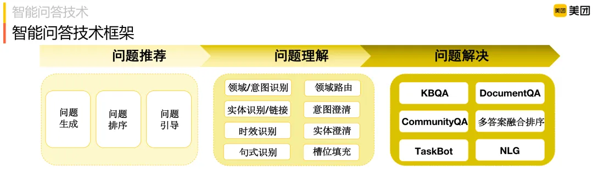
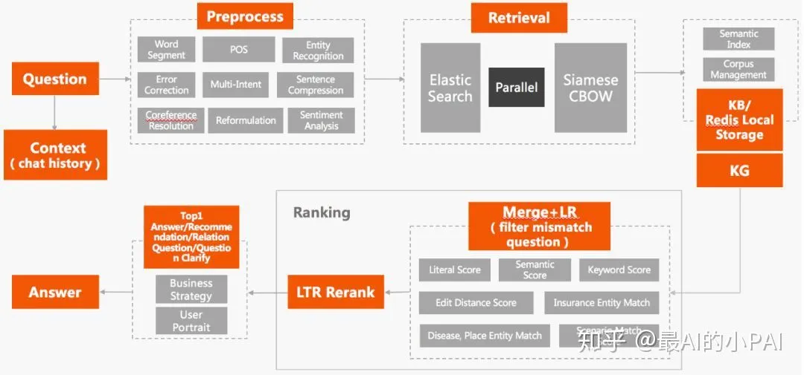

# 3.query理解

## 1.query理解是干什么的

上一期在给出的美团智能问答技术的架构中说到了问题理解，这里所谓的问题理解就是我说的query理解，在这一步中，**需要做的就是把用户提出的内容充分理解，从而让我们后续的回复能更精准**，这点和我们日常的对话是符合的，只有理解对方说的话，回复才有意义。

这里聊清了他的意义，但是具体做的事情其实并不清晰，而具体要做什么，首先要考虑的是，说query理解是为了最终的回复结果，是指就是为了下游的结果生成服务的，这也意味着，query理解的任务很大程度上和下游的需求有关，下游需要什么，我们提取什么。

## 2.query理解的具体任务

### 2.1 美团智能问答技术

先来看看上次提到的美团，看看他们在做什么

可以看到，主要是6个部分，这里先解释下，当然了有些是联合在一起起作用的就合在一起了：

- **领域意图识别**：主要用于识别query的话题意图，下游针对不同的意图是有不同的资源或者是处理方式，所以这个意图识别非常重要。
- **领域路由和意图澄清**：和搜索不同的是，在多意图上的处理，对话系统在只能给一个结果的情况下只能转为澄清或者取一个概率明显高的，这个判断的工作则要由领域路由来判断然后做这个意图澄清。
- **实体识别和链接**：实体的抽取和链接，下游如果是KBQA或者是文本检索，其实是非常需要实体信息的。
- **时效识别**：应该是美团场景特有的一个点了，就是识别某个实体或者活动的时效性，例如有些活动结束了，那应该是需要给拒绝的回复了。
- **实体澄清**：这个和多意图其实类似，举个例子大家就明白了——“苹果”。
- **句式识别**：顾名思义，就是识别整个句式，这个具体的用法很多，例如有的时候有了句式，能快速识别意图或者是实体。
- **槽位填充**：槽位填充和实体识别很类似，很多地方的说法会不太一直，就槽位而言，主要是看指的是向用户追问还是用户提出的槽位问题需要对话系统来填。

这些任务，都是旨在从query中抽取甚至是推理出一些信息，这些信息是有利于给出回复的，例如意图识别是探索用户的需求是什么，ner则是给出用户更加细粒度的要求或者是用户的一些先决条件，当用户给出的内容我们感到模糊的时候，也可以适时返回一些澄清意图，引导用户更好地描述他的问题，从而让我们进一步回答。

### 2.2 平安对话系统

看完美团的，回头看看平安的，其实相比之下，平安的对话系统会稍微简单一些：

这里的细节里可以看到，整个理解被看做是整个预处理模块，这个可能和下游的处理复杂度有关，他这里下游主要是ES检索和向量检索，从而那张可以多少看到，对多轮的要求不多，而是个性化等方面会比较多，所以在query理解上就会相对简单了。

### 2.3 共性query理解任务

从上面的两个例子可以看到一些比较共性的任务：

- 意图识别。
- 实体识别。

而另一方面，也会有一些针对业务定制化的任务和根据下游数据需求去做的任务，前者有美团的时效识别，后者又有类似实体链接之类的任务。

其他的多少要么就是细节内容，我平时讲的语义匹配或者相似度问题，但是这个可能会不放在这里，而一般放在检索之类的里面，这个我放在下一篇讲吧。

## 3.query和下游任务之间的关系

query理解要做的是理解query，但不能局限于此，而还应该考虑下游要怎么用，而不能我们擅自去划分，而这里进一步展开，可以考虑的因素有这些，分段展开描述。

- **对于****检索式****，下游利用意图识别的方式是什么**。直接的，是字段检索构造语义向量的特征，如果是字段检索，那都有哪些字段，类目体系如何，类目之间的边界是什么，这些都是需要去明确和了解的，同样是大类小说，但是类目下有小说名。作者、发布时间等，甚至有些模糊的直接带了些标签，例如“最新”、“恐怖”、“爱情”等等，底层的数据结构是什么样的，只有充分了解，才能让下游更好的利用起来，如果自顾自的做了一版，效果还很好，但就是不好用，那肯定是不行的。
- **对于****生成式****，也要考虑生成式里需要用到的信息有哪些**，毕竟肯定不想要言而无物的万能回复，带一些信息的回复总不至于把天聊死，所以提供的信息就非常重要，此时就要看下游用的信息是用到什么粒度，例如是只需要实体，还是要详细到实体类型的实体信息，下游要根据意图变化给出一些对话策略，那意图体系也要尽可能和下游的意图对话策略对齐。

所以，回到query理解任务下，**需要充分了解下游任务的需求，才来去做query理解，合理划分任务，才能做好这颗在整个系统中的螺丝钉**。

## 4.query任务解释

从日常实践的经验来看，我们更多关注的不应该用什么模型，而是具体设计的思路以及具体的数据，数据集的优化往往是大幅提升效果的快速方式，真心的，大部分情况，textcnn和bert没有太多效果的差异。

### 4.1 意图识别

**意图识别可以看做是一个文本分类任务**，因为这个任务实质上就是把query识别到特定的类目上去，与常规nlp任务不同的主要是这几个特点：

- 类目边界不明确，这块其实难度不小。
- 数据质量大部分情况都不高，需要花大量时间操纵数据，这也是很多情况模型效果diff不明显的原因了。
- 空间分布可能会比较零散，这个其实会一定程度影响我们的方案设计的，模型上也要考虑多空间的承载能力。
- 数据会具有一些场景特色，如名词性场景、口语化问题等。

虽说意图识别可以被看做是一个文本分类的任务，但不局限于用文本分类的方法来解决这个文本分类的问题，与之对应的，更建议是把他当做一个完整的系统来进行处理：

- [心法利器\[29\] | 把文本分类任务做成一个系统](http://mp.weixin.qq.com/s?__biz=MzIzMzYwNzY2NQ==\&mid=2247487101\&idx=1\&sn=f511c12331fb7c2b33bdd973efd4e2a7\&chksm=e88256e3dff5dff57393ea70a09544c5e949cefb6b2c25588ea4069008e52387a279e34fb815\&scene=21#wechat_redirect "心法利器\[29] | 把文本分类任务做成一个系统")
- [前沿重器\[20\] | 文本分类和意图识别调研思考](http://mp.weixin.qq.com/s?__biz=MzIzMzYwNzY2NQ==\&mid=2247488016\&idx=1\&sn=840dcd8585c294a5611e99888a27ae1b\&chksm=e8824a8edff5c39821117112b85636411d53b312440f070aeb5e31d4f79ef2a5d5fb443324fe\&scene=21#wechat_redirect "前沿重器\[20] | 文本分类和意图识别调研思考")
- [心法利器\[26\] | 以搜代分：文本多分类新思路](http://mp.weixin.qq.com/s?__biz=MzIzMzYwNzY2NQ==\&mid=2247487022\&idx=1\&sn=8d4637014107c76c895cbed2e3d6f81b\&chksm=e88256b0dff5dfa61c3b8fe5b7041b7b2a172ca5df4aca02decec6abfcff2b61b48e7687d1df\&scene=21#wechat_redirect "心法利器\[26] | 以搜代分：文本多分类新思路")
- [心法利器\[11\] | 任务方案思考：文本分类篇](http://mp.weixin.qq.com/s?__biz=MzIzMzYwNzY2NQ==\&mid=2247486329\&idx=1\&sn=d83000fea702b6c7ec6ba3584b24a7fe\&chksm=e88253e7dff5daf1acdee035b0712fb0376e49a17211fb7dd716760542da81ca598f8d1681af\&scene=21#wechat_redirect "心法利器\[11] | 任务方案思考：文本分类篇") &#x20;

### 4.2 实体识别

实体识别的本质就是一个NER问题，而且可以是一个比较传统的NER问题，在大部分情况不太需要考虑嵌套、连接之类的问题，在早起版本我们可以把一些复杂的问题放到相对不关键的位置，关键点还是抽取出实体，这一方面是让我们不需要考虑太过复杂的ner模型，另一方面也给了传统地词典匹配足够的生存空间。

这里再仔细聊聊对话场景相比一般场景的NER特点：

- 大部分对话场景，有一定的时效性，这个时效性体现在一些新热词汇的抽取，基本上都要给这个问题留空间，所以词表肯定是要留着的，必须做。
- 短句问题，同样可能需要词典来处理，尤其是光杆名词的时候，词典效果是最好的，毕竟没有上下文，模型很难生效。
- 上面提的分类的口语化问题难做，但其实NER反而好做一点。

具体的方法可以看这些文章吧：

- [心法利器\[12\] | 任务方案思考：序列标注（NER）篇](http://mp.weixin.qq.com/s?__biz=MzIzMzYwNzY2NQ==\&mid=2247486348\&idx=1\&sn=a6010380e084ad8b27fd6168eccff079\&chksm=e8825312dff5da04dbe55c50233320d7a5059f4c229bd6bf7926ac63275d2f325d20cfd70229\&scene=21#wechat_redirect "心法利器\[12] | 任务方案思考：序列标注（NER）篇")
- [NLP.TM\[29\] | 近期做NER的反思](http://mp.weixin.qq.com/s?__biz=MzIzMzYwNzY2NQ==\&mid=2247485200\&idx=1\&sn=049a2a9bd2527a3f5b6c769386d0e9c0\&chksm=e8825f8edff5d698a6e6c7484bb41f1dd07d5c60a0ad6d04899d34b2abaea6520afb145e9472\&scene=21#wechat_redirect "NLP.TM\[29] | 近期做NER的反思")
- [NLP.TM\[31\] | 2018年的一篇NER综述笔记](http://mp.weixin.qq.com/s?__biz=MzIzMzYwNzY2NQ==\&mid=2247485222\&idx=1\&sn=6dd56d91bc33e70df0f64edbfadb9bd8\&chksm=e8825fb8dff5d6ae4ade676002eff8d3dee34568ec4e14d92aa191bb7fe98a47b21c5749d1a4\&scene=21#wechat_redirect "NLP.TM\[31] | 2018年的一篇NER综述笔记")
- [NLP.TM\[18\] | 搜索中的命名实体识别](http://mp.weixin.qq.com/s?__biz=MzIzMzYwNzY2NQ==\&mid=2247484954\&idx=1\&sn=69b4662284aec3f5eda3e64c55c49c6c\&chksm=e8825e84dff5d7921fd35b765d1a004f537466e018d4ba20e5966c57c30ccbb0cde72e07b315\&scene=21#wechat_redirect "NLP.TM\[18] | 搜索中的命名实体识别") &#x20;

### 4.3 其他的工作

query理解的工作主要是这些，而另外的，则是一些场景特点或者是下游任务需求去增加的了，例如纠错、实体连接、时效性之类的，甚至包括关键词抽取或者是词权重，这种要根据任务需求来进行设计和优化了，此时尤其要明确好需求。

举个例子，关键词抽取，在很多讲解中，大部分是根据任务需求来整的，有的时候关键词是那些名词的词汇，有的时候则是动词的词汇，而反推过来，其实所谓的关键词，是要看对谁关键，有的时候，是需要作为关键词给用户看的，有的时候则是给相似度模型看的，这直接导致了抽取方式需要有所取舍判断，此处对于对话系统，其实和搜索系统类似，都是抽取“对相似度模型有利”的词汇，这个就是所谓任务设计根据需求来设计了。

## 5.对话系统特别场景的应对

如果仅仅从NLP角度出发，可能对话系统中拆解得到的很多任务都非常成熟，但是一旦到了落地场景，其实问题绝对不是NLP任务那么简单，是需要考虑到这个场景下的用户习惯的，这些习惯直接导致的是用户的query具有特定的风格，而这些风格，不见得模型能够简单的解决，而需要更多辅助措施才能解决。在日常遇到了不少，这里我聊一些。

### 5.1 时效性问题

类似热点话题、新品迭代比较快的电商平台，这些场景下，都会有很多时效性很多的产品，举个例子，公司出了新品，先不论下游的检索，就是上游的ner和意图识别，都需要快速更新，一般的分类和实体识别模型去做的话，意味着要更新模型，更新模型这个事无论是在效果的稳定性上还是在更新及时性上都有很大风险，而相反，通过词典和模板的方式来处理则无论是在稳定性还是效果上都有稳定的保证。

### 5.2 口语化问题

对话系统本身给用户的感知就是一个聊天框或者一个完整的对话系统，所以相比搜索，用户给出的query会更加口语化，也会更加偏向于完整的句子，更严谨的说，就是完整句子的占比会比搜索高一些，这也就让我们不得不重视这个问题了。

有关这个问题，其实有文章专门聊过：[心法利器\[52\] | 口语化句子解析问题](http://mp.weixin.qq.com/s?__biz=MzIzMzYwNzY2NQ==\&mid=2247487997\&idx=1\&sn=945e9c54354b2a593b7eacf284a7f61b\&chksm=e8824963dff5c0756130372a1c2fa511e66400818e6fde66491b37d2a41a32b7c3c865c0bb3f\&scene=21#wechat_redirect "心法利器\[52] | 口语化句子解析问题")。这里简单说一下，就两个角度，模型角度和数据角度。

- 数据层面是收益比较大的，这里通过定向的补充样本进行优化，就能有比较好的效果了。
- 模型层面，则是使用对抗学习、r-dropout之类的方式对模型进行一定的扰动，毕竟口语化本质还是对句子的信息扰动，所以增强模型鲁棒性，能一定程度缓解这个问题。

当然了，这个口语化的问题，可以一定程度描述为长句问题，其实解决的思路和这个类似，所以长句问题不赘述了，但是短句，还是要拿出来的。

### 5.3 短句问题

长短句之前我同样聊过（[心法利器\[51\] | 长短句语义相似问题探索](http://mp.weixin.qq.com/s?__biz=MzIzMzYwNzY2NQ==\&mid=2247487992\&idx=1\&sn=a07de64da1588ee3ede499413966409d\&chksm=e8824966dff5c070089da72c3e3bf15d2057386f71a92451ebb972998ec96443102cf9abebeb\&scene=21#wechat_redirect "心法利器\[51] | 长短句语义相似问题探索")），不过是在语义相似度上的，其实在综合的query理解也会有类似的问题，但是更多是在短句上，这点和搜索是类似的，这个和口语化可以说是两个极端了，对于短句的问题，主要是两个情况比较多吧：

- 有意义的短句，例如“维修”，意义就很明确。
- 无意义的断句，在一些场景下，用户可能给的短句含义不是很多或者表意不明，例如“请问”，也有一些在特定场景，可能类似"你好"也是无意义词，但是有些场景可能会认为是有意义的，就看你有没有设计“欢迎”意图了。

常规的，句子短信息少，信息少会导致两种情况，分别是无意义和模糊。一般这种问题的解决思路是这样的：

- 意图识别在做的时候，需要考虑短句，常规情况，短句模型是可以覆盖的，尤其是高频的，没见过的理论上应该拒绝。
- 对于新词，就该延续时效性问题那块的处理，用词典来解决，很方便。
- 一般地，被意图识别统一识别为负类的，自然就是无意义的，这样无意义的能被摘出来，而对于困难的，黑名单自然可以安排，短句其实要挖掘覆盖起来难度不会很高的。

意图识别模块的把关其实还好，而对于多意图，此时则需要通过一定的规则和置信度，来调整排序，甚至是，可以在多意图情况下给用户一个澄清，这个在美团那个案例里就有聊到澄清的问题，例如“你是想要问下面的哪个问题”，这个需要和产品一起沟通最佳体验的回复，当然这个是短句引申出来的问题，但是这本质上应该是一个模糊澄清的处理问题，而非短句了。

## 6.小结

本文着重去聊的，主要是这几个点：

- 整个query理解都有哪些关键的组件，不同的业界还往这里面塞了什么有特点的东西。
- 重点的query理解任务，都是怎么做的。
- 对话系统中的任务，和常规的NLP，在数据和场景上有什么特点，以及如何应对。

