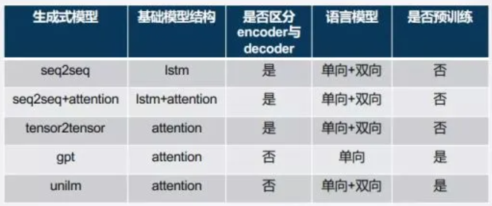

# 4.内容输出

## 1.核心思路和架构情况

一般的，会把整体思路分为两种，检索式和生成式，当然现在也有很多方法其实算是两者结合的方法。

- **检索式**重在检索，根据query理解的结果，在特定的库中进行查询，找到答案后输出，或者在找到之后通过组装完成输出。
- **生成式**则是根据query理解的效果去生成特定的回复，基本使用的是文本生成的方案了。

而对于整体架构而言，这两者往往不是完全独立的，而是两者互相辅助互为补充，或者可以理解为多路召回，后续根据对话策略进行筛选排序，找到最优解。

## 2.检索式

检索式对话这种模型相信很多人都不陌生了，也专门写过文章聊过（[NLP.TM\[38\] | 对话系统经典：检索式对话](http://mp.weixin.qq.com/s?__biz=MzIzMzYwNzY2NQ==\&mid=2247485924\&idx=1\&sn=549116a02409d0b86cf6b3e1cd12c921\&chksm=e882517adff5d86c489c9551bf17ee8628f35d2e4370c01dbe8cca5399580282e5a3dc484a99\&scene=21#wechat_redirect "NLP.TM\[38] | 对话系统经典：检索式对话")），随着技术的逐步迭代，检索的方式其实也逐步丰富化。

### 2.1 检索式的基本方法

首先，大家可以看看检索能有什么比较流行的方式：文本/结构化检索，表征式向量检索，知识图谱推理。

- **文本/结构化检索**。比较传统的检索方式了，基本的是类似ES之类的检索，当然有些非常明确的抽取，mysql也可。这种检索对query理解的要求不小，因为检索时的最优方案是，特定字段搜特定内容，有一些类似“你们有卖5000元左右的电脑吗”之类的疑问，我们甚至需要识别5000是一个价格，从而针对性的进行检索。当然了，有一些比较粗暴的方式是把所有内容拼接然后构造倒排索引，这个会对query理解要求降低，但是相比之下对相似度计算的要求会提升，这个需要权衡，例如如果特外特征很多很杂，这个时候对query理解的难度很大，拼接的方式更简单，例如购物场景的对话，而如果特征不多但是比较集中，此时query理解抽取出来可能更好，例如小说场景的对话，基本都围绕那几个关键槽位，如小说名、作者等。
- **表征式向量检索**。这个好像是大家目前最容易想到的办法了，之前有专门聊过这个问题（[心法利器\[16\] | 向量表征和向量召回](http://mp.weixin.qq.com/s?__biz=MzIzMzYwNzY2NQ==\&mid=2247486586\&idx=1\&sn=ddd1716c5e5860361df3e45de0f14de9\&chksm=e88254e4dff5ddf289bdf02e5e6d18baf42bda78415b61e620c567a749fafb00d2dacd50232a\&scene=21#wechat_redirect "心法利器\[16] | 向量表征和向量召回")），把query等特征进行表征，然后用向量索引做召回，这个详细聊过这里就不赘述了。
- **知识图谱推理**。对自己来说多少算一些超纲，但是确实是逐步成为一个比较重要的技术了，毕竟可解释性和可控性比模糊泛化要好很多，知识结构也更容易定义，而最突出的，其实是他能体现人类文明的逻辑型，这点是常规的生成模型所很难具备的，哪怕强如GPT模型，回答的流畅性应该没什么问题，但是逻辑型可能就很难保证，而知识图谱是能解决这个问题的。

### 2.2 检索式知识库的来源

所谓的检索式就是查，而查的一大前提就是有库的支持，然后才可能找到结果从而返回，这就如米之于炊，没有米就做不了饭了，所以，这里检索库的知识点就需要大量的资源来构建，这里提供集中比较常见的方式，也强调下这个的重要性。

- 人工维护。在很多对话机器人的场景，例如客服，是要确保知识的正确性、官方性、稳定性、可控性，有一个可供维护的能力，其实对对话机器人很重要。
- 在线开源资源。在允许的情况下从三方或者是网上获取。
- 结合日常人工的对话，进行挖掘和抽取，这也是个很好的方法。

总之，检索式对内容的要求其实不低，我们往往是需要花费一些时间去整理和结构化，才能支撑到在线的使用。

### 2.3 检索的匹配度问题

库很大，**查询的本质是从中找到一些比较接近的，可能是结果的答案，这里依赖相似度来做排序和截断**，常规的字面和语义相似度都是比较好的方法，具体的就是我们熟知的那些相似度模型，字面的有jaccard、cqr/ctr、BM25，语义的就是DSSM系列、sentence-bert等的表征式和ESIM等的交互式还有一些更复杂的模型，但是在实践中，单一的相似度可能并不完善，有的时候会结合一些query理解、内容质量等信息会有更好的效果，此时可以组装出一些很实用的大型模型来统一处理。

## 3.生成式

首先，生成式在一段时间内而且在特定场景下是一个很实用的方案，尤其是闲聊，而且在一定情况下收益还是不小的——这个，应该是大部分人对生成式的直观理解，但是在现实应用真的是这样吗？

在近期看的一篇有关生成式闲聊的文章中（[小布助手闲聊生成式算法](http://mp.weixin.qq.com/s?__biz=MzU1NTMyOTI4Mw==\&mid=2247562192\&idx=1\&sn=0344248652f2c319c4860da300aebdb7\&chksm=fbd641bccca1c8aa19bdd76bed10daa4324d54bf47d8b6bfb556e3e3cd36338d3f0891103ebe\&scene=21#wechat_redirect "小布助手闲聊生成式算法")），生成式和闲聊之间的关系没有想象的那么简单，主要还有下面这些问题：

- **可控性不足**，对特定的问题或者回复，需要风控。（政治敏感、涉黄涉暴等）
- **常规的闲聊**，回复内容比较直接，对于闲聊这种多轮倾向比较重的回复，很容易把天聊死，所以需要控制。
- **万能回复**，例如“不知道”、“你说呢”这种，需要约束和控制。
- **一致性问题**。换个问法，可能回复就不同，但是对于有些情况是需要一致的，例如“你多少岁了”和“你几岁”。
- **知识缺失**。就是上面说的通顺但不符合逻辑的回复。

上面的问题基本都是现有生成式的一些主要问题，上面的部分问题可以通过检索式解决，也有一些可以通过上下游的信息输入来完成条件生成。

### 3.1 业界的方法

而重点在于，我们需要集中一些精力，来解决上面的问题。

### 3.2 生成式的使用方式

针对可控性不足的问题，解决思路如下：

- 对于敏感问题和回复，一方面从上游的过滤来处理，有些可能有问题的query就不能进入到这一层来，在上游用规则等方式过滤；另一方面，在生成的过程，业务要对该类型的答案进行惩罚，这点在万能回复里也需要做这个工作。
- 容易把天聊死的问题，可以结合主动对话的对话策略，来推动聊天更容易聊下去。
- 一致性问题和知识缺失问题，本质上都是依赖一个统一地知识库，结合这个知识库，能让生成的结果更加受控，这也是我前面聊的结合检索的生成式。

## 4.方案的选择与决策

方法总有很多，在技术的迭代发展上，无论是生成还是检索，都还有很大的使用空间，肯定是建议大家都去学的，但是在实践过程，总要进行取舍，这个取舍，不仅是实践过程中的方案实施的抉择，还有在线预测阶段的结果筛选排序，都是需要进行决策的。

### 4.1 方案选择的思路

检索式因为物料本身的可控性，为结果的精准度带来很高的下限，只要query理解和匹配没问题，最终的结果就不会太差，就取决于物料质量了，所以一般情况，尤其是企业级的对话机器人，例如淘宝的客服，其实非常乐意去整检索式，甚至连一些客套话、闲聊场景也会用检索式来处理一些高频的问题，毕竟他是真的稳。但缺点也是在这个库上，低质量的库或者是覆盖率不足的库，体验会很差甚至形同虚设，无论是算法还是运营、数据、工程都要为这个数据库维护花费不少精力，但是一旦建立了起来，绝对起飞。

而生成式，其他点就在于泛化性强，库里面没有或者是有但是泛化能力不足的话，生成式是可以轻松解决的，另一方面，生成式本身的句子流畅性高，在用户感知上会更像人，这给用户体验上带来很大的提升，然而缺点在上面提到了，确实很多不稳定的问题，如果要上，很多辅助措施也是要跟着建立起来。

所以该怎么选？如果是给我操作，检索式会是更高优的选择，至少黑白名单之类的方案还是需要考虑有的，系统的可控性全靠这个，此时只需要花时间整理，检索式总能提供一个稳定可用的版本，尤其是知识型要求非常重的，例如客服型，咨询的问题大都是固定而且专业的，检索式的优势可以说是能充分发挥了。

而在后期，针对长尾的问题，包括闲聊，到了收官时刻，开始处理长尾问题的时候，生成式的需要会逐步明显起来，他的泛化能力能让系统能回复更多更长尾的问题，即使是缓兵之计，“我不太清楚哟，我们来聊聊别的吧，今天晚上打算吃什么”这种回复也会体验好不少，毕竟别说机器人了，每个个体人类都有一定的知识上限，所以真的不奇怪。

### 4.2 排序层的结果筛选

不把鸡蛋放在一个篮子里，随着系统逐步完善，系统内肯定会有多种结果召回，需要从中找到最优的方案返回，这点其实和搜索很相似，就是一个**多路召回+排序**的过程，然而在对话系统中，却有一些非常具有特色的难点：

- 大部分对话系统没有点击之类的用户交互数据，顶多是类似客服场景的“满足/不满足”之类的，但这个占比很少。
- 搜索系统多半结果是多条，而且要关注多样性，而对话系统一般只有一个回复，而且要求精准，对于多意图顶多是用“我猜你想问这些问题”这种疑似问的方式来引导，总之最终结合对话策略，只有一条回复。

针对第一个问题，其实对话场景，其实很难有类似推荐或者搜索的排序模型来进行筛选，毕竟是真的没数据，而针对第二个问题，则对结果的精准度有了更高的要求，上游的意图识别和下游的排序层压力都会很大，毕竟结果精准性要求很难。

针对这两个问题，在多意图多内容召回的这个问题下，对话系统很可能采用基于策略和规则来进行综合排序，一方面考虑多个意图或者之间的关系，例如优先信任检索式甚至是kv查询的结果，另一方面，考虑各个结果的置信度（或者结果内和query的相似度）做一个排序从而进行筛选会更为合理。

而如果规则逐渐复杂，系统的维护逐渐存在困难前，可以慢慢往机器学习转，结合各种结果和相似度、匹配度等做一些机器学习的计算，也会有一定效果，当然了，这里用机器学习也是为了避免太过复杂的特征输入，从而降低数据成本，这个方案可供参考。

## 5.小结

这篇给大家讲了对话系统的结果怎么来的，检索式应该算我比较擅长的东西了，但是后者生成式写的其实挺吃力的，年后才开始慢慢看然后现在只是有个认识，也找过一些做这块的朋友聊过一些经验，所以才总结出来，希望大家看不出来什么破绽吧。

