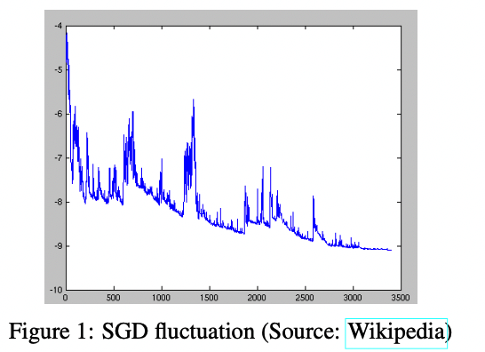
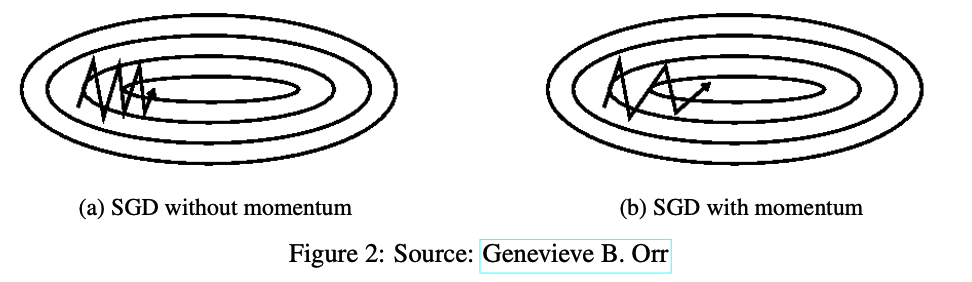
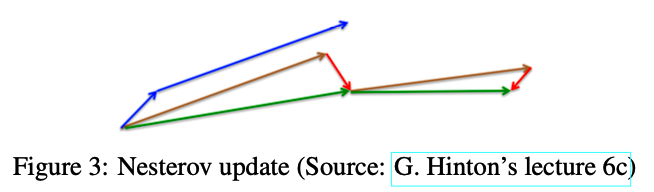

# 5.优化器

## 1.梯度下降变形形式

### 1.1批量梯度下降（batch gradient descent）

批量梯度下降，计算整个训练数据集的目标函数对参数 $θ$ 的梯度：

$$
\theta=\theta-\eta \cdot \nabla_{\theta} J(\theta)
$$

使用批量梯度下降时代码一般如下所示：

```python
for i in range(nb_epochs):
    params_grad = evaluate_gradient(loss_function, data_list, params)
    params = params - learning_rate * params_grad

```

批量梯度下降的缺点是其需要计算整个数据集的梯度，然后仅用于执行一次更新。这导致批量梯度下降速度非常慢。另外如果数据量比较大时，内存一般也不足以加载这些数据。

批量梯度下降能够保证收敛到凸函数的最小值，或者非凸函数的极小值。

### 1.2 随机梯度下降（Stochastic gradient descent）

随机梯度下降 (SGD) 对每个训练示例 $x(i)$ 和标签 $y(i)$ 执行参数更新：

$$
\theta=\theta-\eta \cdot \nabla_{\theta} J\left(\theta ; x^{(i)} ; y^{(i)}\right)
$$

上一部分已经说过，批量梯度下降的计算量是非常大的，因为它每次更新都要计算所有数据的梯度。而SGD则是每次仅计算一条数据的梯度，所以SGD的速度更快。但是由于SGD每次只使用一条数据进行更新，所以**其目标函数的值也会出现较大幅度的波动**，如下图所示。



除了速度以外，SGD还有另一方面的优势。对于非凸函数，批量梯度下降会优化到极小值点，但SGD的波动能够使其跳出极小值点，进入更好的局部最小值。

但是上述这种现象也使得SGD的收敛过程变得非常复杂，甚至其不能收敛到局部最小值。有一种方法是随着学习的进行慢慢降低学习率，在这种策略下SGD能够表现出与批量梯度下降较为相似的收敛行为，能够稳定收敛到凸函数的全局最小值，或者非凸函数的局部最小值。

下面是使用SGD的一般代码结构：

```python
for i in range(nb_epochs):
    np.random.shuffle(data_list)
    for example in data_list:
        params_grad = evaluate_gradient(loss_function , example , params)
        params = params - learning_rate * params_grad

```

在上述代码中可以看出，每个epoch都会对所有的数据进行一次shuffle，这是一个常规操作。而在批量梯度下降中却没有该操作，原因是批量梯度下降每次都是计算完全量数据的梯度再更新，是否shuffle对它计算出的梯度没有影响。

### 1.3 Mini-batch梯度下降（Mini-batch gradient descent）

Mini-batch梯度下降结合批量梯度下降和SGD两者各自的优势，其每次对一个小批量的 n 个训练样本求梯度，并做一次更新。公式如下：

$$
\theta=\theta-\eta \cdot \nabla_{\theta} J\left(\theta ; x^{(i: i+n)} ; y^{(i: i+n)}\right)
$$

Mini-batch梯度下降的优势有：

- 相比于SGD，每次更新时减少了更新的方差，使得收敛比SGD更稳定；
- 相比于批量梯度下降，计算速度大幅提升；同时也有一定的跳出局部最小值的能力；

目前的深度学习中基本都是使用Mini-batch梯度下降，但是使用术语时一般使用SGD。为了和大部分资料保持一致性，在本文的后面部分也是如此，提到SGD时指的是Mini-batch梯度下降。

下面是Mini-batch梯度下降的一般代码结构：

```python
for i in range(nb_epochs):
    np.random.shuffle(data_list)
    for batch in get_batches(data_list, batch_size=50):
        params_grad = evaluate_gradient(loss_function, batch, params)
        params = params - learning_rate * params_grad

```

## 2.梯度下降遇到的挑战

上面提到的三种梯度下降的方法都是比较原始的，并不能保证比较好的收敛性，它们存在的问题有：

- **选择合适的学习率比较困难**。学习率选的太小了会导致收敛缓慢，学习率选的太大了会导致不收敛在最小值附近波动，甚至于发散。
- 有些策略是在训练的过程中调整学习率，但是这些策略里什么时候需要调整、调整为多大都是在训练前预定义好的，对不同的数据集特征的适应性比较差，换一个数据集可能就不生效了。
- **鞍点问题**。有些研究表明，很多时候问题并不是梯度下降收敛到了局部最小值点，而是收敛到了鞍点，收敛到鞍点之后可能模型的效果比收敛到局部最小值点还差。

## 3.梯度下降优化算法

接下来将列举一些被深度学习社区广泛用于解决上述困难的算法，这些算法有个共同之处，**一般是求一阶动量(m)和二阶动量(V)，然后利用一阶、二阶动量本身或者他们组合来优化梯度下降**（其中一阶动量为与梯度相关函数，二阶动量为与梯度平方相关的函数） &#x20;

首先还是给出梯度下降的公式：

$$
\theta_{t+1}=\theta_{t}-\eta \frac{\partial(\text { Loss })}{\partial \theta_{t}}
$$

引入梯度下降优化算法后：

$$
\theta_{t+1}=\theta_{t}-\eta \frac{m_{t}}{\sqrt{V_{t}}}
$$

### 3.1 动量法（Momentum）

随机梯度下降的方法很难通过峡谷区域（也就是在一个维度梯度变化很大，另一个维度变化较小），这个很好理解，因为梯度下降是梯度更新最大的反方向，如果这个时候一个维度梯度变化很大，那么就很容易在这个方向上振荡，另一个方向就更新很慢，如下图：



动量法就是为了解决上述问题，能够对朝着极值点的方向加速，并能够一定程度上抑制震荡。使用动量法的优化路径会是下图2b中所示。

动量法的具体做法是：**将过去的时间步更新的向量的一部分 **$γ$** 添加到当前更新的向量上**。通过这种方式，历史时间步中使得优化轨迹来回震荡的方向的动量会相互抵消，剩下的主要是朝着极值点的方向的动量。公式如下所示：

$$
\begin{aligned}m_{t} & =\gamma m_{t-1}+\eta \nabla_{\theta} J(\theta) \\ 
\theta_{t+1} & =\theta_t - m_{t}\end{aligned}
$$

动量项 $γ$ 通常设置为 0.9 或类似值。

本质上，当使用动量法时：对于梯度指向相同方向的维度，动量项会增加，而对于梯度改变方向的维度，动量项的更新会减少。 结果，我们获得了更快的收敛速度并减少了振荡。

### 3.2 NAG（Nesterov accelerated gradient）

然而，盲目地顺着斜坡滚下山坡的球是非常不令人满意的。 我们想要一个更聪明的球，一个知道它要去哪里的球，这样它就知道在山再次倾斜之前减速。

NAG 是一种赋予我们的动量项这种先见之明的方法。 知道我们将使用动量项 $γv_t−1$ 来移动参数 $θ$。 因此，计算 $θ−γv_t−1$ 为我们提供了参数下一个位置的近似值（完全更新时梯度缺失），这是参数将在哪里的粗略概念。 现在可以通过计算梯度来有效地向前看。

$$
\begin{aligned} m_{t} & =\gamma m_{t-1}+\eta \nabla_{\theta} J\left(\theta-\gamma m_{t-1}\right) \\ 
\theta_{t+1} & =\theta_t - m_{t}\end{aligned}
$$



同样，将动量项 $γ$ 设置为 0.9 左右的值。 Momentum 首先计算当前梯度（图 3 中的小蓝色向量），然后在更新的累积梯度（蓝色大向量）的方向上大跳，而 NAG 首先在前一个累积梯度的方向上大跳（ 棕色矢量），测量梯度，然后进行校正（绿色矢量）。 这种预期性的更新可以防止我们走得太快，从而提高响应能力，从而显着提高了 RNN 在许多任务上的性能。

既然我们能够使我们的更新适应我们的误差函数的斜率并反过来加速 SGD，我们还希望我们的更新适应每个单独的参数，以根据它们的重要性执行更大或更小的更新。

### 3.3 Adagrad

之前提到过这个问题：对于所有特征，我们的学习率一直没有变。

Adagrad算法就是为了解决这个问题，**让学习率学习数据的特征自动调整其大小，Adagrad算法引入了二阶动量**(V)，其表达式为：

$$
\begin{array}{c}m_{t}=g_{t} \\ V_{t}=\sum_{\tau}^{t} g_{\tau}^{2} \\ \theta_{t+1}=\theta_{t}-\eta \frac{m_{t}}{\sqrt{V_{t}}}\end{array}
$$

其中$g(t)$为`t`时刻参数梯度，

下面来讲解为什么adagrad可以实现不同频率特征对其参数学习率改变，首先，看到二阶动量$V(t)$，它是梯度平方累加和，对于训练数据少的特征，自然对应的参数更新就缓慢，也就是说他们的梯度变化平方累加和就会比较小，所以对应于上面参数更新方程中的学习速率就会变大，所以对于某个特征数据集少，相应参数更新速度就快。为了防止上述分母为0，所以往往添加一个平滑项参数`ε`，参数更新方程也就变成：

$$
\theta_{t+1}=\theta_{t}-\eta \frac{m_{t}}{\sqrt{V_{t}+\epsilon}}
$$

但是Adagrad同样也有问题，就是其分母随着训练数增加，也会跟着增加，这样会导致学习速率越来越小，最终变的无限小，从而无法有效更新参数。

### 3.4 RMSprop

RMSprop算法由hinton教授提出，它与Adadelta算法公式其实是一样的，他们是在相同时间被独立的提出，公式自然也为：

$$
\begin{array}{c}m_{t}=g_{t} \\ V_{t}=\gamma V_{t-1}+(1-\gamma) g_{t}^{2} \\ \theta_{t+1}=\theta_{t}-\eta \frac{m_{t}}{\sqrt{V_{t}+\epsilon}}\end{array}
$$

hinton教授建议将$γ$设置为0.9，对于学习率，一个好的固定值为0.001。

### 3.5 Adam

Adam (Adaptive Moment Estimation) **自适应矩估计**，是另一种**自适应学习率的算法**，它是一种将动量和Adadelta或RMSprop结合起来的算法，也就引入了两个参数$β_1$和$β_2$，其一阶和二阶动量公式为：

$$
\begin{aligned} m_{t} & =\beta_{1} m_{t-1}+\left(1-\beta_{1}\right) g_{t} \\ V_{t} & =\beta_{2} V_{t-1}+\left(1-\beta_{2}\right) g_{t}^{2}\end{aligned}
$$

作者发现一阶和二阶动量初始训练时很小，接近为$0$，因为$β$值很大，于是作者重新计算一个偏差来校正：

$$
\begin{array}{l}\hat{m}_{t}=\frac{m_{t}}{1-\beta_{1}^{t}} \\ \hat{v}_{t}=\frac{v_{t}}{1-\beta_{2}^{t}}\end{array}
$$

其中`t`代表其`t`次方，所以刚开始训练时，通过除于 `(1-β)` 就可以很好修正学习速率，当训练多轮时，分母部分也接近1，又回到了原始方程，所以最后总的梯度更新方程为：

$$
\begin{array}{c}m_{t}=\beta_{1} m_{t-1}+\left(1-\beta_{1}\right) g_{t} \\ V_{t}=\beta_{2} V_{t-1}+\left(1-\beta_{2}\right) g_{t}^{2} \\ \widehat{m}_{t}=\frac{m_{t}}{1-\beta_{1}^{t}} \\ \hat{V}_{t}=\frac{V_{t}}{1-\beta_{2}^{t}} \\ \theta_{t+1}=\theta_{t}-\eta \frac{\widehat{m}_{t}}{\sqrt{\hat{V}_{t}+\epsilon}}\end{array}
$$

其中$β1$默认值为0.9，$β2$默认值为0.999,  $ε$为10^-8，Adam集合动量和Adadelta两者的优点，从经验中表明Adam在实际中表现很好，同时与其他自适应学习算法相比，更有优势。

## 4.可视化优化器


## 5.其他SGD优化器

1、Shuffling and Curriculum Learning

2、Batch normalization

3、Early stopping

4、Gradient noise
