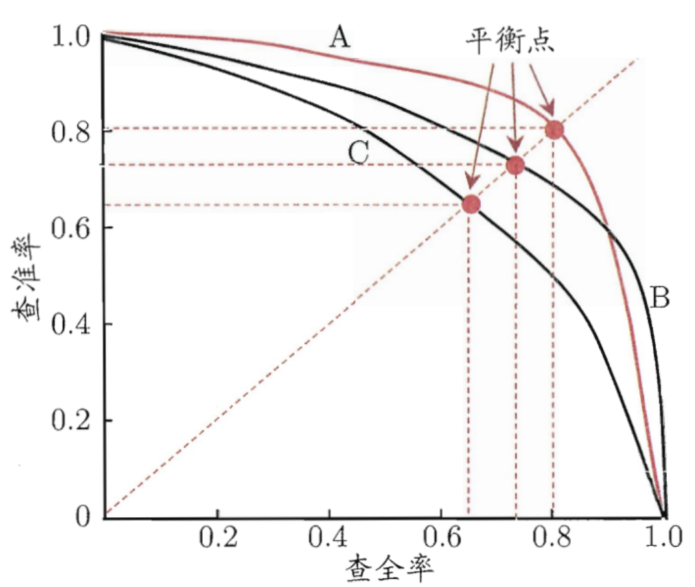
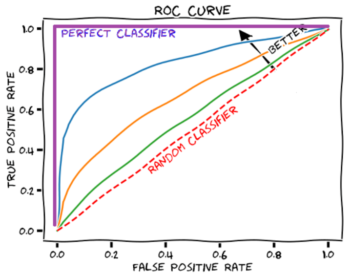

# 6.评估指标

## 1.BLEU

### 1.1 BLEU计算

BLEU（Bilingual Evaluation Understudy）是一种在机器翻译领域广泛采用的评估指标，其通过计算机器翻译输出（下称为“候选文本”）与参考翻译文本（下称为“参考文本”）之间的**词汇相似度来评估翻译质量**。BLEU 主要**计算候选文本与参考文本的 **$𝑛$** 元组（𝑛-gram）共现频率**，评分结果在 `[0, 1]` 的区间内， 具体的计算方式如下所示：

$$
\mathrm{BLEU}=\mathrm{BP} \times \exp \left(\sum_{n=1}^{N} w_{n} \times \log p_{n}\right)
$$

其中，$𝑤_𝑛$ 是 `𝑛` 元组的权重，用于调整不同长度的 `𝑛` 元组对最终评分的影响。具体 实践中，研究者通常设 𝑛 = 4，并平均分配 $𝑤_𝑛$。BP 表示长度惩罚因子，用于修正由于候选文本长度过短导致的评分偏差，其计算方式为：

$$
\mathrm{BP}=\left\{\begin{array}{ll}1, & \text { if } l_{c}>l_{r} \\ \exp \left(1-\frac{l_{r}}{l_{c}}\right), & \text { if } l_{c} \leq l_{r}\end{array}\right.
$$

这里，$𝑙_𝑐$ 和 $𝑙_𝑟$ 分别表示候选文本的长度和最短的参考文本长度。而公式 BLEU中的 $𝑝_𝑛$ 代表 `𝑛` 元组的精确率，计算公式如下：

$$
p_{n}=\frac{\sum_{\mathrm{n}-\text { gram } \in C} \min \left(\operatorname{count}_{C}(\mathrm{n}-\mathrm{gram}), \max _{R \in \mathcal{R}} \operatorname{count}_{R}(\mathrm{n}-\mathrm{gram})\right)}{\sum_{\mathrm{n} \text {-gram } \in C} \operatorname{count}_{C}(\mathrm{n} \text {-gram })}
$$

其中，`𝐶` 代表候选文本，`𝑅` 代表所有参考文本集合 `R` 中的一个文本，$count_𝐶 (n-gram)$ 和 $count_𝑅 (n-gram)$ 分别指 `𝑛` 元组在候选文本和参考文本中的出现次数

在做 n-gram 划分时，随着 n 的增大得分越来越低。这个是很直观的，当 n 非常大时就等于是要求生成的结果必须和人工标注的译文一摸一样才能得分。

### 1.2 BLEU 优缺点[#](#13-bleu "#")

优点：

- BLEU 快速且易于计算，特别是与人工翻译速率模型输出相比的话尤为明显。
- BLEU 无处不在，这使你将模型与同一任务的基准进行比较变得更为轻松。

缺点：

- BLEU 是在计算准确率，所以该指标不能很好的衡量召回的质量。
- 它不考虑意义；
- 它不直接考虑句子结构；
- 它不能很好地处理形态丰富的语言；
- 它与人类的判断并不相符；

## 2.ROUGE指标

ROUGE（Recall-Oriented Understudy for Gisting Evaluation）指标总共有四种：Rouge-N、Rouge-L、Rouge-W、Rouge-S。相比于 BLEU 计算的是准确率，ROUGE **指标计算的是召回率，即强调文本信息的覆盖度和完整度**。

### 2.1 Rouge-N 指标

Rouge-N 的全称为 N-gram Co-Occurrence Statistics。

简单来说 Rouge-N 就是**将模型生成结果和标注结果按照 n-gram 划分后，计算召回率**。公式为：

$$
ROUGE-n=\frac{\sum_{\mathrm{n} \text {-gram } \in R} \min \left(\operatorname{count}_{C}(\mathrm{n} \text {-gram }), \operatorname{count}_{R}(\mathrm{n} \text {-gram })\right)}{\sum_{\mathrm{n} \text {-gram } \in R} \operatorname{count}_{R}(\mathrm{n} \text {-gram })}
$$

其中，`𝐶` 代表候选文本，`𝑅` 代表参考文本。在此公式中，分母表示所有参考文本中 `𝑛` 元组的总数，而分子表示候选文本与参考文本中匹配的 `𝑛` 元组的数量

和 BLEU 一样，n 越大，得分越低。

### 2.2 Rouge-L 指标

Rouge-L 的全称为 Longest Common Subsequence。

无论 BLEU 指标还是 Rouge-N 指标使用的都是词袋模型，它们都不考虑词语之间的相对顺序，而 Rouge-L 指标则是考虑了词语之间的相对顺序。这个名字里的 L 表示的是Longest Common Subsequence（最长公共子序列：注意这个非连续的）。

ROUGE-L 以 F1 分数计算，结合了精确率和召回率的信息。精确率衡量了候选文本中有多少内容是与参考文本相关的，而召回率则衡量了参考文本中有多少内容被候选文本所覆盖。具体计算公式如下:

$$
\begin{aligned} \text { Recall } & =\frac{\operatorname{LCS}(C, R)}{\operatorname{length}(R)} \\ \text { Precision } & =\frac{\operatorname{LCS}(C, R)}{\text { length }(C)} \\ \mathrm{F} 1 & =\frac{\left(1+\beta^{2}\right) \cdot \text { Precision } \cdot \text { Recall }}{\left(\beta^{2} \cdot \text { Precision }\right)+\text { Recall }}\end{aligned}
$$

在上述公式中，$LCS(𝐶, 𝑅)$ 表示 `𝐶` 和 `𝑅` 之间的最长公共子序列长度。$length(𝐶)$ 和 $length(𝑅)$ 分别代表候选文本和参考文本的长度。在 ROUGE-L 中，$\beta
 $ 用于决定召 回率的权重。

### 2.3 Rouge-W 指标

Rouge-W 的全称为 Weighted Longest Common Subsequence。

Rouge-L 指标虽然考虑了词语之间的相对顺序，但是由于其使用最长公共子序列，所以没有考虑到词语之间是否连续的问题。

如果使用 Rouge-L 计算的话，得分是相同的。所以提出了 Rouge-W 指标。简单来说，**Rouge-W 就是给连续匹配到的子序列更高的权重，最终让连续匹配的结果要比非连续匹配的结果得分更高一些**。

Rouge-W 的计算公式如下：

$$
\begin{aligned} R_{w l c s} & =f^{-1}\left(\frac{\mathrm{WLCS}(X, Y)}{f(m)}\right) \\ P_{w l c s} & =f^{-1}\left(\frac{\mathrm{WLCS}(X, Y)}{f(n)}\right) \\ F_{w l c s} & =\frac{\left(1+\beta^{2}\right) R_{u l c s} P_{w l c s}}{R_{w l c s}+\beta^{2} P_{w l c s}}\end{aligned}
$$

其中函数 $f(⋅)$ 就是实现给予连续匹配的序列更高权重的函数，比如连续的、相邻的 `x` 和 `y` 的权重 $f(xy)$ 要比不连续的单独的 $f(x)$ 和 $f(y)$ 的分值要高，即：$f(xy)>f(x)+f(y)$。函数 $f^{−1}(⋅)$ 是函数 $f(⋅)$ 的逆函数。$WLCS(⋅)$ 表示带有加权的最长公共子序列，这里加权的权重就是给连续匹配的子序列更高的权重。其他部分的计算和 Rouge-L 是一致的。

> 该算法还是比较复杂的，关于函数 $f(⋅)$ 和其逆函数 $f^{−1}(⋅)$ 更多的性质，以及其具体的公式。还有 $WLCS(⋅)$ 算法的细节，请看原始论文：[https://aclanthology.org/W04-1013.pdf](https://aclanthology.org/W04-1013.pdf "https://aclanthology.org/W04-1013.pdf")

### 2.4 Rouge-S 指标

Rouge-S 的全称为 Skip-Bigram Co-Occurrence Statistics。

在 Rouge-N 中对文本做 2-gram 划分（也称 bigram 划分）时，都是连续的进行划分。在 Rouge-S 中使用的 skip-bigram 则是在划分时允许跳过一些词。下面先放上计算公式，然后举例进行说明如何计算。

Rouge-S 的计算公式如下：

$$
\begin{array}{c}R_{s k i p 2}=\frac{\operatorname{SKIP} 2(X, Y)}{C(m, 2)} \\ P_{s k i p 2}=\frac{\operatorname{SKIP} 2(X, Y)}{C(n, 2)} \\ F_{s k i p 2}=\frac{\left(1+\beta^{2}\right) R_{s k i p 2} P_{s k i p 2}}{R_{s k i p 2} 2+\beta^{2} P_{s k i p 2}}\end{array}
$$

其中 `X` 表示人工标注的结果，`Y` 表示模型预测的结果，$SKIP2(X,Y)$ 表示标注结果按照 skip-bigram 拆分后与预测结果按照 skip-bigram 拆分后匹配上的个数。$C(m,2)$ 表示人工标注结果按照 skip-bigram 拆分后的个数，$C(n,2)$ 表示预测结果按照 skip-bigram 拆分后的个数。$β$ 是超参数。

其中 $SKIP2(X,Y)$ 表示所有样本的标注结果按 n-gram 拆分后与生成结果按 n-gram 拆分后匹配上个数的和；分母表示所有样本的标注结果按 n-gram 拆分后的和。下面举例说明计算方式。

## 3.分类指标

### 3.1 A、P、R、F1

| **混淆矩阵**         |                      |                     |
| ---------------- | -------------------- | ------------------- |
|                  | 预测值 **P(Positives)** | 预测值**N(Negatives)** |
| 真实值**T(Ture)**   | TP：正样本，预测结果为正（真阳性）   | FN：正样本，预测结果为负（假阴性）  |
| 真实值**F (False)** | FP：负样本，预测结果为正（假阳性）   | TN：负样本，预测结果为负（真阴性）  |

- **准确率**：所有预测正确的正例和负例，占所有样本的比例，其定义为：$Accuracy =\frac{T P+T N}{P+N}$
- **精确率**：模型**预测为正例的样本中真正为正例的比例**，其定义为：$Precision =\frac{\mathrm{TP}}{\mathrm{TP}+\mathrm{FP}}$
- **召回率**：所有**真正为正例的样本中被模型正确预测出来的比例**， 其定义为：$Recall =\frac{\mathrm{TP}}{\mathrm{TP}+\mathrm{FN}}$
- **F1分数**：是精确率和召回率的调和平均数，用于衡量模型在分类任 务上的综合性能，其定义为：$F1 =2 \times \frac{\text { Precision } \times \text { Recall }}{\text { Precision }+ \text { Recall }}$

### 3.2 P-R曲线

P-R曲线：通过选择不同的阈值，得到Recall和Precision，以Recall为横坐标，Precision为纵坐标得到的曲线图。

PR曲线性质：

- 如果一个学习器的P-R曲线被另一个学习器的曲线完全包住，后者性能优于前者;
- 如果两个学习器的曲线相交，可以通过平衡点（如上图所示）来度量性能；
- 如果有个划分点可以把正负样本完全区分开，那么P-R曲线面积是`1*1`；

阈值下降：

- **Recall**：不断增加，因为越来越多的样本被划分为正例，假设阈值为0.，全都划分为正样本了，此时recall为1；
- **Precision**：正例被判为正例的变多，但负例被判为正例的也变多了，因此precision会振荡下降，不是严格递减；
- **AP（average precision）**：Precision-recall 曲线下围成的面积，一般一个分类器性能越好，AP值越高。
- **mAP（mean average precision）**：多个类别AP的平均值。

### 3.3 ROC-AUC

**ROC**（Receiver Operating Characteristic）曲线：**曲线的****横坐标为假正例率（FPR）****，即实际为负的样本有多少被预测为正；****纵坐标为TPR(真正例率)****，即实际为正的样本多少被预测为正**。

$$
F P R=\frac{F P}{F P+T N}
$$

$$
T P R=\frac{T P}{T P+F N}=\text { Recall }
$$

TPR和FPR的范围均是`[0,1]`，通过选择不同的阈值得到TPR和FPR，然后绘制ROC曲线。

**AUC (Area under Curve)**：即ROC曲线下的面积，介于0.1和1之间，作为数值可以直观的评价分类器的好坏，值`越大越好`。
