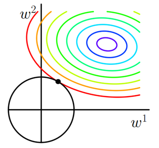
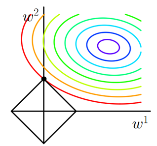
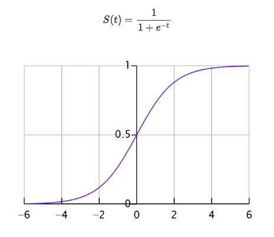
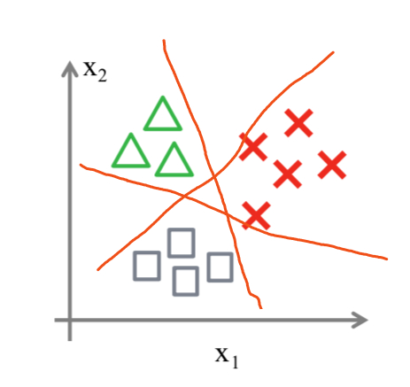

# 2.LR模型

## 1.线性回归（Linear Regression）

- 线性：两个变量之间的关系**是**一次函数关系的——图象**是直线**，叫做线性。
- 非线性：两个变量之间的关系**不是**一次函数关系的——图象**不是直线**，叫做非线性。
- 回归：人们在测量事物的时候因为客观条件所限，求得的都是测量值，而不是事物真实的值，为了能够得到真实值，无限次的进行测量，最后通过这些测量数据计算**回归到真实值**，这就是回归的由来。

### 1.1 计算

**一般表达式**：

$$
Y=w x+b
$$

其中，$w$叫做$x$的系数，$b$叫做偏置项

**损失函数**：MSE

$$
J=\frac{1}{2 m} \sum_{m}^{i=1}\left(y^{\prime}-y\right)^{2}
$$

利用**梯度下降法**找到最小值点，也就是最小误差，最后把 $w$ 和 $b$ 给求出来。

### 1.2 过拟合、欠拟合

使用**正则化项**，也就是给loss function加上一个参数项，正则化项有**L1正则化、L2正则化、ElasticNet**。加入这个正则化项好处：

- 控制参数幅度，不让模型“无法无天”。
- 限制参数搜索空间
- 解决欠拟合与过拟合的问题。

#### （1）L2正则化（岭回归）

方程：$J=J_{0}+\lambda \sum_{w} w^{2}$，其中$J_0$表示上面的 loss function ，在loss function的基础上加入$w$参数的平方和乘以 $\lambda$；

假设：$L=\lambda\left(w_{1}^{2}+w_{2}^{2}\right)$

此时任务变成**在**$L$**约束下求出J取最小值的解。求解**$J_0$**的过程可以画出等值线**。同时L2正则化的函数L也可以在$w_1$ $w_2$的二维平面上画出来。如下图：

$L$表示为图中的黑色圆形，随着梯度下降法的不断逼近，与圆第一次产生交点，而这个交点很难出现在坐标轴上。这就说明了**L2正则化不容易得到稀疏矩阵**，同时为了求出损失函数的最小值，使得w1和w2无限接近于0，达到防止过拟合的问题。

**使用场景**：只要数据线性相关，用Linear Regression拟合的不是很好，**需要正则化**，可以考虑使用岭回归(L2), 如何输入特征的维度很高,而且是稀疏线性关系的话，岭回归就不太合适,考虑使用Lasso回归。

#### （2）L1正则化（Lasso回归）

L1正则化与L2正则化的区别在于惩罚项的不同：

$$
J=J_{0}+\lambda\left(\left|w_{1}\right|+\left|w_{2}\right|\right)
$$

求解$J_0$的过程可以画出等值线。同时L1正则化的函数也可以在$w_1$ $w_2$的二维平面上画出来。如下图：

惩罚项表示为图中的黑色棱形，随着梯度下降法的不断逼近，与棱形第一次产生交点，而这个交点很容易出现在坐标轴上。**这就说明了L1正则化容易得到稀疏矩阵****。** ​

**使用场景**：**L1正则化(Lasso回归)可以使得一些特征的系数变小,甚至还使一些绝对值较小的系数直接变为0**，从而增强模型的泛化能力 。对于高的特征数据,尤其是线性关系是稀疏的，就采用L1正则化(Lasso回归),或者是要在一堆特征里面找出主要的特征，那么L1正则化(Lasso回归)更是首选了。

#### （3）ElasticNet回归

ElasticNet综合了L1正则化项和L2正则化项，以下是它的公式：

$$
\min \left(\frac{1}{2 m}\left[\sum_{i=1}^{m}\left(y_{i}^{\prime}-y_{i}\right)^{2}+\lambda \sum_{j=1}^{n} \theta_{j}^{2}\right]+\lambda \sum_{j=1}^{n}|\theta|\right)
$$

**使用场景**：ElasticNet在我们发现用Lasso回归太过(太多特征被稀疏为0),而岭回归也正则化的不够(回归系数衰减太慢)的时候，可以考虑使用ElasticNet回归来综合，得到比较好的结果。

### 1.4 一些问题

#### （1）线性回归要求因变量服从正态分布

假设线性回归的噪声服从均值为0的正态分布。 当噪声符合正态分布$N(0,\delta^2)$时，因变量则符合正态分布$N(ax(i)+b,\delta^2)$，其中预测函数$y=ax(i)+b$。这个结论可以由正态分布的概率密度函数得到。也就是说**当噪声符合正态分布时，其因变量必然也符合正态分布**。

在用线性回归模型拟合数据之前，首先要求数据应符合或近似符合正态分布，否则得到的拟合函数不正确。

## 2.逻辑回归（Logistics Regression）

逻辑回归是用来做**分类算法**的，大家都熟悉线性回归，一般形式是$Y=aX+b$，y的取值范围是$[-∞, +∞]$，有这么多取值，怎么进行分类呢？不用担心，伟大的数学家已经为我们找到了一个方法。

也就是把$Y$的结果带入一个非线性变换的**Sigmoid函数**中，即可得到$[0,1]$之间取值范围的数`S`，`S`可以把它看成是一个概率值，如果设置概率阈值为0.5，那么S大于0.5可以看成是正样本，小于0.5看成是负样本，就可以进行分类了。

### 2.1 Sigmoid函数

函数公式：

$$
S(t)=\frac{1}{1+e^{-t}}
$$

函数中`t`无论取什么值，其结果都在`[0,-1]`的区间内，回想一下，一个分类问题就有两种答案，一种是“是”，一种是“否”，那0对应着“否”，1对应着“是”;

好了，接下来把$aX+b$带入$t$中就得到了我们的逻辑回归的一般模型方程：

$$
H(a, b)=\frac{1}{1+e^{(a X+b)}}
$$

结果P也可以理解为概率，换句话说概率大于0.5的属于1分类，概率小于0.5的属于0分类，这就达到了分类的目的。

### 2.2 损失函数

逻辑回归的损失函数是 **log loss**，也就是**对数似然函数**，函数公式如下：

$$
\operatorname{Cost}\left(h_{\theta}(x), y\right)=\left\{\begin{aligned}-\log \left(h_{\theta}(x)\right) & \text { if } y=1 \\ -\log \left(1-h_{\theta}(x)\right) & \text { if } y=0\end{aligned}\right.
$$

公式中的 `y=1` 表示的是真实值为1时用第一个公式，真实 `y=0` 用第二个公式计算损失。

为什么要加上log函数呢？可以试想一下，当真实样本为1是，但`h=0`概率，那么`log0=∞`，这就对模型最大的惩罚力度；当`h=1`时，那么`log1=0`，相当于没有惩罚，也就是没有损失，达到最优结果。所以数学家就想出了用log函数来表示损失函数。

最后按照梯度下降法一样，求解极小值点，得到想要的模型效果。

### 2.3 逻辑回归常用优化方法

#### （1）一阶方法

梯度下降、随机梯度下降、mini 随机梯度下降降法。随机梯度下降不但速度上比原始梯度下降要快，局部最优化问题时可以一定程度上抑制局部最优解的发生。

#### （2）二阶方法：牛顿法、拟牛顿法：

这里详细说一下牛顿法的基本原理和牛顿法的应用方式。

牛顿法其实就是**通过切线与x轴的交点不断更新切线的位置，直到达到曲线与x轴的交点得到方程解**。在实际应用中我们因为常常要求解凸优化问题，也就是要求解函数一阶导数为0的位置，而牛顿法恰好可以给这种问题提供解决方法。实际应用中牛顿法首先选择一个点作为起始点，并进行一次二阶泰勒展开得到导数为0的点进行一个更新，直到达到要求，这时牛顿法也就成了二阶求解问题，比一阶方法更快。常常看到的x通常为一个多维向量，这也就引出了Hessian矩阵的概念（就是x的二阶导数矩阵）。

缺点：牛顿法是定长迭代，没有步长因子，所以不能保证函数值稳定的下降，严重时甚至会失败。还有就是牛顿法要求函数一定是二阶可导的。而且计算Hessian矩阵的逆复杂度很大。

拟牛顿法： **不用二阶偏导而是构造出Hessian矩阵的近似正定对称矩阵的方法称为拟牛顿**法。拟牛顿法的思路就是用一个特别的表达形式来模拟Hessian矩阵或者是他的逆使得表达式满足拟牛顿条件。主要有DFP法（逼近Hession的逆）、BFGS（直接逼近Hession矩阵）、 L-BFGS（可以减少BFGS所需的存储空间）。

### 2.4 一些问题

#### （1）优点

- LR能以概率的形式输出结果，而非只是0,1判定。
- LR的可解释性强，可控度高。
- 训练快，feature engineering之后效果赞。
- 因为结果是概率，可以做ranking model。

#### （2）应用

- CTR预估/推荐系统的learning to rank/各种分类场景。
- 某搜索引擎厂的广告CTR预估基线版是LR。
- 某电商搜索排序/广告CTR预估基线版是LR。
- 某电商的购物搭配推荐用了大量LR。
- 某现在一天广告赚1000w+的新闻app排序基线是LR。

#### （3）可以多分类吗？

可以的，其实可以从二分类问题过度到多分类问题(one vs rest)，思路步骤如下：

1. 将类型`class 1`看作正样本，其他类型全部看作负样本，然后就可以得到样本标记类型为该类型的概率`p1`。
2. 然后再将另外类型`class 2`看作正样本，其他类型全部看作负样本，同理得到`p2`。
3. 以此循环，可以得到该待预测样本的标记类型分别为类型`class i`时的概率`pi`，最后\*\*取`pi`\*\***中最大的那个概率对应的样本标记类型作为我们的待预测样本类型**。

总之还是以二分类来依次划分，并求出最大概率结果。

#### （4）为什么要对特征离散化

1. **非线性！非线性！非线性！** 逻辑回归属于广义线性模型，表达能力受限；单变量离散化为N个后，每个变量有单独的权重，相当于为模型引入了非线性，能够提升模型表达能力，加大拟合； 离散特征的增加和减少都很容易，易于模型的快速迭代；
2. **速度快！速度快！速度快！** 稀疏向量内积乘法运算速度快，计算结果方便存储，容易扩展；
3. **鲁棒性！鲁棒性！鲁棒性！** 离散化后的特征对异常数据有很强的鲁棒性：比如一个特征是年龄>30是1，否则0。如果特征没有离散化，一个异常数据“年龄300岁”会给模型造成很大的干扰；
4. **方便交叉与特征组合**：离散化后可以进行特征交叉，由M+N个变量变为M\*N个变量，进一步引入非线性，提升表达能力；
5. **稳定性**：特征离散化后，模型会更稳定，比如如果对用户年龄离散化，20-30作为一个区间，不会因为一个用户年龄长了一岁就变成一个完全不同的人。当然处于区间相邻处的样本会刚好相反，所以怎么划分区间是门学问；
6. **简化模型**：特征离散化以后，起到了简化了逻辑回归模型的作用，降低了模型过拟合的风险。

#### （5）目标函数中增大L1正则化会怎么样？

所有的参数w都会变成0。

## 3.一些题目

#### （1）LR是不是凸优化问题，如何判断LR达到最优值

逻辑回归（Logistic Regression，简称LR）是一个用于解决二分类或多分类问题的经典算法。在逻辑回归中，使用一个sigmoid函数（或softmax函数在多分类情况下）来预测事件发生的概率，并通过极大似然估计来拟合模型参数。为了最小化误差，逻辑回归的目标函数通常是一个对数似然函数的负数，这样的目标函数在某些情况下是凸函数。

对于二分类问题，逻辑回归的目标函数（损失函数）可以表示为：

$$
[ L(\theta) = -\sum_{i=1}^{n} [y_i \log(h_\theta(x_i)) + (1 - y_i) \log(1 - h_\theta(x_i))] ]
$$

其中 $h_\theta(x) = \frac{1}{1 + e^{-\theta^Tx}}$ 是sigmoid函数，$y_i \in \{-1, 1\}$ 是标签，$\theta$ 是模型参数。

通过计算目标函数的二阶导数，**可以发现该函数是凸函数**。这意味着逻辑回归的损失函数在定义域内具有良好的性质，即任何局部最小值都是全局最小值。

逻辑回归作为一种凸优化问题，其目标是最小化损失函数。由于损失函数是凸函数，任何找到的局部最小值都是全局最小值。然而，逻辑回归并没有解析解，这意味着我们不能直接计算出参数$\theta$ 的确切值来达到全局最小值。因此，通常使用迭代优化算法，如梯度下降（Gradient Descent）、牛顿法（Newton's Method）或其他优化方法来逼近这个最小值。

#### （2）LR，SVM, xgboost如何防止过拟合

- LR一般采用L1和L2正则化（权重衰减）；
- **加入软间隔**：SVM引入了松弛变量，引入松弛变量使SVM能够容忍异常点的存在，很好的缓解了过拟合，SVM的最小化$||w||$本质上是要最大化间隔，但同时也是一种**正则化方法**，可以看作是对模型的结构约束，这样可以筛选掉一部分w很大的模型，削减假设空间，控制求解的模型是我们希望的，从而缓解过拟合。
- XGBT可以控制树的深度、最大叶子结点数目、列采样等方法；

#### （3）LR和树模型，离散特征和连续特征怎么处理

**逻辑回归（LR）**：逻辑回归通常用于解决二分类或多分类问题，在处理特征时，它**倾向于使用离散化或转换后的特征**。

- **连续特征**：
  - **离散化**：将连续特征转换为一系列的0、1特征，从而增强模型的非线性能力，使得逻辑回归能够更好地拟合数据。
  - **归一化/标准化**：如果直接使用连续特征而不离散化的话，通常会对特征进行归一化或标准化处理，以确保不同尺度的特征不会影响模型的学习过程。
- **离散特征**：
  - **独热编码（One-Hot Encoding）**：将类别特征转换为多个二元特征，每个类别对应一个特征。
  - **标签编码（Label Encoding）**：有时也可以使用标签编码，但这通常适用于类别数目较少的情况，且需要注意避免引入不必要的顺序关系。
  - **嵌入编码（Embedding Encoding）**：对于高维的离散特征，可以使用嵌入编码将高维特征映射到较低维度的空间。
  - **目标编码（Target Encoding）**：对于某些场景，可以使用目标编码，这是一种基于目标变量的概率编码方法。

**树模型**

- **连续特征**
  - **不需要离散化**：树模型可以直接使用连续特征，因为它通过寻找最佳分割点来进行分裂，从而不需要像逻辑回归那样进行离散化处理。
  - **缩放处理**：尽管树模型对特征缩放不敏感，但在某些情况下，如特征重要性分析时，进行缩放处理可能会更有帮助。
- **离散特征**
  - **不需要独热编码**：树模型可以直接处理离散特征，它会在内部自动寻找最佳的分裂点。
  - **标签编码**：有时也可以直接使用标签编码，尤其是在类别数目不多的情况下。
  - **多值离散化**：对于多值离散特征，可以通过构造特征交叉或者使用其他编码方式来增强模型的表达能力。

总的来说，逻辑回归倾向于将连续特征离散化，而树模型则不需要这样做。此外，逻辑回归在处理离散特征时往往需要进行编码，而树模型则可以直接处理未经编码的离散特征。

#### （4）线性回归可以求闭式解，逻辑回归可以吗，为什么，LR用什么求解参数，为什么要用梯度下降算法

- 不能：最大似然估计下没有。有近似解，如果是非最大似然估计，那么是可能推导出解析解的，也可以理解为是最大似然估计下的近似解。
- 因为他的目标函数是凸函数，存在极小值，所以通过梯度下降法，或者牛顿迭代法都能计算出最优解。

#### （5）概率和似然的区别

在数理统计中，两个术语则有不同的意思。“概率”描述了给定模型参数后，描述结果的合理性，而不涉及任何观察到的数据。而“似然”则描述了给定了特定观测值后，描述模型参数是否合理。

概率和似然都是指可能性，但在统计学中，概率和似然有截然不同的用法。

- 概率描述了已知参数时的随机变量的输出结果;
- 似然则用来描述已知随机变量输出结果时，未知参数的可能取值。

#### （6）最大似然估计和后验概率的区别，分别用LR来推导损失函数的话有什么区别（乘以W的先验概率）

最大似然估计（Maximum Likelihood Estimation, MLE）和后验概率（Posterior Probability）是两种不同的概念，它们分别代表了不同的统计推断方法。

**最大似然估计（MLE）：**一种用于估计模型参数的技术，其**核心思想是在给定的观测数据下，寻找使得数据出现概率最大的参数值。**

- 在数学上，最大似然估计是通过最大化似然函数来完成的。似然函数是基于已知数据，表达不同参数值使得数据出现的可能性的函数。如果模型参数记为 $\theta$ ，并且有一组观测数据$D$ ，那么最大似然估计的目标就是找到参数 $\theta$ ，使得似然函数 $L(\theta|D) = P(D|\theta) $达到最大。
- 在逻辑回归（Logistic Regression, LR）中，损失函数通常是交叉熵损失（Cross Entropy Loss），它等价于对数似然函数的负值。即，最小化损失函数，实际上是在最大化对数似然函数。对于一组独立同分布（i.i.d.）的数据点，损失函数可以写成：$L(\theta) = -\sum_{i=1}^{n} \left[y_i \ln(P(y_i=1|\mathbf{x}_i,\theta)) + (1-y_i) \ln(1-P(y_i=1|\mathbf{x}_i,\theta))\right] $
- 其中  $P(y_i=1|\mathbf{x}_i,\theta)$ 是给定输入 $\mathbf{x}_i$  和参数 $\theta$  时，输出  $y_i=1$ 的概率。

**后验概率**：是贝叶斯统计中的概念 **，指的是在给定观测数据后，模型参数的真实值的概率分布。** 后验概率通过贝叶斯公式来计算，它将先验概率（Prior Probability）与似然函数相结合。在贝叶斯框架下，参数被视为随机变量，具有某种先验分布。后验概率可以写作：$P(\theta|D) = \frac{P(D|\theta)P(\theta)}{P(D)}$&#x20;

- 其中  $P(\theta)$ 是参数的先验概率， $P(D)$  是边缘似然（Marginal Likelihood），它是一个归一化常数，确保后验概率是一个有效的概率分布。
