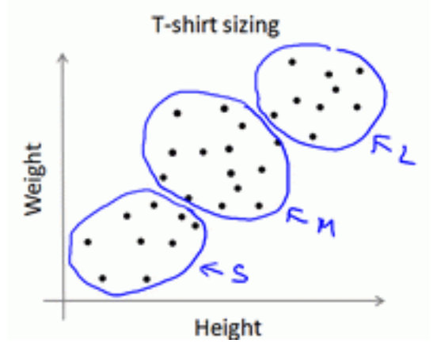

# 4.EM & 聚类

## 1.EM算法

最大期望算法（Expectation-maximization algorithm，又译为期望最大化算法），是在概率模型中寻找参数最大似然估计或者最大后验估计的算法，其中概率模型依赖于无法观测的隐性变量。

最大期望算法经过两个步骤交替进行计算，

- **第一步**是计算期望（E），**利用对隐藏变量的现有估计值，计算其最大似然估计值**；&#x20;
- **第二步**是最大化（M），**最大化在E步上求得的最大似然值来计算参数的值**。
- M步上找到的参数估计值被用于下一个E步计算中，这个过程不断交替进行。

极大似然估计用一句话概括就是：知道结果，反推条件$θ$。

### 1.1 似然函数

在数理统计学中，**似然函数**是一种关于统计模型中的参数的函数，表示模型参数中的似然性。“似然性”与“或然性”或“概率”意思相近，都是指某种事件发生的可能性。**而极大似然就相当于最大可能的意思****。** ​

**多数情况下是根据已知条件来推算结果，而最大似然估计是已经知道了结果，然后寻求使该结果出现的可能性最大的条件，以此作为估计值。**

### 1.2 极大似然函数的求解步骤

假定要从10万个人当中抽取100个人来做身高统计，那么抽到这100个人的概率就是(概率连乘):

$$
L(\theta)=L\left(x_{1}, \ldots, x_{n} \mid \theta\right)=\prod_{i=1}^{n} p\left(x_{i} \mid \theta\right), \theta \in \ominus
$$

现在要求的就是这个 $\theta$值，也就是使得 $L(\theta)$ 的概率最大化，那么这时的参数 $\theta$ 就是所求。

为了便于分析，可以定义对数似然函数，将其变成连加的形式：

$$
H(\theta)=\ln L(\theta)=\ln \prod_{i=1}^{n} p\left(x_{i} \mid \theta\right)=\sum_{i=1}^{n} \ln p\left(x_{i} \mid \theta\right)
$$

对于求一个函数的极值，最直接的设想是求导，然后让导数为0，那么解这个方程得到的$θ$就是了（当然，前提是函数$L(θ)$连续可微）。但，如果θ是包含多个参数的向量那怎么处理呢？当然是求$L(θ)$对所有参数的偏导数，也就是梯度了，从而`n`个未知的参数，就有`n`个方程，方程组的解就是似然函数的极值点了，最终得到这`n`个参数的值。

求极大似然函数估计值的一般步骤：

1. 写出似然函数；
2. 对似然函数取对数，并整理；
3. 求导数，令导数为0，得到似然方程；
4. 解似然方程，得到的参数即为所求；

### 1.3 EM算法求解步骤

1. 随机初始化分布参数 $\theta$
2. E步：求Q函数，对于每一个`i`，计算根据上一次迭代的模型参数来计算出隐型变量的后验概率（其实就是隐形变量的期望），来作为隐藏变量的现估计值：
   $$
   Q_{i}\left(z^{(i)}\right)=p\left(z^{(i)} \mid x^{(i)} ; \theta\right)
   $$
3. M步：求使Q函数获得极大时的参数取值，将似然函数最大或获得最新的参数值：
   $$
   \theta=\operatorname{argmax} \sum_{i} \sum_{z^{(i)}} Q_{i}\left(z^{(i)}\right) \log \frac{p\left(x^{(i)}, z^{(i)} ; \theta\right)}{Q_{i}\left(z^{(i)}\right)}
   $$
4. 然后循环重复2、3步骤直到收敛

### 1.4 使用EM算法的模型

用EM算法求解的模型一般有GMM或者协同过滤，k-means其实也属于EM。EM算法一定会收敛，但是可能收敛到局部最优。由于求和的项数将随着隐变量的数目指数上升，会给梯度计算带来麻烦。

## 2.k-means算法

什么是聚类算法？聚类是一种机器学习技术，它涉及到数据点的分组。给定一组数据点，我们可以使用聚类算法将每个数据点划分为一个特定的组。理论上，同一组中的数据点应该具有相似的属性和/或特征，而不同组中的数据点应该具有高度不同的属性和/或特征。**聚类是一种无监督学习的方法**，是许多领域中常用的统计数据分析技术。

### 2.1 算法过程

K-means是最普及的聚类算法，算法接受一个未标记的数据集，然后将数据聚类成不同的组。

K-means是一个迭代算法，假设想要将数据聚类成 `n` 个组，其方法为:

- 首先选择`𝐾`个随机的点，称为**聚类中心（cluster centroids）**；
- 对于数据集中的每一个数据，按照距离`𝐾`个中心点的距离，将其与距离最近的中心点关联起来，与同一个中心点关联的所有点聚成一类。
- 计算每一个组的平均值，将该组所关联的中心点移动到平均值的位置。
- 重复步骤，直至中心点不再变化。

用$u^{1}, u^{2}, \ldots, u^{k}$来表示聚类中心，用$𝑐(1),𝑐(2),...,𝑐(𝑚)$来存储与第`𝑖`个实例数据最近的聚类中心的索引，K-means算法的伪代码如下：

```pascal
Repeat {
    for i = 1 to m
    c(i) := index (form 1 to K) of cluster centroid closest to x(i)
    for k = 1 to K
    μk := average (mean) of points assigned to cluster k
}
```

算法分为两个步骤，第一个 for 循环是赋值步骤，即：对于每一个样例`𝑖`，计算其应该属于的类。第二个 for 循环是聚类中心的移动，即：对于每一个类`𝐾`，重新计算该类的质心。

K-means算法也可以很便利地用于将数据分为许多不同组，即使在没有非常明显区分的组群的情况下也可以。下图所示的数据集包含身高和体重两项特征构成的，利用 K-均值算法将数据分为三类，用于帮助确定将要生产的 T-恤衫的三种尺寸。



### 2.2 损失函数

K-均值最小化问题，是要**最小化所有的数据点与其所关联的聚类中心点之间的距离之和**，因此 K-均值的代价函数（又称畸变函数 Distortion function）为：

$$
J\left(c^{(1)}, c^{(2)}, \ldots, c^{(m)}, u_{1}, \ldots, u_{k}\right)=\frac{1}{m} \sum_{i=1}^{m}\left\|X^{(1)}-u_{c^{(i)}}\right\|^{2}
$$

其中 $u_c^{(i)}$代表与$x^{(i)}$最近的聚类中心点。 我们的的优化目标便是找出使得代价函数最小的 $c^{(1)},c^{(2)},...,c^{(m)}$和$u_1,u_2,...,u_k$

### 2.3 k值的选择

在运行 K-均值算法的之前，我们首先要随机初始化所有的聚类中心点，下面介绍怎样做：

1. 我们应该选择`𝐾 < 𝑚`，即聚类中心点的个数要小于所有训练集实例的数量。
2. 随机选择`𝐾`个训练实例，然后令𝐾个聚类中心分别与这`𝐾`个训练实例相等K-均值的一个问题在于，它有可能会停留在一个局部最小值处，而这取决于初始化的情况。

为了解决这个问题，我们通常需要多次运行 K-均值算法，每一次都重新进行随机初始化，最后再比较多次运行 K-均值的结果，选择代价函数最小的结果。这种方法在`𝐾`较小的时候（2--10）还是可行的，**但是如果**\*\*`𝐾`\*\***较大，这么做也可能不会有明显地改善。**

### 2.4 KNN和K-means区别

K最近邻(k-Nearest Neighbor，KNN)分类算法，是一个理论上比较成熟的方法，也是最简单的机器学习算法之一。

| KNN                                                                       | K-Means                                                                          |
| ------------------------------------------------------------------------- | -------------------------------------------------------------------------------- |
| 1.KNN是分类算法  &#xA;2.属于监督学习  &#xA;3.训练数据集是带label的数据                         | 1.K-Means是聚类算法  &#xA;2.属于非监督学习  &#xA;3.训练数据集是无label的数据，是杂乱无章的，经过聚类后变得有序，先无序，后有序。 |
| 没有明显的前期训练过程，属于memory based learning                                       | 有明显的前期训练过程                                                                       |
| K的含义：一个样本x，对它进行分类，就从训练数据集中，在x附近找离它最近的K个数据点，这K个数据点，类别c占的个数最多，就把x的label设为c。 | K的含义：K是人工固定好的数字，假设数据集合可以分为K个蔟，那么就利用训练数据来训练出这K个分类。                                |

**相似点**

都包含这样的过程，给定一个点，在数据集中找离它最近的点。即二者都用到了NN(Nears Neighbor)算法思想。

### 2.5 K-Means优缺点及改进

k-means：在大数据的条件下，会耗费大量的时间和内存。 优化k-means的建议：

1. 减少聚类的数目K。因为，每个样本都要跟类中心计算距离。
2. 减少样本的特征维度。比如说，通过PCA等进行降维。
3. 考察其他的聚类算法，通过选取toy数据，去测试不同聚类算法的性能。
4. hadoop集群，K-means算法是很容易进行并行计算的。
5. 算法可能找到局部最优的聚类，而不是全局最优的聚类。使用改进的二分k-means算法。

二分k-means算法：首先将整个数据集看成一个簇，然后进行一次k-means（k=2）算法将该簇一分为二，并计算每个簇的误差平方和，选择平方和最大的簇迭代上述过程再次一分为二，直至簇数达到用户指定的k为止，此时可以达到的全局最优。

## 3.高斯混合模型（GMM）

### 3.1 GMM思想

高斯混合模型（Gaussian Mixed Model，GMM）也是一种常见的聚类算法，与K均值算法类似，同样使用了EM算法进行迭代计算。高斯混合模型假设每个簇的数据都是符合高斯分布（又叫正态分布）的，当前**数据呈现的分布就是各个簇的高斯分布叠加在一起的结果。**

> 第一张图是一个数据分布的样例，如果只用一个高斯分布来拟合图中的数据，图 中所示的椭圆即为高斯分布的二倍标准差所对应的椭圆。直观来说，图中的数据 明显分为两簇，因此只用一个高斯分布来拟和是不太合理的，需要推广到用多个 高斯分布的叠加来对数据进行拟合。

> 第二张图是用两个高斯分布的叠加来拟合得到的结果。**这就引出了高斯混合模型，即用多个高斯分布函数的线形组合来对数据分布进行拟合。** 理论上，高斯混合模型可以拟合出任意类型的分布。


高斯混合模型的核心思想是，**假设数据可以看作从多个高斯分布中生成出来的**。在该假设下，每个单独的分模型都是标准高斯模型，其均值 $u_i$ 和方差 $\sum_{i}$是待估计的参数。此外，每个分模型都还有一个参数 $\pi_i$，可以理解为权重或生成数据的概 率。高斯混合模型的公式为：

$$
p(x)=\sum_{i=1}^{k} \pi_{i} N\left(x \mid u_{i}, \sum_{i}\right)
$$

通常并不能直接得到高斯混合模型的参数，而是观察到了一系列数据点，给出一个类别的数量`K`后，希望求得最佳的`K`个高斯分模型。因此，高斯混合模型的计算，便成了最佳的均值$μ$，方差$Σ$、权重$π$的寻找，这类问题通常通过最大似然估计来求解。遗憾的是，此问题中直接使用最大似然估计，得到的是一 个复杂的非凸函数，目标函数是和的对数，难以展开和对其求偏导。

\*\*在这种情况下，可以用EM算法。 \*\*EM算法是在最大化目标函数时，先固定一个变量使整体函数变为凸优化函数，求导得到最值，然后利用最优参数更新被固定的变量，进入下一个循环。具体到高 斯混合模型的求解，EM算法的迭代过程如下。

首先，初始随机选择各参数的值。然后，重复下述两步，直到收敛。

- E步骤。根据当前的参数，计算每个点由某个分模型生成的概率。
- M步骤。使用E步骤估计出的概率，来改进每个分模型的均值，方差和权重。

> 高斯混合模型是一个生成式模型。可以这样理解数据的生成过程，假设一个最简单的情况，即只有两个一维标准高斯分布的分模型$N(0,1)$和$N(5,1)$，其权重分别为0.7和0.3。那么，在生成第一个数据点时，先按照权重的比例，随机选择一个分布，比如选择第一个高斯分布，接着从$N(0,1)$中生成一个点，如−0.5，便是第一个数据点。在生成第二个数据点时，随机选择到第二个高斯分布$N(5,1)$，生成了第二个点4.7。如此循环执行，便生成出了所有的数据点。

也就是说，我们并不知道最佳的K个高斯分布的各自3个参数，也不知道每个 数据点究竟是哪个高斯分布生成的。所以每次循环时，**先固定当前的高斯分布不 变，获得每个数据点由各个高斯分布生成的概率。然后固定该生成概率不变，根据数据点和生成概率，获得一个组更佳的高斯分布。** 循环往复，直到参数的不再变化，或者变化非常小时，便得到了比较合理的一组高斯分布。

### 3.2 GMM与K-Means相比

高斯混合模型与K均值算法的相同点是：

- 它们都是可用于聚类的算法；
- 都需要 指定`K`值；
- 都是使用EM算法来求解；
- 都往往只能收敛于局部最优。

而它相比于K 均值算法的优点是，可以给出一个样本属于某类的概率是多少；不仅仅可以用于聚类，还可以用于概率密度的估计；并且可以用于生成新的样本点。

## 4.聚类算法的评估

由于数据以及需求的多样性，没有一种算法能够适用于所有的数据类型、数据簇或应用场景，似乎每种情况都可能需要一种不同的评估方法或度量标准。例 如，K均值聚类可以用误差平方和来评估，但是基于密度的数据簇可能不是球形， 误差平方和则会失效。在许多情况下，判断聚类算法结果的好坏强烈依赖于主观 解释。尽管如此，聚类算法的评估还是必需的，它是聚类分析中十分重要的部分之一。

聚类评估的任务是估计在数据集上进行聚类的可行性，以及聚类方法产生结 果的质量。这一过程又分为三个子任务。

1. **估计聚类趋势****。** 这一步骤是检测数据分布中是否存在非随机的簇结构。如果数据是基本随机 的，那么聚类的结果也是毫无意义的。我们可以观察聚类误差是否随聚类类别数 量的增加而单调变化，如果数据是基本随机的，即不存在非随机簇结构，那么聚 类误差随聚类类别数量增加而变化的幅度应该较不显著，并且也找不到一个合适 的K对应数据的真实簇数。
2. **判定数据簇数****。** 确定聚类趋势之后，我们需要找到与真实数据分布最为吻合的簇数，据此判定聚类结果的质量。数据簇数的判定方法有很多，例如手肘法和Gap Statistic方 法。需要说明的是，用于评估的最佳数据簇数可能与程序输出的簇数是不同的。 例如，有些聚类算法可以自动地确定数据的簇数，但可能与我们通过其他方法确 定的最优数据簇数有所差别。
3. **测定聚类质量****。** 在无监督的情况下，我们可以通过考察簇的分离情况和簇的紧 凑情况来评估聚类的效果。定义评估指标可以展现面试者实际解决和分析问题的 能力。事实上测量指标可以有很多种，以下列出了几种常用的度量指标，更多的 指标可以阅读相关文献。

   轮廓系数、均方根标准偏差、R方（R-Square）、改进的HubertΓ统计。

## 5.一些问题

#### （1）介绍kmeans，与其他聚类算法的对比

- K-means 是我们最常用的基于欧式距离的聚类算法，其认为两个目标的距离越近，相似度越大；
- 所以 K-means 的算法步骤为：
  1. 选择初始化的 k 个样本作为初始聚类中心  $a=a_{1}, a_{2}, \ldots a_{k}$；
  2. 针对数据集中每个样本  计算它到 k 个聚类中心的距离并将其分到距离最小的聚类中心所对应的类中 $x_i$；
  3. 针对每个类别，重新计算它的聚类中心  $a_{j}=\frac{1}{\left|c_{i}\right|} \sum_{x \in c_{i}} x$（即属于该类的所有样本的质心）；
  4. 重复上面 2 3 两步操作，直到达到某个中止条件（迭代次数、最小误差变化等）。
- 优点：
  - 容易理解，聚类效果不错，虽然是局部最优， 但往往局部最优就够了；
  - 处理大数据集的时候，该算法可以保证较好的伸缩性；
  - 当簇近似高斯分布的时候，效果非常不错；
  - 算法复杂度低。
- 缺点：
  - K 值需要人为设定，不同 K 值得到的结果不一样；
  - 对初始的簇中心敏感，不同选取方式会得到不同结果；
  - 对异常值敏感；
  - 样本只能归为一类，不适合多分类任务；
  - 不适合太离散的分类、样本类别不平衡的分类、非凸形状的分类。

#### （2）讲讲Kmeans、EM算法

K-means算法和EM算法都是在无监督学习中广泛应用的聚类算法，但它们各自有着不同的特点和适用场景。

##### **K-means算法**

K-means是一种简单而流行的聚类算法，它试图将数据划分为K个聚类，使得每个聚类内部数据点之间的平方误差最小。K-means算法采用迭代方法，通过计算样本点到聚类中心的距离来更新聚类。具体步骤包括：

1. **初始化**：选择K个初始聚类中心。
2. **分配**：计算每个数据点与各个聚类中心的距离，并将每个数据点分配给最近的聚类中心。
3. **更新**：根据每个聚类中的所有数据点，重新计算聚类中心（通常是聚类中所有点的均值）。
4. **迭代**：重复上述步骤2和3，直到聚类中心不再发生变化或变化小于某个阈值为止。

K-means算法的优点在于其简单易实现，并且对于大规模数据集来说效率较高。然而，它也有一些缺点，如需要预先知道聚类数目K，对初始值敏感，以及对于非球形的聚类形状表现不佳。

##### **EM算法**

EM算法，即期望最大化（Expectation-Maximization）算法，是一种迭代优化策略，它主要用于含有隐变量的概率模型参数估计。EM算法在每次迭代中包含两个步骤：E步（期望步）和M步（最大化步）：

- **E步**：在当前参数估计下，计算隐变量的后验概率分布。
- **M步**：基于E步得到的后验概率分布，通过极大化对数似然函数来更新模型参数。

EM算法广泛应用于处理含有隐变量的模型，如高斯混合模型（GMM）、隐马尔可夫模型（HMM）等。EM算法的优点在于能够处理隐含的数据结构，使得模型更加灵活和强大。然而，EM算法同样存在一些局限性，比如它可能会收敛到局部最优解，而不是全局最优解。

##### **K-means与EM算法的联系与区别**

K-means算法可以视为EM算法的一个特例。当我们考虑一个高斯混合模型（GMM），其中每个分量的协方差矩阵均为常数时，K-means可以被看作是GMM的EM解法的一个特例。在这个意义上，K-means进行的是“硬分配”（hard assignment），即每个数据点仅属于一个聚类；而GMM的EM解法则基于后验概率分布，对数据点进行“软分配”（soft assignment），即每个高斯模型对数据聚类都有不同程度的贡献。

总之，K-means适用于数据大致呈球形分布并且聚类数目已知的情况，而EM算法则更适合处理含有隐变量的复杂模型，特别是当数据分布不是简单的球形时。

#### （3）无监督学习，半监督学习，有监督学习的区别

- **有监督学习** 需要大量带有标签的数据，目标是学习输入与输出之间的映射关系。
- **无监督学习** 不需要标签，目标是发现数据中的结构或模式。
- **半监督学习** 则是利用标记数据和未标记数据的组合来增强模型的学习能力，特别是在标记数据稀缺时尤为有用。
