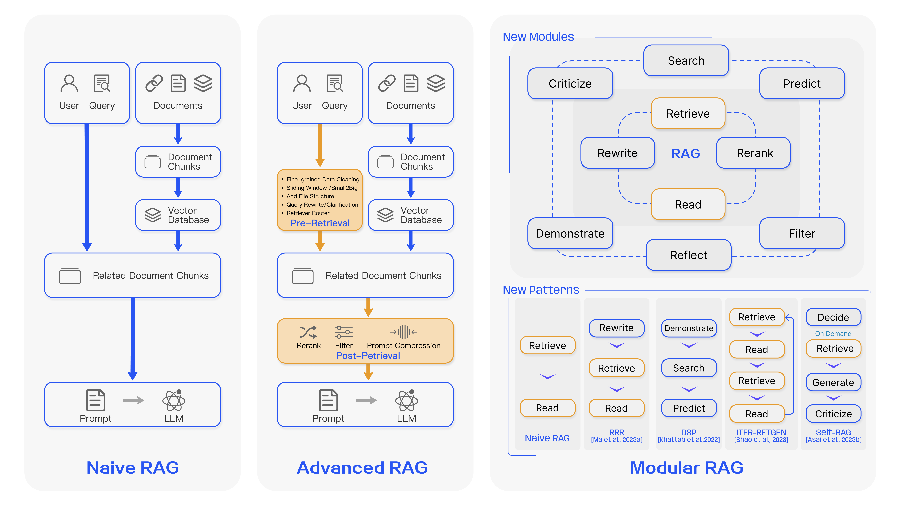

# 综述-面向大模型的检索增强生成（RAG）

- 论文：Retrieval-Augmented Generation for Large Language Models: A Survey
- 链接：[https://arxiv.org/abs/2312.10997](https://arxiv.org/abs/2312.10997 "https://arxiv.org/abs/2312.10997")
- 翻译：[https://baoyu.io/translations/ai-paper/2312.10997-retrieval-augmented-generation-for-large-language-models-a-survey](https://baoyu.io/translations/ai-paper/2312.10997-retrieval-augmented-generation-for-large-language-models-a-survey "https://baoyu.io/translations/ai-paper/2312.10997-retrieval-augmented-generation-for-large-language-models-a-survey")

## 1.概念和意义

### 1.1 概念

既然是综述，还是要先重申一下概念，这里直接摘录论文原文：

> In the era of Large Language Models, the specific definition of RAG refers to the model, when answering questions or generating text, first **retrieving** relevant information from a vast corpus of documents. Subsequently, it **utilizes** this retrieved information to generate responses or text, thereby enhancing the quality of predictions.

这里提及两个关键步骤，其实只要有这俩步骤，都能称为RAG了，这也是RAG最核心的两个部分：

- **retrieving**：从语料、文档中进行检索。
- **utilizes**：使用检索结果来提升预测质量。

为什么要做这个来增强，而不选择比较容易想到的微调来做，这里提及了RAG的优势以及和微调的差异，在这里列出，主要是为了让大家在进行问题定位和解决方案思考时能参考，权衡好什么时候该该哪些部分。

- **使用外部知识**，能有效提升大模型生成时的可靠度。
- **检索库的更新机制能让大模型的生成更具及时性**，不需要进行训练就能更新回答。
- **可解释性强**，可以通过信息来源核实回复的准确性。
- **具备高度定制能力**，通过特定领域的知识库，即可快速让大模型具备该领域的能力。
- **安全和隐私管理能力**，通过约束知识库的权限，能精准实现安全控制。
- **数据上具备很强的可拓展性**，海量数据直接更新到数据库即可立刻完成大模型的知识更新。
- **知识更新的同时，不需要训练模型**，更经济实惠。
- **结果更加确定而可控**，RAG检索结果直接对应最终结果，微调并不能保证模型学不会或者学歪。

### 1.2 RAG和微调

| 特征比较    | RAG                                        | 微调 (Fine-tuning)                              |
| ------- | ------------------------------------------ | --------------------------------------------- |
| 知识更新    | 直接更新检索知识库，确保信息持续更新，无需频繁重新训练，非常适合动态变化的数据环境。 | 存储静态数据，需要重新训练用于知识和数据的更新。                      |
| 外部知识    | 擅长利用外部资源，特别适合处理文档或其他结构化/非结构化数据库。           | 可用于将预训练中外部学习到的知识与大语言模型保持一致，但对于频繁变化的数据源可能不太实用。 |
| 数据处理    | 对数据的处理和操作要求极低。                             | 依赖于构建高质量的数据集，有限的数据集可能无法显著提高性能。                |
| 模型定制    | 侧重于信息检索和融合外部知识，但可能无法充分定制模型行为或写作风格。         | 允许根据特定风格或术语调整 LLM 行为、写作风格或特定领域知识。             |
| 可解释性    | 答案能够追溯到具体的数据来源，提供更高的可解释性和可追踪性。             | 就像一个黑盒子，并不总是清楚模型为什么会做出某种反应，可解释性相对较低。          |
| 计算资源    | 需要计算资源来支持检索策略和数据库相关技术。外部数据源的整合和更新需保持维护。    | 有必要准备和整理高质量的训练数据集，确定微调目标，并提供相应的计算资源。          |
| 延迟要求    | 因涉及数据检索，可能带来较高的延迟。                         | 经过微调的大语言模型 (LLM) 可以不通过检索直接回应，降低延迟。            |
| 降低幻觉    | 由于每个回答都基于检索到的实际证据，因此本质上更不容易产生错误或虚构的回答。     | 根据特定领域的数据训练模型，有助于减少幻觉，但面对未训练过的输入时仍可能出现幻觉。     |
| 伦理和隐私问题 | 从外部数据库存储和检索文本可能引起伦理和隐私方面的担忧。               | 训练数据中的敏感内容可能会引起伦理和隐私方面的问题。                    |

## 2.RAG的迭代升级路径

RAG的迭代升级，主要分三个阶段，分别是原始RAG、高级RAG、模块化RAG，三者的大致区别是这样的：

显然，RAG的建立并非一蹴而就的，以原始RAG为起点，完成初步功能，在此基础上逐步升级，形成高级RAG，而这些迭代升级的组件也会逐步形成完整的模块独立承担重要功能，形成了模块化RAG。

原始RAG，只是具备了RAG最基础的部分，离线索引构造、在线检索以及大模型生成，高级RAG则是在这3个流程里增加更多细化的工作，用于进一步优化，例如数据预处理、滑动窗口、文章切片等，重点在检索层面的优化，提升检索模块的质量，而模块化RAG则是一个更为精细的系统，把简单的RAG组件拓展成更多的复杂的模块以应对更复杂的需求，例如query和文档的改写、过滤、精排等，或者引入多模态、决策模块（或者大家爱说的agent）、后处理等。现在让我为大家逐个解释其组件的含义以及特点。

### 2.1 Navie RAG

原始RAG一般只包含3个简单的组件，**索引、检索和生成**：

- **索引**是一个离线的流程，是为方便检索服务的，在构造索引阶段需要对各种类型的原始文档进行预处理和转化，例如PDF之类的文档解析、长文本分块、嵌入和索引等，再者需要做嵌入和转化，转化成方便检索的方式，例如向量化等。这些工作很杂但是挺重要的，为了保证检索正确，需要构造这些东西。
- **检索**，就是在线用query去建立好的索引中查询，转化为向量是一个重要、简单但不唯一的方式。
- **生成**步骤将检索结果和用户query进行组装后交给大模型，从而生成更可控的回复结果。

因为组件的简单，在实际应用功能中很可能没办法立刻达到很好的效果，根据原论文，主要会有如下挑战：

- **检索质量**：查询的结果并不一定适合给定的query，这个的原因可能会有很多，例如索引和文档预处理的问题（如分块导致的内容缺失、知识覆盖率等）、向量的问题等。
- **回复质量**：笼统地可以说是幻觉，但不限于幻觉，尽管RAG能很大程度约束大模型的随意生成，但不见得能绝对保证约束，模型还是可能会生成编造、违背现实、拒答、不参考检索结果等问题。
- **增强过程问题**：这里指的是检索结果和大模型回复的协同的问题，不合适的文档或者是不够强的模型都可能导致这块的失效，大模型可能会被检索结果误导，或者是被重复信息影响之类的，从而生成杂乱无章、重复、答非所问的问题。另一方面，大模型的生成如果过度依赖检索结果，也可能会让回复内容受到限制。

### 2.2 Advanced RAG

高级的RAG能很大程度优化原始RAG的问题，在索引、检索和生成上都有更多精细的优化。

首先是在**索引层面**，或者说是在预检索阶段进行优化，**提升索引内容质量**，从而方便检索，文中提到的手段主要是如下五种：

- **提升数据粒度**：直接进行向量表征得到的向量往往粒度比较粗，很多信息在转化为向量后就会被稀释，因此**提前做标准化或者剔除一些无关的字符，对检索式有很大好处的**，再者对知识的准确性、上下文连贯性、及时性等因素也要加以把控。
- **优化索引结构**：通过调整数据块大小、改变所有路径、加入图结构的方式，能优化检索效果。
- **添加元数据信息**：为原有的文档或者文档块增加元数据信息，例如修改时间、用途等，这些信息如果能被参考检索，能提升检索的灵活性和及时性。
- **对齐优化**：所谓的对齐，是指检索的内容和用户的提问尽可能对齐，这样计算的相似度会比较高，容易被检索到，这时候可以通过大模型对文档或者文档块挖掘问题来处理。
- **混合检索**：不拘泥于一个向量检索，可以有多个表征方式的向量检索，也可以加入字面、数字等的检索，混合检索能提升有效文档的召回率。

一般都会在RAG中加入向量检索，而其中的关键就是向量表征模型，也就是embedding嵌入，向量表征模型的准确与否，决定了这一路检索的准确性，因此**会对向量表征模型做优化**：

- **微调**。针对特定问题、特定领域或者是特定的检索对，用特定的向量表征一般都会有比较好的效果，因此在有一定训练数据下，很推荐微调以获取更高的上限。
- **动态嵌入**。这里的动态嵌入相对于很久之前的word-embedding为代表的静态而言的，每个词对应的表征会根据上下文变化，这个其实早在ELMO模型的时候就已经实现了，每个词汇的表征都会依赖上下文，到了bert时代甚至是现在的模型，基本都已经算动态嵌入了。

然后是**检索后处理**，准是检索的首要要求，但不是唯一，检索回来的结果过于冗长或者重复对最终的记过都有影响，因此，还可以通过后处理来进一步优化。

- **重排序**：一方面，提及Diversity Ranker会根据文档的多样性进行重新排序，而LostInTheMiddleRanker则会交替地将最佳文档放在上下文窗口的开始和结束位置，从而获取更加合适而又丰富的结果，再者，为了进一步强化排序结果，通过一些精排模型，也能进一步优化排序结果，如bgererank5等。
- **prompt压缩**：在进行大模型生成之前，先进行prompt压缩，减少噪音信息，凸显关键段落，有利于最终的回复。

再者，可以考虑进一步优化整个RAG的流程，当前的思路主要集中在**混合检索、递归检索和搜索引擎、HyDE**等方案。

- RAG中的R本质就是检索，原来搜索领域留下的各种宝贵经验很多都能够借鉴，关键词、字面匹配等，都是可以使用的。
- 递归检索在文中的概念，其实是把索引文段和返回文段进行分拆，计算相似度的时候是query和小片段，但是返回的是大片段，用大片段给大模型做检索增强。
- stepback prompt是一种prompt工程方案，通过诱导让大模型逐步探索出方案，具体可以参考这个：[LangChain的Step-Back Prompt Engineering的实现](https://zhuanlan.zhihu.com/p/664396592 "LangChain的Step-Back Prompt Engineering的实现") ，当然了，这其实代表的是prompt工程方案了，这里能探索出很多不同的优化方案。
- 论文中提到的子查询（subquery），其实是传统搜索领域的词了，在这里面有一些类似“检索语法树”的概念，例如可以用“should”、“must”、“filter”之类的检索策略来约束整个检索，使之更加精准可控，这个是能提升检索的效果的。
- HyDE方案是指，**让大模型对query先生成一个答案，这个答案允许是错的，但里面的关键词基本不会差异很大**，在这个假设下，对答案做embedding相比对原query能更接近索引中的doc的embedding，此时对检索难度是有很大程度的下降。这里所代表的，或者说更抽象的，是通过query拓展的手段让检索query和doc拉到更接近的语义空间的思想，实践起来非常容易而且效果明显。

### 2.3 Modular RAG

模块化RAG是对高级RAG的一种升级，这里面**集成了大量优化策略，并将这些策略进行重组，形成完整的模块独立完成特定功能**，其实很多内容和上面提及的很接近，只是更加模块化。论文里有提及很多模块，这些模块都是可以进行单独优化的。

- **搜索模块**：相比于前面提及的RAG中的简单搜索，这里的搜索可以涵盖大量经典搜索的必要组件，如query改写、意图识别、实体检索等，还涉及多路召回等工程思路，再者，也要开始面对各种千奇百怪的文档形式，表格、数字公式等。
- **记忆模块**：借助大模型本身的记忆功能来实现，寻找和大模型历史回复最接近的，来进行回复。
- **额外生成模块**：提供除生成回复结果之外的其他生成能力，例如对文档的精简，删除检索噪音等。
- **任务适配模块**：让RAG系统能够适配不同的下游任务，有些时候，类似用大模型进行分类，其实也能使用RAG的模式进行优化。
- **对齐模块**：用于对齐query和doc，毕竟query和doc本身的语义空间就有巨大差异，直接进行相似度计算的难度其实很大，因此可以进行一定的调整。
- **验证模块**：作为检索的后处理，验证query和检索结果的相关性，即确定检索得到的文档是否能够回答这个问题。

RAG本就是一个高度组织性的项目，在迭代过程中，是需要对这些模块进行优化和调整的，而往里面新增模块，主要有两种形式：

- 直接进行增加和替换。
- 调整模块之间的协同流程，尤其是大模型和检索模块之间的互动。

这里原文中有提及self-RAG，即会引入了一个主动判断的模块，这个思路还挺有意思的，大家有兴趣可去看看。

## 3.检索模块的优化

检索模块的优化可以说是RAG的重头戏，文章中，把RAG主要划分成3个问题：

1. 如何获得准确的语义表示；
2. 如何匹配query和文档的语义空间
3. 如何让大模型和检索结果更好的协同。

### 3.1 如何获得准确的语义表示

为了获得准确的语义表示，针对文档和query，主要有两个大方向，**分块和语义模型的微调**。

- **分块**的根源问题是，语义块的太大和太小对结果都有影响，固定的滑动窗口可能很难获得最优。
- **微调语义模型**这个其实前面也有提及，当然简单的baseline可以用一些已有的开源模型，但后续上限提升还是离不开微调向量表征模型。

说到微调，其实微调的思路和方案也非常多，可以把思路打开，考虑数据的来源和训练策略，都可以做很多事：

- 领域知识微调，加入领域的数据语料进行训练。在never stop pretraining论文里把这个叫做DAPT（ Domain-Adaptive Pretraining）
- 下游任务微调，直接奔着下游任务来微调，直面任务，例如能要从qq匹配转为qa匹配，那模型肯定要做比较大的调整了，这个在never stop pretraining论文里叫做TAPT（ Task-Adaptive Pretraining）。

### 3.2 如何匹配query和文档的语义空间

向量化的视角，所谓的向量化，就是把一段文本映射到对应的一个语义空间上，如果两个文本在语义接近，则在语义空间上的位置也必然是接近的，但可以明确的是，**query和doc其实本身的语义其实并不是相似，只是相关，这是两者的鸿沟，所需要做的，就是要通过两者的改写、归一让他们尽可能更好地能匹配起来。**

**Query侧，更多的就是做改写**，从query拓展出更多和doc匹配的信息，而doc侧，也可以通过特征抽取、问题挖掘等方式来让doc和query更接近。文章此处只提了query改写，此处个人认为工作不能只局限在query侧，在doc侧也可以做一些专项的转化。

embedding训练是另一个思路，前面也多少有些提及了，就是优化模型了，这里提出了一些专项的方法，例如对比学习、围绕实体进行的mask等策略。

### 3.3 如何让大模型和检索结果更好的协同

这个问题在后期会成为一个重点问题，即在检索没什么大问题的情况下，为什么大模型仍旧回复不好，这就像是做阅读理解一样，答案就在原文里，为什么就是答不对，这里不完全是大模型或者是检索的问题，更多问题出在了两者的协同上。

文中提供了两种思路：

1. **用LLM的结果来反馈给上游的检索，从而训练上游的检索模型**；
2. **用adapter，adapter看用于做关键信息的抽取和筛选**。

## 4.生成模块

生成在绝大部分的情况下的作用就是把检索到的信息转化为针对回答、语言流畅的回复，与此同时，需要确保回复的忠诚度，以及特定场景下指令对回复风格的约束。这一章主要聊的，就是检索得到后的一系列针对性的操作。

### 4.1 检索后处理

作者把检索后处理放在这里，这部分是对检索结果进行进一步加工，关键就是**压缩和重排**。

- **压缩**：在于抽取关键信息，把里面无关的，尤其对回复无关的内容进行删减，再者还要考虑的是有关文档过多下如何让大模型更好地接受这一大堆的信息。
- **重排**：要进一步对检索答案进行筛选，例如对信息的多样性要求、对重复信息的删减约束。

### 4.2 生成器对检索结果的处理

为了解决一个关键问题——如何解决检索正确的情况下大模型生成的回复仍旧出错，一定程度归因就在于生成器对检索结果的处理能力不足，文中主要分为两种流派，通用优化流程和对比学习：

- 前者是比较经典的方式，就是有监督学习了，这个大概都能理解。
- 后者，则是为了避免“暴露偏差”，即要让模型接触到更丰富的反馈，而做出的操作，能提升模型回复的多样性和鲁棒性。

## 5.RAG的调优

### 5.1 能进行调优的阶段

从本文的角度，主要把各种调优手段根据RAG阶段，分为3类，**预训练、微调和推流阶段的优化**。

- **预训练阶段**，很多研究者在尝试找到更适合学习到知识的预训练手段，例如用MLM的模式，或者是用类似RAG的方式，都能让大模型在预训练阶段学到知识，从而提升RAG整体的效果。
- **微调阶段**，可操作的除了大模型本身，拓展到检索器、生成器的优化，一方面能单独提升其中一个的效果，也能够两者联合训练，提升两者各自能力的同时提升他们的系统配合能力。但同时要注意，微调所需要的数据结构比预训练阶段要求是更高的，且资源也不低。
- **推理阶段**，即融合检索结果与大模型，此处其实还有很多可以做的工作，例如增加知识引导、跨语言、思维链引导等，其实都对两者得到融合起到很重要的好处，这些优化体现出的鲜明特点是轻量、高效、无需更新模型参数，这种经济的方式是大家在日后项目落地时能快速尝试的。

### 5.2 数据来源问题

数据来源对RAG的效果影响很大，且不同的数据结构也非常让人头疼，此处介绍各种数据的处理和优化手段。

首先是**非结构化数据**，这个应该是目前最常见的部分，大部分是文本型的，最简单的处理方式是用移动窗口进行分块，当然还有类似用token、短语之类的方式，这些应该都是比较通用的处理方案了。

其次是**结构化数据**，作者专门提到的是知识图谱（虽然不止这一个），知识图谱的引入有利于大模型使用这些知识。

最后就是**大模型生成的内容**，让大模型自己生成的内容来辅助自己生成，这是一个比较有趣的思路，同时也带来一些意外效果，例如自己判断“已知或未知”、判断检索或者回复策略等。

### 5.3 调优思路

这一张其实挺给大家拓展思路的，让大家意识到，RAG的整个过程里，可以调用不止一次大模型，可以用多次，同时，也有很多不一样的使用方法。此处作者通过迭代检索和自适应检索给大家介绍。

迭代检索强调知识的稳健性和完整性，毕竟某些知识可能会分散在很多文档里，此时通过特定的检索策略，能够把这些分散信息给融合起来。

适应性检索则强调让大模型来控制检索策略（有些agent那块的思想了），查什么、怎么查等，这样能提升检索的效率和准确性。

## 6.RAG评估

效果评估应该是新领域综述比较重要的部分了，讲解如何评估某个领域下多个方法的好坏，这本身也是一个非常值得研究的课题。

### 6.1 评估方法

这里把评估方法分成了两部分，分别是**独立评估和端到端评估**。毕竟RAG其实算是一个完整的系统，是由每个部分分别完成各自的任务最终完成整体任务的，所以评估每个部分和整体，都是有必要的。

- **独立评估**，这里比较关键的其实就是**检索模块和生成模块**，前者更关心的是**命中率、平均排名倒数、NDCG**等，后者存在一些生成方面的指标，例如rouge等（这个作者没提但个人认为还是有必要的）。
- **端到端评估**，这里query输入到最终结果回复的匹配度，这里又分为有标注评估和无标注评估，无标注评估更多是主观性的（人工）看的，更多关注答案的准确性、相关性和无害性，有标注则可以直接根据标注来进行，例如准确率和精准匹配率，当然因为最后一环还是生成任务，所以一些生成方面的指标也可以用，例如前面提的rouge、bleu等。

### 6.2 关键指标和能力

上面谈的是评估的方法，此处更关注评估指标，毕竟大模型本身能力比较广泛，指标配合数据集一般只能反馈某些基础能力，但在实践中的评估应该更加严谨全面。

关键指标上，经过梳理，总结出了3种，**答案的准确性、答案的相关性和上下文相关性**：

- **答案准确性**：要求的是生成的答案必须和上下文一致，尤其是检索知识库记过这块，同时也要求符合事实，
- **答案相关性**：要求所答要对应所问，聚焦“答非所问”这个问题，
- **上下文相关性**：关注长文本下的信息继承和提取能力，一般用在长文本的RAG问题。

“能力”这个概念，主要是指模型在应对各种query时所体现的综合能力，文中提及了4种，分别是抗噪声能力、拒绝无效回答能力、信息综合能力、反事实鲁棒性能力，还是比较全面的，在实践过程中，我们可以关注这些能力，让自己的RAG系统更加完善。

### 6.3 评估框架

人工评估肯定是痛苦的，因此由自动化评估的方案当然非常好，文章提了两个比较推荐的方案，RAGAS和ARES。

RAGAS关注检索模块信息筛选能力、答案利用能力和生成内容质量，基本是基于大模型对答案进行分解、拆分来进行评估。

ARES本身的评估角度也是基于上述提及的3种能力，尽管用了少数标注数据，其主体还是一种基于大模型进行生成和比对的方法。

## 7.未来展望

在未来的研究方向上，作者提出了3个方向，**垂直优化、横向拓展和RAG生态**。

- **垂直优化**，这里的垂直指的是RAG内部还有很多问题有待优化，分别是RAG的上下文处理、鲁棒性以及RAG&微调的协同作用以及工程应用。
- **横向拓展**，这里的横向拓展指的是模态、信息或者内容结构上的拓展，例如图像、文本、代码、结构化知识、音视频等，无论是理解、检索还是生成，都仍有很大的空间。
- **RAG的生态**，即围绕RAG外围的一系列工具，作者提了亮点，分别是下游任务及其评估和技术栈。

RAG本身不能只当做是一个检索+生成的问答系统，它本身也是大模型落地的一个重要方向，它的功能不能局限在问答本身，因此下游任务仍可以继续挖掘，再者，与之配合的评估方案也需要跟上。
