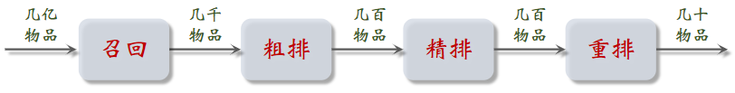

# 1.概要

# 1.推荐系统的基本概念

## 1.1 小红书推荐系统转化流程

### （1）**消费指标**：反映用户对推荐是否满意

- **点击率** = 点击次数 / 曝光次数 ：越高，证明推荐越精准 —— 不能仅追求它，不然都是标题党了
- **点赞率 **= 点赞次数 / 点击次数
- **收藏率 **= 收藏次数 / 点击次数
- **转发率** = 转发次数 / 点击次数
- **阅读完成率 **= 滑动到底次数 / 点击次数 × f(笔记长度)&#x20;
  - &#x20;f：归一化函数，与笔记长度有关，因笔记越长阅读完成率就越低，所以采用归一化

这些**都是短期消费指标，不能一味追求**。因为重复推荐相似内容可以提高消费指标，但容易让用户腻歪，进而降低用户活跃度。而尝试提供多样性的内容，可以让用户发现自己新的兴趣点，提高活跃度（但在这个过程中，消费指标可能下降）。反正就是尽量让用户多在平台投入精力

### （2）北极星指标：衡量推荐系统好坏，最关键的指标

在小红书考虑下面 3 个

- **用户规模**：日活用户数（DAU）、月活用户数（MAU）
  - DAU：每天使用 1 次以上
  - MAU：每月使用 1 次以上
- **消费**：人均使用推荐的时长、人均阅读笔记的数量
- **发布**：发布渗透率、人均发布量

通常来说，点击率跟时长、阅读数量的涨跌是一致的，若出现不一致情况，以北极星指标为准。例如，把推荐系统的多样性做好，时长增加了，但点击率下降了，这样的策略也是可以上线的。

北极星指标 都是线上指标，只能上线了才能获得。

### （3）实验流程

- **离线实验**：收集历史数据，在历史数据上做训练、测试。算法没有部署到产品中，没有跟用户交互。
- **小流量AB测试**：把算法部署到实际产品中，用户实际跟算法做交互。一般分为两组，实验组和对照组，实验组用新策略，对照组使用旧策略，对比两者的业务指标，看是否优于旧策略。
- **全流量上线**：

# 2.推荐系统的链路

**推荐系统目标**：从物品数据库中选取几十个物品，展示给用户。

- **召回**：用召回通道，从物品的数据库中快速取回一些数据
- **粗排**：用到规模比较小的机器学习模型给几千篇笔记打分，按照分数做排序和截断，保留分数最高的几百篇笔记
- **精排**：用到大规模深度神经网络，对笔记逐一进行打分；精排的分数反应笔记对用户的兴趣；精排之后可以做截断，也可以不做截断。
- **重排**：根据精排分数和多样性分数做笔记抽样，得到几十篇笔记，把相似内容打散，插入广告和运营内容

## 2.1召回

**召回通道**：协同过滤、双塔模型、关注的作者、等等

小红书有几十个召回通道，每个通道返回几十上百篇笔记，将所有召回通道的内容融合后，会去重，并过滤（例如去掉用户不喜欢的作者的笔记，不喜欢的话题）

## 2.2排序

排序：** \[几千] → 粗排 → \[几百] → 精排 → \[几百] → 重排 → \[几十]**

用粗排做筛选，再用精排 —— 平衡计算量和准确性

- 粗排模型小、简单，速度快，快速打分，可以做截断；
- 精排用的模型大，计算量大，打分更可靠；

粗排和精排非常相似，唯一区别就是精排模型更大，用的特征更多。

模型的输入，包括用户特征、物品特征和统计特征，后续输入神经网络，神经网络会输出点击率、点赞率等（预测值），最后把多个预测值做融合，得到最终的排序分数，决定了这篇笔记是否展示给用户，以及笔记的位置是靠前还是靠后。

本来是可以用精排分数排序后直接推荐的，但此时的结果还存在一些不足（重排，例如 多样性）

## 2.3重排

重排**根据多样性随机抽样（比如MMR、DPP），还要用规则将相似的笔记打散**，还得把广告插进去；

多样性抽样依据有：精排分数、多样性。

**目的**：

- 接着用规则打散相似笔记，不能把内容过于相似的笔记，排在相邻的位置上，减少一个页面中的同质化内容。
- 插入广告、运营推广内容，根据生态要求调整排序（例如 不能同时出很多美女图片）

重排的结果，就是最终展示给用户的物品

# 3.A/B 测试

## 3.1 A/B 测试举例

- 召回团队实现了一种 GNN 召回通道，离线实验结果正向
- 下一步是做线上的小流量 A/B 测试，考察新的召回通道对线上指标的影响
- 模型中有一些参数，比如 GNN 的深度取值 $\in\{1,2,3\} $，需要用 A/B 测试选取最优参数；如开三组对比AB测试

## 3.2 随机分桶

分 b = 10 个桶，每个桶中有 10% 的用户；如果用户的数量足够大，每个组的DAU、留存等指标是相同的。

分桶方法：

- 首先用哈希函数把用户 ID 映射成某个区间内的整数，然后把这些整数均匀随机分成 b 个桶
- 全部 n 位用户，分成 b 个桶，每个桶中有 $\frac{n}{b}$ 位用户

- 计算每个桶的业务指标，比如 DAU、人均使用推荐的时长、点击率、等等
- 如果某个实验组指标显著优于对照组，则说明对应的策略有效，值得推全

## 3.3分层实验

### （1）目标

目标：解决流量不够用的问题

信息流产品的公司有很多部门和团队，大家都需要做 A/B 测试

- 推荐系统（召回、粗排、精排、重排）
- 用户界面
- 广告

如果把用户随机分成 10 组，1 组做对照，9 组做实验，那么只能同时做 9 组实验，分组不够用。

### （2）**分层实验**

- 分层实验：召回、粗排、精排、重排、用户界面、广告......（例如 GNN 召回通道属于召回层）
- **同层互斥**：GNN 实验占了召回层的 4 个桶，其他召回实验只能用剩余的 6 个桶；避免一个用户数据被两个召回实验影响。
- **不同层正交**：每一层独立随机对用户做分桶。每一层都可以独立用 100% 的用户做实验

参考文献：Tang et al. Overlapping experiment infrastructure: more, better, faster experimentation. In KDD, 2010.

### （3）分层实验举例

- 召回层把用户分成 10 个桶：$\mathcal{U} _1,\mathcal{U} _2,...,\mathcal{U} _{10}$
- 精排层把用户分成 10 个桶：$\mathcal{V} _1,\mathcal{V} _2,...,\mathcal{V} _{10}$
- 设系统共有 n 个用户，那么$ |\mathcal{U}_i|=|\mathcal{V}_j | =n/10$
- 即每个召回桶里的用户数与每个精排桶里的用户数是差不多的
- 召回桶 $\mathcal{U}_i $和召回桶$ \mathcal{U} _j$ 交集为 $\mathcal{U} \cap \mathcal{U} _j= \empty$
- 召回桶之间互斥，即 2 个召回实验不会同时作用到相同用户上
- 召回桶 $\mathcal{U}_i$ 和精排桶 $\mathcal{V} _j $交集的大小为 $|\mathcal{U}\cap \mathcal{V}_j |=n/100$

**即 1 个用户虽然不能同时受 2 个召回实验的影响，但他可以受 1 个召回实验 + 1 个精排实验的影响**。

### （4）互斥 vs 正交

同层互斥：

不同层正交：

在用户界面的 2 号桶用户，被随机均匀打撒到了召回的 10 个桶中。**通常来说 用户界面实验的效果 和 召回实验的效果 不容易相互增强（或抵消）**，所以允许 1 个用户同时受两层实验的影响

如果所有实验都正交，则可以同时做无数组实验

必须使用互斥的原因

- 同类的策略（例如精排模型的两种结构）天然互斥，对于一个用户，只能用其中一种
- 同类的策略（例如添加两条召回通道）效果会相互增强（1+1>2）或相互抵消（1+1<2）。互斥可以避免同类策略相互干扰
- 不同类型的策略（例如添加召回通道、优化粗排模型）通常不会相互干扰（1+1=2），可以作为正交的两层

## 3.4 Holdout 机制

- 每个实验（召回、粗排、精排、重排）独立汇报对业务指标的提升
- 公司考察一个部门（比如推荐系统）在一段时间内对业务指标总体的提升
- Holdout 机制：取 10% 的用户作为 holdout 桶，推荐系统使用剩余 90% 的用户做实验，两者互斥
- 10% holdout 桶 vs 90% 实验桶的 diff（需要归一化）为整个部门的业务指标收益

- holdout 桶里面不加任何新的实验，保持干净以便对照

- 每个考核周期结束之后，清除 holdout 桶，让推全实验从 90% 用户扩大到 100% 用户
- 重新随机划分用户，得到 holdout 桶和实验桶，开始下一轮考核周期
- 新的 holdout 桶与实验桶各种业务指标的 diff 接近 0：划分随机均匀
- 随着召回、粗排、精排、重排实验上线和推全，diff 会逐渐扩大

## 3.5实验推全 & 反转实验

### （1）推全实验

假设做重排策略实验，取一个桶作为实验组，一个桶作为对照组，实验影响了20%的用户，观测到正向的业务指标收益，可以推全。

原来实验关闭；推全时，新开一层，使用90%的用户

### （2）反转实验

- 有的指标（点击、交互）立刻受到新策略影响，有的指标（留存）有滞后性，需要长期观测。
- 实验观测到显著收益后尽快推全新策略。目的是腾出桶供其他实验使用，或需要基于新策略做后续的开发。
- 用反转实验解决上述矛盾，既可以尽快推全，也可以长期观测实验指标。
- **在推全的新层中开一个旧策略的桶，长期观测实验指标**

## 3.6总结

- **分层实验**：同层互斥（不允许两个实验同时影响一位用户）、不同层正交（实验有重叠的用户）。把容易相互增强（或抵消）的实验放在同一层，让它们的用户互斥
- **Holdout**：保留 10% 的用户，完全不受实验影响，可以考察整个部门对业务指标的贡献
- **实验推全**：新建一个推全层，与其他层正交
- **反转实验**：在新的推全层上，保留一个小的反转桶，使用旧策略。长期观测新旧策略的 diff

