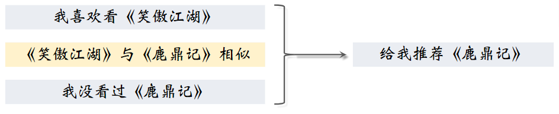
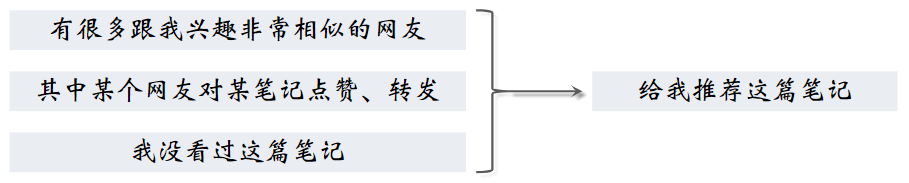
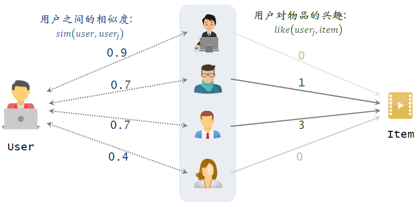
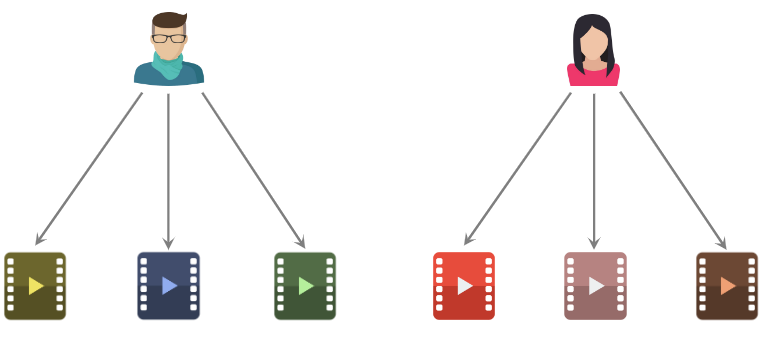
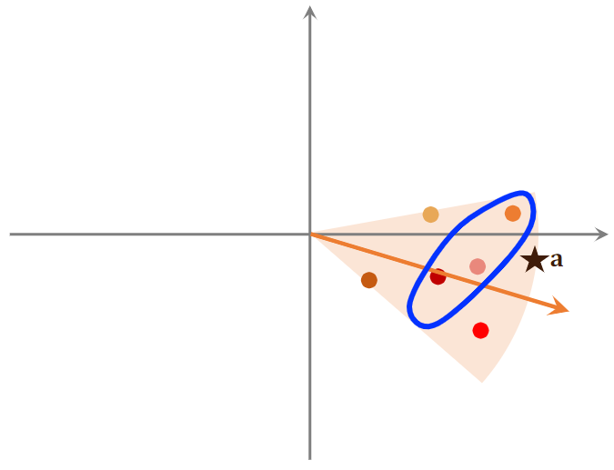
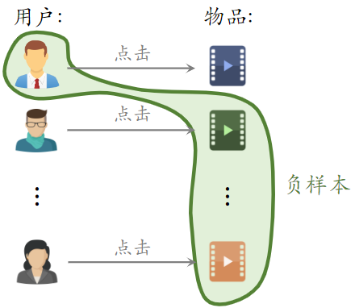
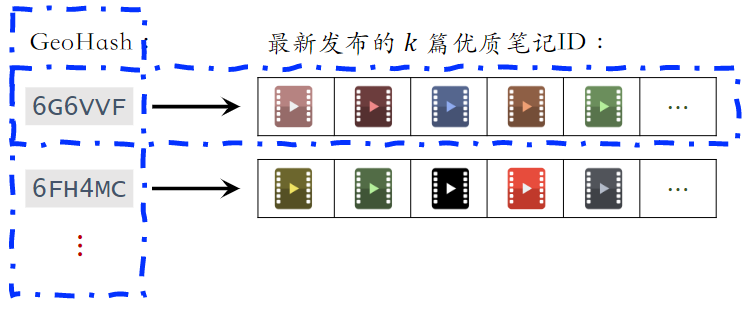
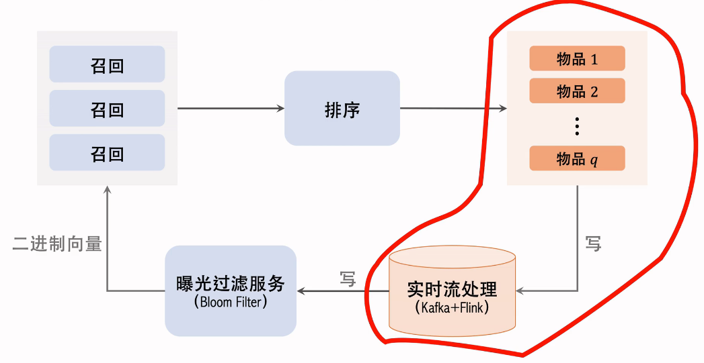

# 2.召回

# 1.基于物品的协同过滤（ItemCF）

## 1.1 ItemCF 的原理

推荐系统如何知道《笑傲江湖》与《鹿鼎记》相似？

- 用**知识图谱**：两本书的作者相同，所以相似
- 根据**全体用户的行为**：看过《笑傲江湖》的用户也看过《鹿鼎记》；给《笑傲江湖》好评的用户也给《鹿鼎记》好评

### （1）ItemCF 的实现

预估用户对候选物品的兴趣：2\*0.1 + 1\*0.4 + 4\*0.2 + 3\*0.6 = 3.2

### （2）物品相似度

两个物品的**受众**重合度越高，两个物品越相似

例如：

- 喜欢《射雕英雄传》和《神雕侠侣》的读者重合度很高
- 可以认为《射雕英雄传》和《神雕侠侣》相似

**计算物品相似度**

- 喜欢物品$ i_1$ 的用户记作集合 $\mathcal{W}_1$
- 喜欢物品 $i_2 $的用户记作集合 $\mathcal{W}_2$
- 定义交集 $\mathcal{V}=\mathcal{W}_1\cap\mathcal{W}_2$
- 两个物品的相似度：$sim(i_1,i_2)=\frac{|\mathcal{V}|}{\sqrt{|\mathcal{W}_1|·|\mathcal{W}_2|}}  $

注： 公式没有考虑喜欢的程度 𝑙𝑖𝑘𝑒(𝑢𝑠𝑒𝑟, 𝑖𝑡𝑒𝑚)，即喜欢就是 1，不喜欢就是 0；计算出的相似度介于0到1之间的一个数。

如果考虑了喜欢程度：

$$
\operatorname{sim}\left(i_{1}, i_{2}\right)=\frac{\sum_{v \in \mathcal{V}} \operatorname{like}\left(v, i_{1}\right) \cdot \operatorname{like}\left(v, i_{2}\right)}{\sqrt{\sum_{u_{1} \in W_{1}} \operatorname{like}^{2}\left(u_{1}, i_{1}\right)} \cdot \sqrt{\sum_{u_{2} \in W_{2}} l i k e^{2}\left(u_{2}, i_{2}\right)}}
$$

### （3）小结

**ItemCF 的基本思想**：如果用户喜欢物品 $item_1 $，而且物品 $item_1 $与 $item_2 $相似，那么用户很可能喜欢物品 $item_2$。

**注意**：不是以物品的内容来判定相似，而是以用户的行为判定相似。

**预估用户对候选物品的兴趣**：$\sum_{j}\,l i ke\bigl(u s e r,\,i t e m_{j}\bigr)\times s i m\bigl(i t e m_{j},i t e m\bigr)$；从用户历史行为记录中，我们知道用户对 $item_j $的兴趣，还知道 $item_j $与候选物品的相似度

**计算两个物品的相似度**：

- 把每个物品表示为一个稀疏向量，向量每个元素对应一个用户
- 相似度 $sim $就是两个向量夹角的余弦
- 两个物品的相似度：$sim(i_1,i_2)=\frac{|\mathcal{V}|}{\sqrt{|\mathcal{W}_1|·|\mathcal{W}_2|}}  $

## 1.2 ItemCF 召回的完整流程

### （1）事先做离线计算

**建立“用户 → 物品”的索引**

- 记录每个用户最近点击、交互过的物品 ID
- 给定任意用户 ID，可以找到他近期感兴趣的物品列表

**建立“物品 → 物品”的索引**

- 计算物品之间两两相似度
- 对于每个物品，索引它最相似的 k 个物品
- 给定任意物品 ID，可以快速找到它最相似的 k 个物品

### （2）线上做召回

索引的意义在**于避免枚举所有的物品**。**用索引，离线计算量大，线上计算量小**。

1. 给定用户 ID，通过“**用户 → 物品**”索引，找到用户近期感兴趣的物品列表（**last-n**）。
2. 对于 last-n 列表中每个物品，通过“**物品 → 物品**”的索引，找到 **top-k **相似物品
3. 对于取回的相似物品（最多有 𝑛𝑘 个），用公式预估用户对物品的兴趣分数
4. 返回分数最高的 100 个物品，作为推荐结果

**示例：**

1. 记录用户最近感兴趣的 n = 200 个物品
2. 取回每个物品最相似的 k = 10 个物品
3. 给取回的 nk = 2000 个物品打分（用户对物品的兴趣）
4. 返回分数最高的 100 个物品作为 ItemCF 通道的输出

- 如果取回的 item 中有重复的，就去重，并把分数加起来

## 1.3 总结

### （1）**ItemCF 的原理**

用户喜欢物品 $i_1$ ，那么用户喜欢与物品 $i_1$ 相似的物品 $i_2$

物品相似度：

- 如果喜欢 $i_1$、$i_2$ 的用户有很大的重叠，那么$ i_1$ 与 $i_2$ 相似
- **不是根据物品内容来判定相似，而使用用户行为来判定相似**
- 公式：$sim(i_1,i_2)=\frac{|\mathcal{W}_1\cap\mathcal{W}_2|}{\sqrt{|\mathcal{W}_1|·|\mathcal{W}_2|}}  $
- $\mathcal{W}_1$ 表示喜欢物品 $i_1$ 的用户集合

### （2）ItemCF 召回通道

**维护两个索引：**

- **用户 → 物品列表**：用户最近交互过的 n 个物品
- **物品 → 物品列表**：相似度最高的 k 个物品

线上做召回：

- 利用两个索引，每次取回 nk 个物品
- 预估用户对每个物品的兴趣分数：  $\sum_{j}\,l i ke\bigl(u s e r,\,i t e m_{j}\bigr)\times s i m\bigl(i t e m_{j},i t e m\bigr) $&#x20;
- 返回分数最高的 100 个物品，作为召回结果

# 2.Swing 召回通道

- Swing 是 ItemCF 的一个变体，在工业界很常用
- Swing 和 ItemCF 很像，唯一区别在于**如何定义相似度**

## 2.1 ItemCF

**ItemCF 的原理**

- 物品相似度：如果喜欢 $i_1$、$i_2$ 的用户有很大的重叠，那么 $i_1$ 与 $i_2$ 相似

**ItemCF 的物品相似度**

- 喜欢物品 $i_1 $的用户记作集合 $\mathcal{W}_1$
- 喜欢物品 $i_2$ 的用户记作集合 $\mathcal{W}_2$
- 定义交集 $\mathcal{V}=\mathcal{W}_1\cap\mathcal{W}_2$，对两个物品都感兴趣的人数
- 两个物品的相似度： $sim(i_1,i_2)=\frac{|\mathcal{V}|}{\sqrt{|\mathcal{W}_1|·|\mathcal{W}_2|}}  $，数值越大表示两个物品越相似

**ItemCF 的不足之处：**

- 下图中两篇笔记被碰巧分享到了一个微信群里面
- 造成问题：两篇笔记的**受众完全不同**，但很多用户同时交互过这两篇笔记，导致系统错误判断两篇笔记相似度很高。

- 想要解决该问题，就要**降低小圈子用户的权重**，我们希望两个重合的物品，广泛而且多样，而不是集中在一个小圈子中。
- **如果大量不相关的用户同时交互两个物品，则说明两个物品的受众真的相同**。
- Swing模型给小圈子设置权重，解决小圈子问题

## 2.2 Swing 模型

- 用户 $u_1$ 喜欢的物品记作集合 $\mathcal{J}_1$
- 用户$ u_2$ 喜欢的物品记作集合 $\mathcal{J}_2$
- 定义两个用户的重合度：  $overlap(u_1,u_2)=|\mathcal{J}_1\cap\mathcal{J}_2|  $，值越大，说明用户的重合度越高，有可能是一个小圈子的人。
- 用户 $u_1 $和 $u_2 $的重合度高，则他们可能来自一个小圈子，**要降低他们的权重**
- 喜欢物品 $i_1$ 的用户记作集合 $\mathcal{W}_1$
- 喜欢物品 $i_2 $的用户记作集合$ \mathcal{W}_2$
- 定义交集 $\mathcal{V}=\mathcal{W}_1\cap\mathcal{W}_2$
- 两个物品的相似度：$sim(i_1,i_2)=\sum_{u_1\in \mathcal{V}}\sum_{u_2\in \mathcal{V}}\frac{1}{α+overlap(u_1,u_2)}  $，其中，$α$ 是超参数；$overlap(u_1,u_2) $表示两个用户的重合度，**重合度高**，说明两人是一个小圈子的，那么他两**对物品相似度的贡献就比较小**，**重合度小**，两人不是一个小圈子的，他两**对物品相似度的贡献就比较大**。

## 2.3总结

- Swing 与 ItemCF 唯一的区别**在于物品相似度**
- **ItemCF**：两个物品重合的用户比例高，则判定两个物品相似
- **Swing**：额外考虑重合的用户是否来自一个小圈子
- 同时喜欢两个物品的用户记作集合 $\mathcal{V}$
- 对于 $\mathcal{V} $中的用户 $u_1$ 和 $u_2$，重合度记作 $overlap(u_1,u_2)$，$overlap$越大，则重合度越高，则可能来自一个小圈子，需要降低权重，反之增加权重。

# 3.基于用户的协同过滤（UserCF）

## 3.1 UserCF 的原理

推荐系统如何找到跟我兴趣非常相似的网友呢？

- **方法一**：点击、点赞、收藏、转发的笔记有很大的重合
- **方法二**：关注的作者有很大的重合

## 3.2 UserCF 的实现

在做UserCF之前，需要先离线算好每两个用户之间的相似度；

如下图片中，想给左边的用户做推荐，中间为最相似的四个用户，右边是候选物品，左边的用户还未看过右边的候选物品，我们要预估左边的用户对右边的候选的物品兴趣有多大。

预估用户对候选物品的兴趣：$\sum_jsim(user,user_j)×like(user_j,item)$

- $sim(user,user_j)$：左边用户与第j个用户的相似度，即左边的分数
- $like(user_j,item)$：第j个用户对右边候选物品的兴趣
- 例如：0.9×0 + 0.7×1 + 0.7×3 + 0.4×0 = 2.8

## 3.3用户的相似度

用户相似度：用户之间有共同点

如下图，两个用户不相似，他两喜欢的物品之间没有重合。

下图中的例子，判断为相似，他两喜欢较多相似的物品

计算用户相似度

- 用户 $u_1 $喜欢的物品记作集合 $\mathcal{J}_1$
- 用户 $u_2 $喜欢的物品记作集合 $\mathcal{J}_2$
- 定义交集 $I=\mathcal{J}_1\cap\mathcal{J}_2$
- 两个用户的相似度： $sim(u_1,u_2)=\frac{|I|}{\sqrt{|\mathcal{J}_1|·|\mathcal{J}_2|}}  $

上述公式有所**不足**：**同等的权重对待热门和不热门的物品**

如下图，哈利波特这本书是热门的物品，他两都喜欢，对相似度的计算是没有价值的。所以，越热门的物品，越无法反映用户独特的兴趣，对计算用户相似度越没有价值。故，需要降低热门物品的权重。

如下是之前计算相似度的公式，讲分子中的$|I|$更换一种写法，写成对1的连加，其中$l$是物品的序号，连加中的1是物品的权重。

刚刚讨论热门物品的重要性，越热门的物品，重要性应该越低。将分子中的1，换成$\frac{1}{\log{(1+n_l)}} $，表示第$l$个物品的权重。

降低热门物品权重后：$sim(u_1,u_2)=\frac{ {\sum_{l\in{I} } \frac{1}{\log{(1+n_l)} } } }{\sqrt{|\mathcal{J}_1|·|\mathcal{J}_2|} }$

- $n_l$：喜欢物品 l 的用户数量，反映物品的热门程度
- 物品越热门，$\frac{1}{\log{(1+n_l)}} $越小，对相似度的贡献就越小

**小结**：

- UserCF 的基本思想：
  - 如果用户 $user_1 $跟用户 $user_2 $相似，而且$  user_2  $喜欢某物品
  - 那么用户 user\_1 也很可能喜欢该物品
- 预估用户 user 对候选物品 item 的兴趣：$\sum_jsim(user,user_j)×like(user_j,item)$
- 计算两个用户的相似度：
  - 把每个用户表示为一个稀疏向量，向量每个元素对应一个物品
  - 相似度 sim 就是两个向量夹角的余弦

## 3.4 UserCF 召回的完整流程

### （1）事先做离线计算，建立两个索引

建立“用户 → 物品”的索引

- 记录每个用户最近点击、交互过的物品 ID
- 给定任意用户 ID，可以找到他近期感兴趣的物品列表

建立“用户 → 用户”的索引

- 对于每个用户，索引他最相似的 k 个用户
- 给定任意用户 ID，可以快速找到他最相似的 k 个用户

### （2）线上做召回

1. 给定用户 ID，通过“**用户 → 用户**”索引，找到 top-k 相似用户
2. 对于每个 top-k 相似用户，通过“**用户 → 物品**”索引，找到用户近期感兴趣的物品列表（last-n）
3. 对于取回的 nk 个相似物品，用公式预估用户对每个物品的兴趣分数
4. 返回分数最高的 100 个物品，作为召回结果

## 3.5总结

**UserCF 的原理：**

- 用户 $u_1 $跟用户 $u_2 $相似，而且 $u_2 $喜欢某物品，那么用户 $u_1 $也很可能喜欢该物品
- 用户相似度，通过交互过的物品来定义
  - 如果用户 $u_1 $和 $u_2 $喜欢的物品又很大的重叠，那么 $u_1 $和 $u_2 $相似
  - 公式：$sim(u_1,u_2)=\frac{|\mathcal{J}_1\cap\mathcal{J}_2|}{\sqrt{|\mathcal{J}_1|·|\mathcal{J}_2|} }$

**UserCF 召回通道，**离线维护两个索引：

- **用户 → 物品列表**：用户近期交互过的 n 个物品
- **用户 → 用户列表**：相似度最高的 k 个用户

**线上做召回：**

- 利用两个索引，每次取回 𝑛𝑘 个物品
- 预估用户 user 对每个物品 item 的兴趣分数：$\sum_jsim(user,user_j)×like(user_j,item)$
- 返回分数最高的 100 个物品，作为召回结果

# 4.离散特征处理

后面几节讲向量召回，需要用到这部分知识。

## 4.1离散特征

**举例：**

- 性别：男、女两种类别
- 国籍：中国、美国、印度等 200 个国家
- 英文单词：常见的英文单词有几万个
- 物品 ID：小红书有几亿篇笔记，每篇笔记有一个 ID
- 用户 ID：小红书有几亿个用户，每个用户有一个 ID

**离散特征处理的步骤**

1. **建立字典**：把类别映射成序号
   - 中国 → 1
   - 美国 → 2
   - 印度 → 3
2. **向量化**：把序号映射成向量
   - **One-hot 编码**：把序号映射成高维稀疏向量（向量中只有 0，1）
   - **Embedding**：把序号映射成低维稠密向量（向量中有小数）

## 4.2 One-Hot 编码

**例 1：性别特征**

- 性别：男、女两种类别
- **字典**：男 → 1，女 → 2
- **One-hot 编码**：用 2 维向量表示性别
  - 未知 → 0 → \[0, 0]
  - 男 → 1 → \[1, 0]
  - 女 → 2 → \[0, 1]

**例 2：国籍特征**

- 国籍：中国、美国、印度等 200 种类别
- 字典：中国 → 1，美国 → 2，印度 → 3， ...
- **One-hot 编码**：用 200 维稀疏向量表示国籍
  - 未知 → 0 → \[0, 0, 0, 0, ⋯ , 0]
  - 中国 → 1 → \[1, 0, 0, 0, ⋯ , 0]
  - 美国 → 2 → \[0, 1, 0, 0, ⋯ , 0]
  - 印度 → 3 → \[0, 0, 1, 0, ⋯ , 0]

**One-Hot 编码的局限**

- 例 1：自然语言处理中，对**单词**做编码
  - 英文有几万个常见单词
  - 那么 one-hot 向量的维度是几万，实践中一般不会用这么高纬的向量
- 例 2：推荐系统中，对物品 ID 做编码
  - 小红书有几亿篇笔记
  - 那么 one-hot 向量的维度是几亿
- **类别数量太大时，通常不用 one-hot 编码**

## 4.3 Embedding（嵌入）

### （1）国籍的Embedding

**参数数量**：向量维度 × 类别数量

- 设 embedding 得到的向量都是 4 维的
- 一共有 200 个国籍
- 参数数量 = 4 × 200 = 800

**编程实现**：TensorFlow、PyTorch 提供 embedding 层

- 参数以矩阵的形式保存，矩阵大小是 `向量维度 × 类别数量`
- 输入是序号，比如“美国”的序号是 2
- 输出是向量，比如“美国”对应参数矩阵的第 2 列

### （2）物品 ID 的 Embedding

- 数据库里一共有 10,000 部电影
- 任务是给用户推荐电影
- 设 embedding 向量的维度是 16
- Embedding 层有多少参数？`参数数量 = 向量维度 × 类别数量 = 160,000`

如果物品类别较多，则**一个神经网络绝大多数的参数都在 Embedding 层**，所以工业界都会**对 Embedding 层做很多优化**，以提高存储和计算的效率

### （3）Embedding和One-Hot向量关系

$Embedding = 参数矩阵 \times One-Hot向量$

左侧为One-Hot向量，中间为Embedding层向量矩阵。

## 4.4总结

离散特征处理：one-hot 编码、embedding

类别数量很大时，用 embedding

- Word embedding
- 用户 ID embedding
- 物品 ID embedding

# 5.矩阵补充

- 矩阵补充是向量召回最常见的方法，只是现在不常用了
- 此处讲解矩阵补充，是为了帮助理解下节课的双塔模型

## 5.1 模型结构

矩阵补充模型：基于 Embedding 来做推荐。

模型输入为用户ID和物品ID，内积输出是一个实数，是用户对候选物品兴趣的预估值，这个数越大，表示用户对物品越感兴趣。

Embedding嵌入维度a和b的维度是一样的。两个Embedding层不共享参数

## 5.2训练

### （1）基本想法

- 用户 embedding 参数矩阵记作 $\bold{A}$。第 $u$ 号用户对应矩阵第 $u$ 列，记作向量 $\bold{a}_u$
- 物品 embedding 参数矩阵记作 $\bold{B}$。第 $i$ 号物品对应矩阵第 $i$ 列，记作向量 $\bold{b}_i$
- 内积 $\left\langle \bold{a}_u,\bold{b}_i \right\rangle$ 是第 u 号用户对第 i 号物品兴趣的预估值，内积越大，说明兴趣越强。
- 训练模型的目的是学习矩阵 $\bold{A}$ 和 $\bold{B}$，使得预估值拟合真实观测的兴趣分数。矩阵A和B是Embedding层的参数。

### （2）数据集

数据集：`（用户 ID，物品 ID，真实兴趣分数）`的集合，记作 $\Omega=\{(u,i,y) \}$，意思为：该用户对该物品真实的兴趣分数。

数据集中的兴趣分数是系统记录的，比如：

- 曝光但是没有点击 → 0 分
- 点击、点赞、收藏、转发 → 各算 1 分
- 分数最低是 0，最高是 4

训练的目的就是让模型的输出拟合真实兴趣分数

### （3）训练

把用户 ID、物品 ID 映射成向量。

- 第 u 号用户 → 向量 $\bold{a}_u$
- 第 i 号物品 → 向量 $\bold{b}_i$

求解优化问题，得到参数 $\bold{A}$ 和 $\bold{B}$：$\min_{\bold{A},\bold{B}}\sum_{(u,i,y)\in\Omega}(y- \left\langle \bold{a}_u,\bold{b}_i \right\rangle)^2  $

- 找到使得 真实兴趣分数 y 与 模型输出 $\left\langle \bold{a}_u,\bold{b}_i \right\rangle$ 间 差别 最小的 $\bold{A}$ 和 $\bold{B}$
- 求最小化常用的方法就是随机梯度下降，每次更新矩阵 $\bold{A}$ 和 $\bold{B}$ 的一列

### （4）矩阵补充

解释下为什么模型叫做矩阵补充

- **绿色位置**表示曝光给用户的物品；**灰色位置**表示没有曝光；曝光后，会得到用户对物品的兴趣分数。
- 矩阵中只有少数位置是绿色，大多数位置是灰色（即大部分物品没有曝光给用户）；并不知道用户对没曝光过的物品的分数。
- 而我们**用绿色位置训练出的模型，可以预估所有灰色位置的输出，即把矩阵的元素补全**。
- 把矩阵元素补全后，我们只需选出对应用户一行中分数较高的 **物品** 推荐给 **用户** 即可。

## 5.3 缺点

矩阵补充在实践中效果不好 ……

**缺点 1：仅用 ID embedding，没利用物品、用户属性**

- 物品属性：类目、关键词、地理位置、作者信息
- 用户属性：性别、年龄、地理定位、感兴趣的类目
- 双塔模型可以看做矩阵补充的升级版，双塔模型不仅使用 ID，还结合各种属性，实际表现较好。

**缺点 2：负样本的选取方式不对**

- 样本：用户—物品的二元组，记作 $(u,i)$
- 正样本：曝光之后，有点击、交互。（正确的做法）
- 负样本：曝光之后，没有点击、交互。（错误的做法）
- 后面会专门用一节课时间讲正负样本如何选择

**缺点 3：做训练的方法不好**

- 内积 $\left\langle \bold{a}_u,\bold{b}_i \right\rangle $不如余弦相似度，工业界普遍使用 余弦相似度 而不是 内积。
- 用平方损失（回归），不如用交叉熵损失（分类）

## 5.4 线上服务

### （1）模型存储

1. 训练得到矩阵 $\bold{A}$ 和 $\bold{B}$，这两个矩阵可能会很大，需要**特殊的读取和存储方式**。
   - $\bold{A} $的每一列对应一个用户
   - $\bold{B} $的每一列对应一个物品
2. 把矩阵 $\bold{A} $的列存储到 key-value 表
   - key 是用户 ID，value 是 $\bold{A} $的一列
   - 给定用户 ID，返回一个向量（用户的 embedding）
3. 矩阵 $\bold{B} $的存储和索引比较复杂

### （2）线上服务

1. 把用户 ID 作为 key，查询 key-value 表，得到该用户的 embedding 向量，记作 $\bold{a}$
2. **最近邻查找**：查找用户最有可能感兴趣的 k 个物品，作为召回结果
   - 第 𝑖 号物品的 embedding 向量记作 $\bold{b}_i$
   - 内积 $\left\langle \bold{a}_u,\bold{b}_i \right\rangle $是用户对第 𝑖 号物品兴趣的预估
   - 返回内积最大的 k 个物品

最近邻查找存在的问题：如果枚举所有物品，时间复杂度正比于物品数量；**最近邻查找的计算量太大，不现实**，下面讲解如何加速最近邻查找。

## 5.5近似最近邻查找（Approximate Nearest Neighbor Search）

### （1）支持最近邻查找的系统

**系统**：Milvus、Faiss、HnswLib、等等；快速最近邻查找的算法已经被集成到这些系统中

**衡量最近邻的标准**：

- 欧式距离最小（**L2 距离**）
- 向量内积最大（**内积相似度**），矩阵补充用的就是内积相似度
- 向量夹角余弦最大（**cosine 相似度**）；最常用，对于不支持的系统：把所有向量作归一化（让它们的二范数等于 1），此时内积就等于余弦相似度。

### （2）示例

图中每个点表示一个物品的 Embedding

右边的 ★ 表示用户的Embedding向量$ \bold{a}$，想要召回用户a感兴趣的物品，如果暴力枚举，需要计算用户Embedding向量和物品每个向量的相似度。

数据预处理：

- **把数据据划分为多个区域**；划分后，每个区域用一个向量表示，这些向量的长度都是 1。具体如何划分，看使用的最近邻算法，如果是余弦相似度，划分结果如下图；如果是欧式距离，划分结果为多边形。
- **将划分的区域用一个向量表示**，例如图中蓝色区域用蓝色箭头向量表示。这些向量的长度都为1.

- **划分区域后，建立索引**：每个区域的向量作为key，区域中所有点的列表作为value。给点一个向量，就可以取回一个扇形区域的点。比如1亿个物品，建立1W个索引。

- 实际推荐时，**先把用户向量与所有的索引向量做对比**，计算相似度，找到最相似的索引向量。

- **通过索引向量，我们找到索引对应区域中的所有物品，然后再计算该区域中所有物品与 **$\bold{a} $**的相似度**；一般情况是几亿个物品被几万个索引向量划分，于是一个区域中就只有几万个物品。

## 5.6总结

矩阵补充

- 把物品 ID、用户 ID 做 embedding，映射成向量
- 两个向量的内积 $\left\langle \bold{a}_u,\bold{b}_i \right\rangle$ 作为用户 u 对物品 i 兴趣的预估值
- 训练时让$ \left\langle \bold{a}_u,\bold{b}_i \right\rangle$ 拟合真实观测的兴趣分数，学习模型的 embedding 层参数
- 矩阵补充模型有很多缺点，效果不好，工业界一般使用双塔模型

线上召回

- 把用户向量 $\bold{a}$ 作为 query，查找使得$  \left\langle \bold{a}_u,\bold{b}_i \right\rangle  $最大化的物品 i
- 暴力枚举速度太慢。实践中用近似最近邻查找
- Milvus、Faiss、HnswLib 等向量数据库支持近似最近邻查找

# 6.双塔模型：模型和训练

## 6.1 矩阵补充模型

模型输入为用户ID和物品ID，使用两个Embedding层，将用户ID映射到两个向量；用两个向量的内积来预估用户对物品的兴趣分数。

模型比较弱，只用到用户和物品的ID，没有用到其他属性。

## 6.2双塔模型结构

### （1）用户特征

- 用户ID，使用Embedding层映射为一个向量
- 对每个离散特征（城市，感兴趣话题），单独使用一个 Embedding 层得到一个向量；对于性别这种类别很少的离散特征，直接用 one-hot 编码；
- 用户的连续特征（年龄、活跃程度、消费），不同连续特征有不同的处理方式，最简单的为做归一化，均值为0，方差为1。某些长尾分布的特征，需要特殊处理，如取log、分桶等。
- 将上述向量拼接起来，输入神经网络，得到用户表征

### （2）物品特征

物品特征处理类似用户ID特征处理。

### （3）双塔模型

双塔模型：左塔提取用户特征，右塔提取物品特征；与矩阵补充的区别在于，使用了除 ID 外的多种特征作为双塔的输入。

常用余弦相似度

## 6.3 双塔模型的训练

- **Pointwise**：独立看待每个正样本、负样本，做简单的二元分类
- **Pairwise**：每次取一个正样本、一个负样本（参考文献：Jui-Ting Huang et al. Embedding-based Retrieval in Facebook Search. In KDD, 2020.）
- **Listwise**：每次取一个正样本、多个负样本（参考文献：Xinyang Yi et al. Sampling-Bias-Corrected Neural Modeling for Large Corpus Item Recommendations. In RecSys, 2019.）

正负样本的选择

- 正样本：用户点击的物品
- 负样本：
  - 没有被召回的？
  - 召回但是被粗排、精排淘汰的？
  - 曝光但是未点击的？
- 小红书选取负样本时，基本就参考了上面两篇论文

## 6.4 Pointwise 训练

- 把召回看做二元分类任务
- 对于正样本，鼓励 $\cos{(\bold{a},\bold{b})}$ 接近 +1
- 对于负样本，鼓励 $\cos{(\bold{a},\bold{b})} $接近 −1
- 控制正负样本数量为 1: 2 或者 1: 3（业内经验）

## 6.5 Pairwise 训练

训练时，每一组的输入为三元组，通过神经网络得到表征向量，分别计算用户对正样本和负样本的兴趣，对正样本的相似度，越大越好，最好接近+1；对负样本的相似，越小越好，最好接近于-1。

两个物品塔是相同的，它们共享参数

基本想法：**鼓励 **$\cos{(\bold{a},\bold{b}^+)} $**大于 **$\cos{(\bold{a},\bold{b}^-)}$，两者之差越大越好

- 如果 $\cos{(\bold{a},\bold{b}^+)} $大于 $\cos{(\bold{a},\bold{b}^-)}+m$，则没有损失；m 是超参数，需要调
- 否则，会有损失，损失等于$ \cos{(\bold{a},\bold{b}^-)}+m-\cos{(\bold{a},\bold{b}^+)}$
- **Triplet hinge loss**：$L(\bold{a},\bold{b}^+,\bold{b}^-)=\max{\{ 0,\cos{(\bold{a},\bold{b}^-)}+m-\cos{(\bold{a},\bold{b}^+)}\}}  $
- **Triplet logistic loss****：**$L(\bold{a},\bold{b}^+,\bold{b}^-)=\log{( 1+\exp{[\sigma·(\cos{(\bold{a},\bold{b}^-)}-\cos{(\bold{a},\bold{b}^+))}])}}  $
- $\sigma $是大于 0 的超参数，控制损失函数的形状，需手动设置

## 6.6 Listwise 训练

一条数据包含：

- 一个用户，特征向量记作$ \bold{a}$
- 一个正样本，特征向量记作$ \bold{b}^+$
- 多个负样本，特征向量记作 $\bold{b}^-_1,...,\bold{b}^-_n$

**鼓励 **$\cos{(\bold{a},\bold{b}^+)} $**尽量大；鼓励 **$\cos{(\bold{a},\bold{b}^-_1)},...,\cos{(\bold{a},\bold{b}^-_n)} $**尽量小**

- 向量a和b之间的相似度，介于+1和 -1之间的实数，输入softmax激活函数，输出分数，这些分数介于0到1之间；
- 正样本$ y^+=1$，即鼓励$ s^+ \rightarrow 1$
- 负样本$ y^-_1=...=y^-_n=0$，即鼓励 $s^-_1...s^-_n \rightarrow 0$
- 用 y 和 s 的交叉熵作为损失函数，训练时，最小化交叉熵，意思是鼓励 $\rm Softmax$ 的输出 s 接近标签 y；
- 其实交叉熵等于 $-log~s^+$，训练时最小化交叉熵，也就是最大化 $s^+$，等价于最大化正样本的余弦相似度，最小化负样本的余弦相似度。

## 6.7总结

**双塔模型**

- 用户塔、物品塔各输出一个向量
- 两个向量的余弦相似度作为兴趣的预估值

**三种训练方式：**

- Pointwise：每次用一个用户、一个物品（可正可负）
- Pairwise：每次用一个用户、一个正样本、一个负样本
- Listwise：每次用一个用户、一个正样本、多个负样本

### 不适用于召回的模型

下面这种模型为粗排，精排的模型，不是召回的模型，这种模型没有办法应用到召回；

下面的结构和双塔模型是一样的，都是提取用户和物品的特征，得到两个特征向量，但是**上层的处理结构不一样了**。

用户和物品的向量在**进入神经网络前就拼接起来了**，和双塔模型有很大区别；**双塔模型是在后期输出相似度时才进行融合**。

用户（或物品）自身特征的拼接没有影响，依然保持了用户（或物品）的独立性，而**一旦用户和物品进行拼接，此时的输出就特定于该 用户（或物品）了**。

**这种前期融合的模型，不适用于召回，**因为得在召回前，把每个用户向量对应的所有物品向量挨个拼接了送入神经网络，假设有一亿个物品，每给用户做一次召回，就得跑一亿遍。

**这种模型通常用于排序**，在几千个候选物品中选出几百个

以后看到这种模型就要意识到 —— 这是排序模型，不是召回模型

# 7.双塔模型：正负样本

## 7.1 正样本

正样本：曝光而且有点击的 **用户—物品** 二元组（用户对物品感兴趣）

问题：少部分物品占据大部分点击，导致**正样本大多是热门物品**

解决方案：**过采样冷门物品，或降采样热门物品**

- 过采样（up-sampling）：一个样本出现多次
- 降采样（down-sampling）：一些样本被抛弃

以一定概率抛弃热门物品，抛弃的概率与样本的点击次数正相关

## 7.2简单负样本

### （1）全体物品抽取负样本

简单负样本：未被召回的物品，大概率是用户不感兴趣的，**未被召回的物品 ≈ 全体物品**。

从全体物品中做抽样，作为负样本

均匀抽样 or 非均匀抽样？

- 均匀抽样：对冷门物品不公平。正样本大多是热门物品，如果均匀抽样产生负样本，负样本大多是冷门物品。
- 非均抽采样：目的是打压热门物品。**负样本抽样概率与热门程度（点击次数）正相关**。
- $抽样概率 ∝ (点击次数)^{0.75}$，其中0.75为经验值

### （2）Batch 内负样本

Batch 内负样本：第一个用户可以和第三个物品组成负样本

- 一个 batch 内有 n 个正样本
- 一个用户和 n-1 个物品组成负样本
- 这个 batch 内一共有 n(n-1) 个负样本
- 都是简单负样本。（因为第一个用户不喜欢第二个物品）

**Batch 内负样本存在的问题**

- 一个物品出现在 batch 内的概率 **∝ 点击次数**
- 物品成为负样本的概率本该是 $∝ (点击次数)^{0.75}$，但这里实际是** ∝ 点击次数**
- **热门物品成为负样本的概率过大**
- 即对热门物品打压太狠了，容易造成偏差，下面这篇论文讲了如何修正偏差（参考文献：Xinyang Yi et al. Sampling-Bias-Corrected Neural Modeling for Large Corpus Item Recommendations. In RecSys, 2019.）

**修正偏差：**

- 物品 i 被抽样到的概率：$p_i ∝ 点击次数$，反应物品的热门程度
- 预估用户对物品 i 的兴趣：$\cos{(\bold{a},\bold{b}_i)}$
- 做训练的时候，将兴趣调整为：$\cos{(\bold{a},\bold{b}_i)}-\log{p_i}$，这样纠偏，避免过度打压热门物品。
- 训练结束后，在线上做召回时，还是用$ \cos{(\bold{a},\bold{b}_i)}$ 作为兴趣

## 7.3 困难负样本

**困难负样本：**

- **被粗排淘汰的物品（比较困难）**，这些物品被召回，说明和用户兴趣有关；又被粗排淘汰，说明用户对物品兴趣不大；而在对正负样本做二元分类时，这些困难样本容易被分错（被错误判定为正样本）；
- **精排分数靠后的物品（非常困难），**能够进入精排，说明物品比较符合用户兴趣，但不是用户最感兴趣的

**对正负样本做二元分类：**

- 全体物品（简单）分类准确率高
- 被粗排淘汰的物品（比较困难）容易分错
- 精排分数靠后的物品（非常困难）更容易分错

**训练数据**

- **混合几种负样本**
- 50% 的负样本是全体物品（简单负样本）
- 50% 的负样本是没通过排序的物品（困难负样本）
- 即在粗排、精排淘汰的物品

## 7.4常见的错误

可以把**曝光没有点击的物品作为负样本？但这是错误的，如果用这样的负样本训练双塔模型，效果肯定会变差****。**

**可以作为排序的负样本，不能作为召回的负样本**

选择负样本的原理

- 召回的目标：快速找到用户可能感兴趣的物品
- 即区分用户 **不感兴趣** 和 **可能感兴趣** 的物品，而不是区分 **比较感兴趣** 和 **非常感兴趣** 的物品
- **全体物品（easy ）**：绝大多数是用户根本不感兴趣的
- **被排序淘汰（hard ）**：用户可能感兴趣，但是不够感兴趣
- **有曝光没点击（没用）**：用户感兴趣，可能碰巧没有点击；**曝光没点击的物品已经非常符合用户兴趣了，甚至可以拿来做召回的正样本**；这种**样本可以作为排序的负样本，不能作为召回的负样本**。

召回：区分用户不感兴趣和可能刚兴趣物品

排序：区分比较感兴趣和非常感兴趣物品

## 7.5总结

- **正样本**： 曝光而且有点击
- **简单负样本**：
  - 全体物品
  - Batch 内负样本
- **困难负样本**：被召回，但是被排序淘汰
- **错误**：曝光、但是未点击的物品做召回的负样本

# 8.双塔模型：线上召回和更新

## 8.1线上召回

### （1）物品：离线存储：把物品向量 $\bold{b} $存入向量数据库

1. 完成训练之后，用物品塔计算每个物品的特征向量$ \bold{b}$
2. 把几亿个物品向量$  \bold{b}  $存入向量数据库（比如 Milvus、Faiss、HnswLib ）
3. 向量数据库建索引，以便加速最近邻查找

### （2）用户：线上召回：查找用户最感兴趣的 k 个物品

1. 给定用户 ID 和画像，线上用神经网络现算（**实时计算**）用户向量 $\bold{a}$
2. 最近邻查找：

- 把向量$ \bold{a}$ 作为 query，调用向量数据库做最近邻查找
- 返回余弦相似度最大的 k 个物品，作为召回结果

**为什么事先存储物品向量 **$\bold{b}$**，线上现算用户向量 **$\bold{a}$**？**

- 每做一次召回，用到一个用户向量 $\bold{a}$，几亿物品向量 $\bold{b}$（**线上算物品向量的代价过大**）
- 用户兴趣动态变化，而物品特征相对稳定（**可以离线存储用户向量，但不利于推荐效果**）

## 8.2模型更新

全量更新 vs 增量更新

### （1）全量更新

- 全量更新：**今天凌晨，用昨天全天的数据训练模型**
- 在昨天模型参数的基础上做训练（不是重新随机初始化）
- 用昨天的数据，训练 1 epoch，即每天数据只用一遍
- 发布新的 用户塔神经网络 和 物品向量，供线上召回使用
- 全量更新对数据流、系统的要求比较低

### （2）增量更新

- 增量更新：**做 online learning 更新模型参数**
- **用户兴趣会随时发生变化**
- **实时收集线上数据**，做流式处理，生成 TFRecord 文件
- 对模型做 online learning，增量更新 ID Embedding 参数（**不更新神经网络其他部分的参数**）
- 即锁住全连接层的参数，只更新 Embedding 层的参数，这是**出于工程实现的考量**
- 发布用户 ID Embedding，供用户塔在线上计算用户向量

**问题：能否只做增量更新，不做全量更新？**

- **小时级数据有偏**；分钟级数据偏差更大；在不同时间段，用户行为不一样，这和全体数据的统计值差别很大。
- 全量更新：random shuffle 一天的数据，做 1 epoch 训练。random shuffle 消除了不同时间段的差别
- 增量更新：按照数据从早到晚的顺序，做 1 epoch 训练
- **随机打乱**优于**按顺序排列数据**，全量训练优于增量训练
- 全量更新效果最好，增量更新可以实时捕捉用户的兴趣。

## 8.3 总结

**双塔模型**

- 用户塔、物品塔各输出一个向量，两个向量的余弦相似度作为兴趣的预估值
- 三种训练的方式：pointwise、pairwise、listwise
- 正样本：用户点击过的物品
- 负样本：全体物品（简单）、被排序淘汰的物品（困难）

**召回**

- 做完训练，把物品向量存储到向量数据库，供线上最近邻查找
- 线上召回时，给定用户 ID、用户画像，调用用户塔现算用户向量 $\bold{a}$
- 把$  \bold{a}  $作为 query，查询向量数据库，找到余弦相似度最高的 k 个物品向量，返回 k 个物品 ID

**更新模型**

- 全量更新：今天凌晨，用昨天的数据训练整个神经网络，做 1 epoch 的随机梯度下降
- 增量更新：用实时数据训练神经网络，只更新 ID Embedding，锁住全连接层
- 实际的系统：
  - 全量更新 & 增量更新 相结合
  - 每隔几十分钟，发布最新的用户 ID Embedding，供用户塔在线上计算用户向量

# 9.双塔模型 + 自监督学习

## 9.1双塔模型

自监督学习的目的，是把物品塔训练的更好

### （1）双塔模型的问题

推荐系统头部效应严重：

- 少部分物品占据大部分点击
- 大部分物品的点击次数不高

高点击物品的表征学得好，长尾物品的表征学的不好；因为长尾物品的点击和曝光太少，训练的样本和次数不够。

自监督学习：做data augmentation，更好的学习长尾物品的特征向量。

参考文献：Tiansheng Yao et al. Self-supervised Learning for Large-scale Item Recommendations. In CIKM,2021

### （2）Listwise 损失函数

$p_i$为预测值，$y_i$为标签值，正样本越接近于1越好，负样本越接近于0越好。

### （3）训练双塔模型

从点击数据中随机抽取n个 **用户-物品 **二元组，组成一个batch

双塔模型的损失函数：

$$
L_{\text {main }}[i]=-\log \left(\frac{\exp \left(\cos \left(\mathbf{a}_{i}, \mathbf{b}_{i}\right)-\log p_{i}\right)}{\sum_{j=1}^{n} \exp \left(\cos \left(\mathrm{a}_{i}, \mathbf{b}_{j}\right)-\log p_{j}\right)}\right)
$$

其中，$L_{main}[i]$对应用户i

做梯度下降，减少损失函数：损失函数为n的平均，i为第i个用户，n为batch的大小

$$
\frac{1}{n} \sum_{i=1}^{n} L_{\text {main }}[i]
$$

## 9.2 自监督学习

主要用于训练物品塔，物品塔共享权重参数。

物品塔输出的两个向量，由于下面的随机特征变换，导致两个向量不完全相等；两个向量是同一个物品的表征，**如果物品塔足够好，它两应该高度相似**；训练时，会鼓励两个cos相似度尽量大。

**不同物品的表征向量应该分散开**，而不是集中在一小块区域

### （1）自监督学习目标

物品i的两个向量表征$\bold{b}_i^{\prime}$和$\bold{b}_i^{{\prime}{\prime}}$有较高的相似度

物品i和j的向量表征$\bold{b}_i^{{\prime}}$和$\bold{b}_j^{{\prime}{\prime}}$有较低的相似度

鼓励$\cos{(\bold{b}_i^{{\prime}},\bold{b}_i^{{\prime}{\prime}})}$尽量大，$\cos{ (\bold{b}_i^{{\prime} },\bold{b}_j^{{\prime}{\prime} } ) }$尽量小

### （2）特征变换

**Random Mask**：随机选一些离散特征（比如类目，把他们遮住）

- 某物品的类目特征是$ u=\{数码，摄影\}$，分别做embedding，得到两个向量，再去加和或是平均处理，最终输出一个向量，表征物品的类目。
- Mask后的类目特征是$ u=\{default\}$，意思为缺失值，对此做embedding，得到一个向量，表征类目

**Dropout**（仅对多值的离散特征生效）：随机丢弃特征中的50%的值

- 一个物品可以有多个类目，那么类目是一个多值离散特征。
- 某物品的类目特征是$ u=\{数码，摄影\}$
- Dropout后的类目特征是$ u=\{数码\}$

**互补特征（complementary）**：

- 假设物品一共有4中特征：$ID，类目，关键词，城市$，正常提取特征，做4次Embedding，将4个特征向量加和为一个特征向量。
- 随机分成两组：$\{ID，关键词\}$和$\{类目，城市\}$，

**Mask一组关联的特征**：随机遮蔽一组关联的特征，特征时间有较强的关联，遮住一个特征，并不会丢失太多的信息，模型可以从其他强关联特征中，学到遮蔽特征的信息。最好是把关联特征一次全部遮住。

- 受从性别：$U=\{男，女，中性\}$
- 类目：$V=\{美妆，数码，足球，摄影，科技，.... \}$
- 这两个之间存在关联，如$u=女$和$v=美妆$同时出现的概率$p(u,v)$大
- $p(u)$：某特征取值为u的概率。$P(男性)=20\%$；$P(女性)=30\%$；$P(中性)=50\%$
- $p(u,v)$：某特征取值u和另一个特征取值为v同时发生的概率。$p(女性，美妆)=3\%$
- 离线计算特征两两之间的关联，用互信息（mutual information）衡量：两个特征关联越强，MI就越大

$$
MI(\mathcal{U},\mathcal{V})=\Sigma_{u\in\mathcal{U}}\Sigma_{v\in\mathcal{V}}p(u,v)\cdot\log\frac{p(u,v)}{p(u)\cdot p(v)}
$$

- **设一共有k种特征。离线计算特征两两之间MI，得到 **$k \times k$** 的矩阵**
- **随机选一个特征作为种子，找到种子最相关的 k/2 种特征**
- **Mask种子及其相关的 k/2种特征，保留其余的 k/2种特征。**
- 好处：比Random mask、Dropout、互补特征等方法效果更好
- 坏处：方法复杂，实现的难度大，不容易维护

### （3）训练模型

从全体物品种均匀抽样，得到m个物品，作为一个batch。注意：冷门物品和热门物品的抽样概率是一样的

**做两类特征变换，物品塔输出两组向量**

自监督学习，第i个物品的损失函数：

$$
L_{\text {self } }[i]=-\log \left(\frac{\exp \left(\cos \left(\mathbf{b}_{i}^{\prime}, \mathbf{b}_{i}^{\prime \prime}\right)\right)}{\sum_{j=1}^{m} \exp \left(\cos \left(\mathbf{b}_{i}^{\prime}, \mathbf{b}_{j}^{\prime \prime}\right)\right) }\right)
$$

做梯度下降，减小自监督学习的损失：

$$
\frac{1}{m} \sum_{i=1}^{m} L_{\text {self }}[i]
$$

- 正样本：对同一个物品做两个不同的特征变换，得到两个向量，做相似度，如果物品塔足够好，相似度应该很高；
- 负样本：两个向量属于不同物品，相似度应该比较小；
- softmax输出后，$s_{i,i}$应该接近于1，其余应该接近于0
- 训练时，应最小化损失函数

## 9.3 总结

双塔模型学不好低曝光的向量特征

自监督学习：

- 对物品做随机特征变换
- 物品i的两个向量表征$\bold{b}_i^{\prime}$和$\bold{b}_i^{{\prime}{\prime}}$有较高的相似度（相同物品）
- 品i和j的向量表征$\bold{b}_i^{{\prime}}$和$\bold{b}_j^{{\prime}{\prime}}$有较低的相似度（不同物品）

实验效果：低曝光物品、新物品的推荐变得更准。

模型训练：

- 对点击做随机抽样，得到n对用户-物品二元组，作为要给batch，用来**训练双塔**
- 从全体物品种均匀抽样，得到m个物品，作为一个batch，用来做自监督学习，**只用来训练物品塔**
- 做梯度下降，使得损失减小：

$$
\frac{1}{n} \sum_{i=1}^{n} L_{\text {main }}[i]+\alpha \cdot \frac{1}{m} \sum_{j=1}^{m} L_{\text {self }}[j]
$$

- 其中， $\frac{1}{n} \sum_{i=1}^{n} L_{\text {main }}[i]$ 为双塔模型损失；$\frac{1}{m} \sum_{j=1}^{m} L_{\text {self }}[j]$为自监督学习损失；中间 $\alpha $为超参数，决定自监督学习起到的作用。

# 10.其他召回通道

## 10.1地理位置召回

### （1）GeoHash 召回

- 用户可能对附近发生的事感兴趣
- GeoHash：对经纬度的编码，大致表示地图上一个长方形区域
- 索引：**GeoHash → 优质笔记列表（按时间倒排）**
- **这条召回通道没有个性化**
- 根据用户定位的 GeoHash，取回该地点最新的 k 篇优质笔记；具体那些笔记展示给用户，由排序模型决定。

### （2）同城召回

- 用户可能对同城发生的事感兴趣
- 索引： **城市 → 优质笔记列表（按时间倒排）**
- 这条召回通道没有个性化

## 10.2 作者召回

### （1）关注作者召回

用户对关注的作者发布的笔记感兴趣

索引：

- **用户 → 关注的作者**
- **作者 → 发布的笔记**（按照发布时间倒排）

召回：

- **用户 → 关注的作者 → 最新的笔记**

### （2）有交互的作者召回

如果用户对某笔记感兴趣（点赞、收藏、转发），那么用户可能对该作者的其他笔记感兴趣

索引： **用户 → 有交互的作者**

- 作者列表需要定期更新，加入最新交互的作者，删除长期未交互的作者

召回： 用户 → 有交互的作者 → 最新的笔记

### （3）相似作者召回

如果用户喜欢某作者，那么用户喜欢相似的作者

索引：**作者 → 相似作者（k 个作者）**

- 作者相似度的计算类似于 ItemCF 中判断两个物品的相似度；例如两个作者的粉丝有很大重合，则认定两个作者相似。

召回：**用户 → 感兴趣的作者 → 相似作者 → 最新的笔记  **

&#x20;                （n 个作者） （nk 个作者）（nk 篇笔记）

## 10.3缓存召回

想法：**复用前 n 次推荐精排的结果**

背景：

- 精排输出几百篇笔记，送入重排
- 重排做多样性抽样，选出几十篇
- 精排结果一大半没有曝光，被浪费

精排前 50，但是没有曝光的，缓存起来，作为一条召回通道

**缓存大小固定，需要退场机制**

- 一旦笔记成功曝光，就从缓存退场
- 如果超出缓存大小，就移除最先进入缓存的笔记
- 笔记最多被召回 10 次，达到 10 次就退场
- 每篇笔记最多保存 3 天，达到 3 天就退场

## 10.4总结

- **地理位置召回**：GeoHash 召回、同城召回
- **作者召回**：关注的作者、有交互的作者、相似的作者
- **缓存召回**

这 6 条召回通道都是工业界在用的，只是它们的重要性比不上 ItemCF、Swing、双塔那些通道。

# 11.曝光过滤 & Bloom Filter

## 11.1 曝光过滤问题

**如果用户看过某个物品，则不再把该物品曝光给用户**。小红书抖音这样的短视频使用曝光过滤，长视频基本不使用

对于每个用户，记录已经曝光过给他的物品。（小红书只召回一个月以内的笔记，因此只需要记录每个用户最近一个月的曝光历史）

对于每个召回的物品，判断它是否已经给该用户曝光过，排除掉曾经曝光过的物品。

一位用户看过$n$个物品，本次召回$r$个物品，如果暴力对比，需要$O(nr)$的时间

## 11.2 Bloom Filter

Bloom filter判断一个物品ID是否在已曝光的物品集合中。

- 如果判断是no，那么该物品一定不在集合中；
- 如果判断为yes，那么该物品很可能在集合中。（可能误伤，错误判断未曝光物品为已曝光物品，将其过滤掉）

如果根据Bloom filter做曝光过滤，肯定能干掉所有已经曝光过的，但是有一定的概率会误伤，召回的物品，明明没有曝光过，但是被干掉了。

Bloom Filter是一种数据结构，把物品集合表征为一个m维的二进制向量。每个用户有一个曝光物品的集合，表征为一个向量，需要m个bit的存储。Bloom filter有k个哈希函数，每个哈希函数把物品ID映射成介于0和m-1之间的整数。k和m都是要设置的参数。

### （1）Bloom Filter（k=1）

将已曝光的物品映射到二进制向量中，向量值变为1.

下面开始做推荐过滤：

- ID7：物品未曝光，被映射到二进制向量表中，对应0，判断正确
- ID5：物品已曝光，被映射到二进制向量表中，对应1，判断正确
- ID8：物品未曝光，被映射到二进制向量表中，对应1，被判断为已曝光物品，判断错误

### （2）Bloom Filter（k=3）

将已曝光的物品，使用三个不同的哈希函数，映射到二进制向量中，向量值变为1

下面开始做推荐过滤：

- ID8：物品未曝光，被映射到二进制向量表中，对应101，有一个0，判断为未曝光，判断正确。
- ID4：物品已曝光，被映射到二进制向量表中，对应111，判断为已曝光，判断正确
- ID9：物品未曝光，被映射到二进制向量表中，对应111，被判断为已曝光物品，判断错误

### （3）Bloom Filter参数

曝光物品集合大小为n，二进制向量维度为m，使用k个哈希函数。

Bloom filter误伤概率为：$\delta \approx\left(1-\exp \left(-\frac{k n}{m}\right)\right)^{k}$

- n越大，向量中的1越多，误伤概率越大。（未曝光物品的k个位置恰好都是1的概率大）
- m越大，向量越长，越不容易发生哈希碰撞，但是需要的存储会变大
- k太大、太小都不好，k有最优取值
- 设定可容忍的误伤概率为$\delta$，那么最优参数为：

$$
k=1.44 \cdot \ln \left(\frac{1}{\delta}\right), \quad m=2 n \cdot \ln \left(\frac{1}{\delta}\right)
$$

## 11.3 曝光过滤的链路

红色圈出部分要足够快，否则两侧刷新之间会出现重复的物品。需要用kafka和Flink实时计算。用这样的数据链路，用户在刷新后几秒，就能修改曝光过滤。但实时流这一部分也是有问题的，会经常挂掉。

曝光过滤用在召回之后，召回服务器，请求曝光过滤服务，曝光过滤服务，把过滤二进制向量发送给召回服务器，在召回服务器上计算召回物品的哈希值，在和过滤二进制向量对比，把已经曝光的物品过滤掉，剩余物品发送给排序服务器。

## 11.4 Bloom Filter的缺点

Bloom Filter把物品的集合表示成一个二进制向量

每往集合中添加一个物品，只需要把向量k个位置的元素置为1.（如果原本就是1，则不变）

**Bloom Filter只支持添加物品，不支持删除物品**。从集合中移除物品，无法消除它对响亮的影响。

每天都需要从物品集合种移除年龄大于1个月的物品（超龄物品不可能被召回，没必要把他们记录在Bloom Filter，降低n可以降低误伤率。）

