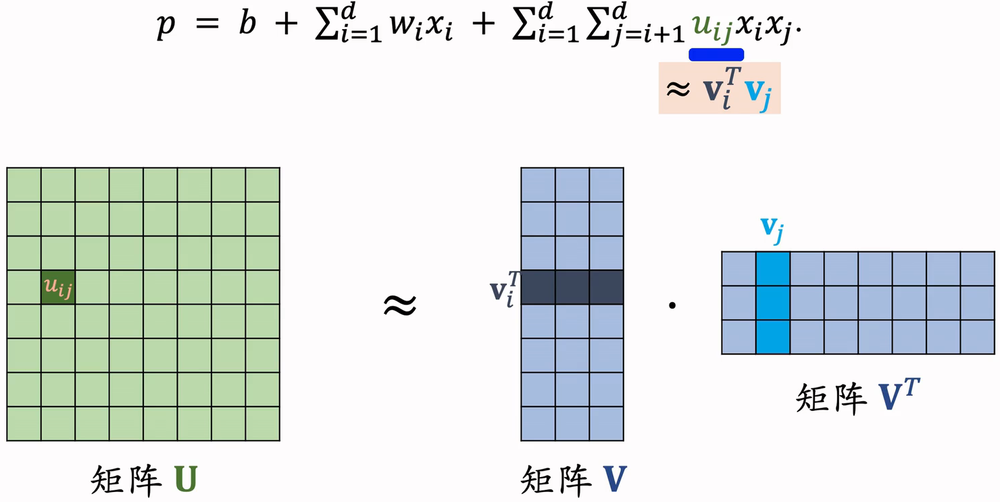
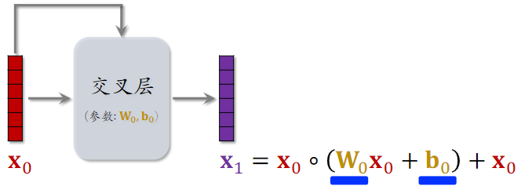
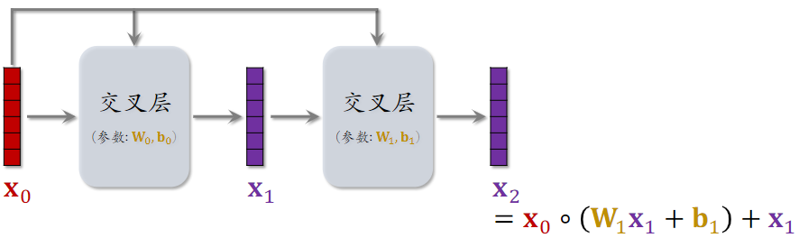
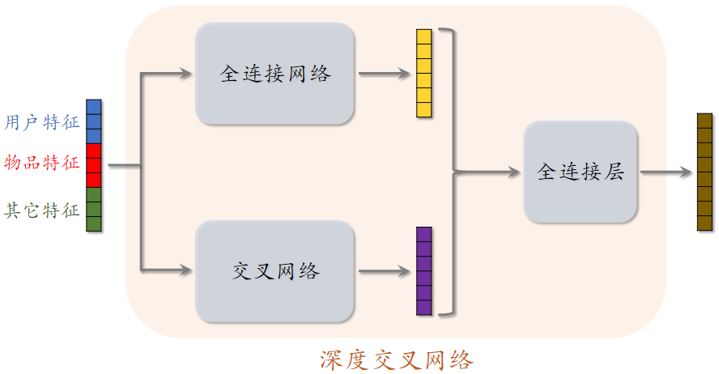
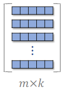
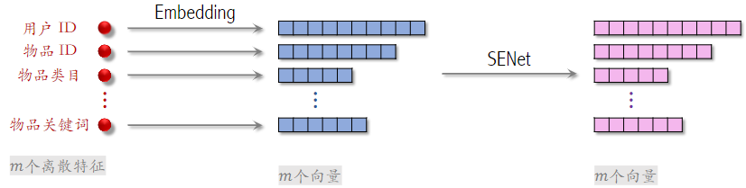
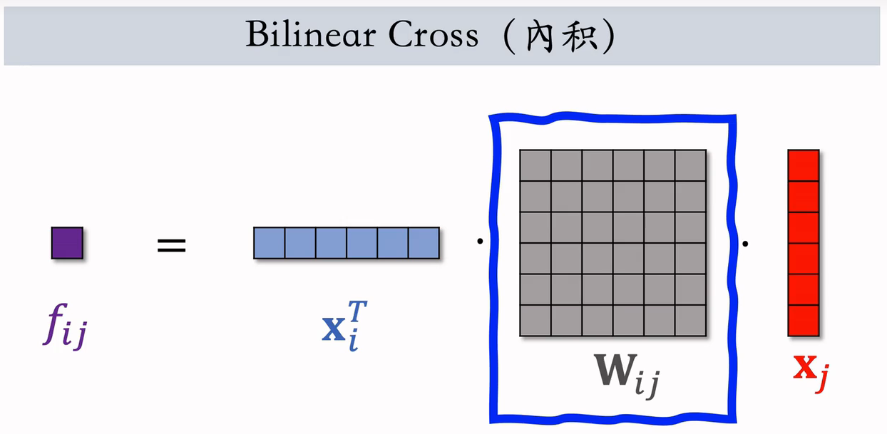
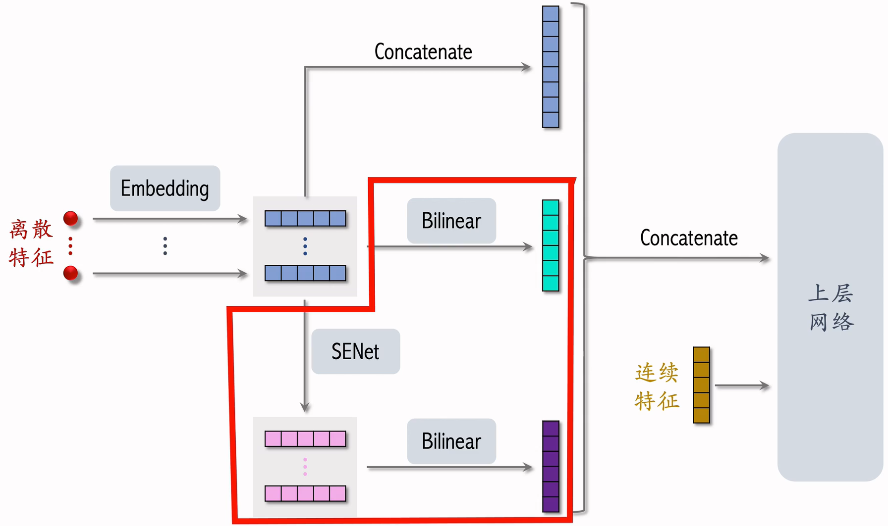

# 4.特征交叉

# 1.Factorized Machine (FM) &#x20;

FM 以前常用，现在用得少了，主要了解一下思想。 &#x20;

## 1.1 线性模型

- 有d个特征，记作 $\mathbf{x}=\left[x_{1}, \cdots, x_{d}\right]$
- 线性模型：b为偏移项bias，w为权重参数，p为目标的预估，如果做分类，可以用激活函数

$$
p=b+\sum_{i=1}^{d} w_{i} x_{i}
$$

- 模型有d+1个参数：$\mathbf{w}=\left[w_{1}, \cdots, w_{d}\right]$和$b$
- 预测是特征的加权和（只有加，没有乘），即特征之间没有交叉

## 1.2 二阶交叉特征

- 有d个特征，记作$\mathbf{x}=\left[x_{1}, \cdots, x_{d}\right]$
- 线性模型 + 二阶交叉特征：

$$
p^2=b^2+\sum_{i=1}^dw_ix_i+\sum_{i=1}^d\sum_{j=i+1}^du_{ij}x_ix_j
$$

- 前两项是线性模型，主要区别在第三项。$u_{ij}x_ix_j$是特征的交叉，其中u为权重；
- 模型有 $O(d^2)$个参数；d较大时，参数数量过多，且容易出现过拟合  。

如何减少参数的数量？重点关注交叉权重$u_{ij}$，把所有$u_{ij}$组成权重矩阵U，

- 使用矩阵$VV^T$来近似矩阵U
- k≪d，是一个超参数 &#x20;

## 1.3 Factorized Machine (FM)

$$
p=b+\sum_{i=1}^{d} w_{i} x_{i}+\sum_{i=1}^{d} \sum_{j=i+1}^{d}\left(\mathbf{v}_{i}^{T} \mathbf{v}_{j}\right) x_{i} x_{j}
$$

- FM 模型有$O(kd)$个参数（k≪d）

## 1.4 FM 总结 &#x20;

- FM 是线性模型的替代品，能用线性回归、逻辑回归的场景，都可以用 FM &#x20;

- FM **使用二阶交叉特征，表达能力比线性模型更强  **
- 通过做近似$u_{i j} \approx \mathbf{v}_{i}^{T} \mathbf{v}_{j}$，FM 把二阶交叉权重的数量从$O(d^2)$降低到$O(kd)$

参考文献：Steffen Rendle. Factorization machines. In ICDM, 2010. &#x20;

# 2.深度交叉网络（DCN）

DCN用来代替简单的全连接网络，DCN既可以用于排序，也可以用于召回

## 2.1召回、排序模型 &#x20;

### （1）双塔模型

用户塔和物品塔可以用任意的网络结构

### （2）标准多目标排序模型

shared bottom可以用任意网络结构

### （3）排序MMoE

专家神经网络也可以用任意的结构

## 2.2交叉层（Cross Layer） &#x20;

- Hadamard Product：逐元素相乘，要求两个向量的形状相同
- 这个操作类似于 ResNet 中的 跳跃链接 Skip Connection &#x20;
- 交叉层的参数，全部在全连接层中

- 交叉层的输入是两个向量 $x_0$和$x_i$，$x_0$是神经网络最底层的输入，$x_i$是神经网络第i层的输入
- 全连接层的输入输出向量大小是一样的，矩阵w和b是全连接层中的参数，也是交叉层中全部的参数。
- o为Hadamard Product
- 交叉层的输出与输入形状相同&#x20;

## 2.3 交叉网络（Cross Network）&#x20;

参考文献

- 这节课介绍的是 Cross Network V2\[1] &#x20;
- 老版本的 Cross Network 在论文\[2] 中提出   &#x20;

1. Ruoxi Wang et al. DCN V2: Improved Deep & Cross Network and Practical Lessons for Web-scale Learning to Rank Systems. In WWW, 2021. &#x20;
2. Ruoxi Wang et al. Deep & Cross Network for Ad Click Predictions. In ADKDD, 2017. &#x20;

## 2.4深度交叉网络 (Deep & Cross Network) &#x20;

- 把 **全连接网络、交叉网络、全连接层** 拼到一起，就是 深度交叉网络 DCN &#x20;
- 召回、排序模型中的各种 塔、神经网络、专家网络 都可以是 DCN &#x20;

# 3.LHUC网络结构

**LHUC 在工业界有效，不过只用于精排  **

标准的多目标排序模型，中间神经网络为shared bottom，被多个神经网络共享，用什么样的神经网络都可以，包括全连接网络、深度交叉网络和LHUC。

**Learning Hidden Unit Contributions (LHUC)**

- LHUC 起源于语音识别\[1] &#x20;
- 快手将 LHUC 应用在推荐精排\[2]，称作 **PPNet  **

参考文献： &#x20;

1. Pawel Swietojanski, Jinyu Li, & Steve Renals. Learning hidden unit contributions for unsupervised acoustic model adaptation. IEEE/ACM Transactions on Audio, Speech, and Language Processing, 2016. &#x20;
2. [快手落地万亿参数推荐精排模型](https://www.51cto.com/article/644214.html "快手落地万亿参数推荐精排模型") &#x20;

## 3.1语音识别中的 LHUC &#x20;

输入是一段语音信号，希望用神经网络对其做变换，得到更有效的表征，然后识别出语音中的文字。

语音是人说的，不同的人说话有所区别，所以是最好加入以下说话者的特征，对说话者的特征做embedding，得到说话者的向量。

- 说话者的特征：例如说话者的 ID，年龄，性别 等 &#x20;

网络结构：

- 把语音信号输入全连接层，得到一个向量；
- 把说话者的特征输入另一个神经网络，得到另一个向量；这个神经网络内部包含多个全连接层，最后一个全连接层的激活函数是 **Sigmoid 乘以 2**，即输出向量介于 \[0,2] ；
- 两个向量形状完全一样，计算两个向量的Hadamard Product，输出向量形状和两个输入向量形状相同；把两者信号相融合。
- 把输出向量再输入下一个全连接层，再输出一个向量；
- 把说话者的特征再输入一个神经网络，最后一层的激活函数也是 Sigmoid 乘以 2，即输出向量介于 \[0,2] ；
- 最后做Hadamard Product，输出最终向量。

## 3.2推荐系统排序模型中的 LHUC

输入变成了 物品特征 和 用户特征 &#x20;

# 4.SENet & Bilinear Cross &#x20;

## 4.1 SENet &#x20;

参考文献： &#x20;

1. Jie Hu, Li Shen, and Gang Sun. Squeeze-and-Excitation Networks. In CVPR, 2018. &#x20;
2. Tongwen Huang, Zhiqi Zhang, and Junlin Zhang. FiBiNET: Combining Feature Importance and Bilinear feature Interaction for Click-Through Rate Prediction. In RecSys, 2019. &#x20;

下面是推荐系统用到的离散特征，包括用户ID、物品ID等，对这些特征做Embedding，得到很多向量。

- 设一共有m个特征，每个特征表示为k维向量，把所有特征表示成 $m\times k$的矩阵。
- 对矩阵的行做AvgPool，得到m维元素；向量中的每一个向量，得到一个离散特征。
- 用FC和ReLU，把m维的向量，压缩成 $\frac{m}{r}$向量；r是压缩比列，设置为大于 1 的数；
- 在用FC和Sigmoid，恢复出m维的向量；
- 两个矩阵行相乘，得到$m\times k$的矩阵；中间m维矩阵的作用，就是对特征做加权。例如：学习发现物品 ID 对任务的重要性不高，就给物品 ID embedding 降权 &#x20;

刚刚为了方便，把m维离散特征映射成k个维度；其实这m个向量维度可以不同，但这不会影响SENet，SENet输出m个向量，和输入相同。

SENet 本质是对离散特征做 field-wise 加权；

Field 举例：

- 用户 ID Embedding 是 64 维向量 &#x20;

- 64 个元素算一个 field，获得相同的权重 &#x20;

如果有m个 fields，那么权重向量是m维Field 间特征交叉；

## 4.2 Field间特征交叉

SENet是一个Field之间的特征加权；Field间特征交叉是多个Field之间做特征交叉

### （1）特征交叉- 内积、哈达玛乘积

- 哈达玛乘积的输出是$m^2$个向量，参数量过大；如果要用它做特征交叉，必须人工选择 tier 做交叉 &#x20;

- &#x20;内积和哈达玛乘积都要求特征形状相同

### （2）**Bilinear Cross（內积）  **

- 不要求特征形状相同○
- $m ~fields →m^2$个交叉特征（实数） &#x20;
- $m ~fields →m^2/2$个参数矩阵 &#x20;
- 参数矩阵过多，**需要人工指定某些相关且重要的特征做交叉**，不能对所有特征做两两交叉

这也是，用哈达玛乘积，替换内积

- $m ~fields →m^2$个向量 &#x20;

- 在实践中依然需要人工指定某些特征做交叉 &#x20;

## 4.3 FiBiNet &#x20;

把 SENet 和 Bilinear Cross 结合起来就是 FiBiNet。 &#x20;

参考文献：Tongwen Huang, Zhiqi Zhang, and Junlin Zhang. FiBiNET: Combining Feature Importance and Bilinear feature Interaction for Click-Through Rate Prediction. In RecSys, 2019. &#x20;

- 以前我们就直接把离散特征的 Embedding 拼接后再与连续特征拼接
- FiBiNet 多做了一些工作
- 对离散特征的 Embedding 做 Bilinear Cross，得到交叉特征并拼接为 1 个向量
- 用 SENet 对 Embedding 做加权，再对这些向量做 Biliner Cross，得到交叉特征并拼接为 1 个向量
- 王老师个人认为这里的 Biliner Cross 多余了，小红书没有用，而是直接做了拼接 &#x20;
- 小红书借鉴了 FiBiNet，SENet 和 Bilinear Cross 在精排模型上确实有效 &#x20;
- 模型结构以及 Bilinear Cross 的实现都与原文区别很大 &#x20;

