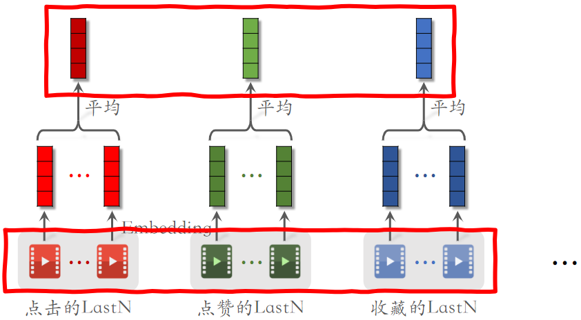

# 5.行为序列

# 1.用户行为序列建模 &#x20;

- 用户行为序列简称为 LastN，即用户最后交互的n个物品 &#x20;

- LastN 可以反映用户对什么样的物品感兴趣 &#x20;

## 1.1 **LastN 特征**

- LastN：用户最近的n次交互（点击、点赞等）的物品 ID &#x20;

- 对 LastN 物品 ID 做 embedding，得到n个向量 &#x20;

- 把n个向量取平均得到一个向量，作为用户的一种特征 &#x20;

- 适用于召回双塔模型、粗排三塔模型、精排模型 &#x20;

参考文献：Covington, Adams, and Sargin. Deep neural networks for YouTube recommendations. In ACM Conference on Recommender Systems, 2016. &#x20;

## 1.2小红书的实践 &#x20;

小红书的召回、粗排、精排中都用到了 LastN 行为序列。 &#x20;

- 取平均是早期的用法，效果不错；现在更多的是用 **Attention  **
- 上面得到的多个**向量拼接起来**，作为一种用户特征，传到召回或排序模型中 &#x20;
- Embedding 不只有物品 ID，还会有物品类别等特征 &#x20;

# 2.DIN 模型

对LastN建模的一种方法，效果优于平均

## 2.1 DIN 模型 &#x20;

- DIN 用加权平均代替平均，即注意力机制（attention） &#x20;
- 权重：**候选物品与用户 LastN 物品的相似度  **

参考文献：Zhou et al. Deep interest network for click-through rate prediction. In KDD, 2018. &#x20;

如下图所示：

- 红色向量：用户交互过的LastN向量表征；
- 蓝色向量：候选物品的向量表征；候选物品：比如粗排选出500个物品，这就是精排的候选物品；
- 计算相似度：计算$x_1$与q的相似度，....., 计算$x_n$与q的相似度；计算相似度的方法很多，如 内积 和 余弦相似度 等 &#x20;
- 紫色向量：与LastN向量相乘，得到加权和，权重是相似度

**DIN 模型总结  **

- 对于某候选物品，计算它与用户 LastN 物品的相似度 &#x20;
- 以相似度为权重，求用户 LastN 物品向量的加权和，结果是一个向量 &#x20;
- 把得到的向量作为一种用户特征，输入排序模型，预估（用户，候选物品）的点击率、点赞率等指标 &#x20;
- **本质是注意力机制（attention） **&#x20;

DIN 的本质是注意力机制

## 2.2简单平均 vs. 注意力机制 &#x20;

简单平均 和 注意力机制 都适用于精排模型 &#x20;

**简单平均适用于双塔模型、三塔模型 **&#x20;

- 简单平均只需要用到 LastN，属于用户自身的特征，与候选物品无关 &#x20;
- 把 LastN 向量的平均作为用户塔的输入 &#x20;

**注意力机制不适用于双塔模型、三塔模型  **

- 注意力机制 需要用到 LastN + 候选物品 &#x20;
- 用户塔看不到候选物品，不能把 注意力机制 用在用户塔  ，但是DIN需要候选特征，所以DIN不能放在用户塔。

# 3.SIM 模型 &#x20;

SIM 模型的主要目的是保留用户的长期兴趣。 &#x20;

## 3.1回顾 DIN 模型

DIN 模型

- 计算用户 LastN 向量的加权平均 &#x20;
- 权重是候选物品与 LastN 物品的相似度 &#x20;

DIN 模型的缺点：

- 注意力层的计算量 $∝n$（用户行为序列的长度），只能记录最近几百个物品，否则计算量太大
- **关注短期兴趣，遗忘长期兴趣；**通过实验发现，增长记录的行为序列，可以显著提升推荐系统的所有指标，但增加的计算量太大了 &#x20;

参考文献：Zhou et al. Deep interest network for click-through rate prediction. In KDD, 2018.&#x20;

**如何改进 DIN？**

- **目标**：保留用户长期行为序列（n很大），而且计算量不会过大
- 改进 DIN：DIN 对 LastN 向量做加权平均，权重是相似度 ；**如果某 LastN 物品与候选物品差异很大，则权重接近零；快速排除掉与候选物品无关的 LastN 物品，降低注意力层的计算量。  **

## 3.2 SIM 模型 &#x20;

- 保留用户长期行为记录，n的大小可以是几千；如果不用SIM，n的大小一般是200左右

- **对于每个候选物品，在用户 LastN 记录中做快速查找，找到k个相似物品 **&#x20;
- 把 LastN 变成 TopK，然后输入到注意力层 &#x20;

- SIM 模型减小计算量（从n降到k） &#x20;

- 参考文献：Qi et al. Search-based User Interest Modeling with Lifelong Sequential Behavior Data for Click-Through Rate Prediction. In CIKM, 2020. &#x20;

### （1）查找&#xA;

- 方法一：**Hard Search**：根据规则做筛选○根据候选物品的类目，保留 LastN 物品中类目相同的；简单，快速，无需训练  。
- 方法二：**Soft Search**：把物品做 embedding，变成向量 ；把候选物品向量作为 query，做k近邻查找，保留 LastN 物品中最接近的k个；**效果更好，编程实现更复杂  **

### （2）注意力机制 &#x20;

本质上核DIN没有区别，**只不过用用户的TopK交互记录，而不是LastN交互记录**。

## 3.3 Trick：使用时间信息 &#x20;

用户与某个 LastN 物品的交互时刻距今为$\delta$

&#x20;对$\delta$做离散化，再做 embedding，变成向量d；例如把时间离散为 1 天内、7 天内、30 天内、一年、一年以上 &#x20;

把两个向量做 concatenation，表征一个 LastN 物品交互记录

- 向量$x$是物品 embedding &#x20;
- 向量$d$是时间的 embedding&#x20;

**为什么 SIM 使用时间信息？  **

- DIN 的序列短，记录用户近期行为 &#x20;
- SIM 的序列长，记录用户长期行为 &#x20;
- 时间越久远，重要性越低 &#x20;

## 3.4结论 &#x20;

长序列（长期兴趣）优于短序列（近期兴趣） &#x20;

注意力机制优于简单平均 &#x20;

Soft search 还是 hard search？取决于工程基建 &#x20;

使用时间信息有提升 &#x20;

