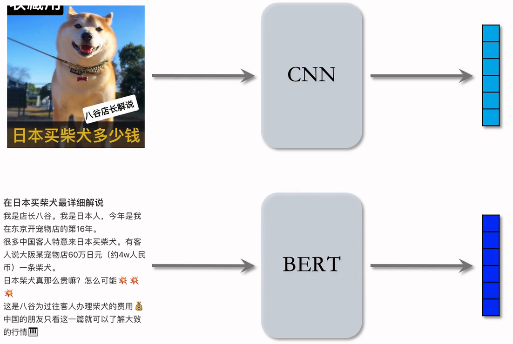
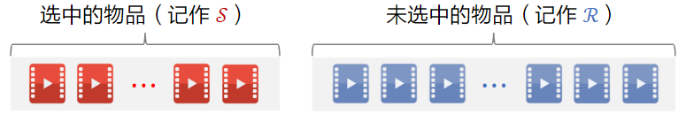
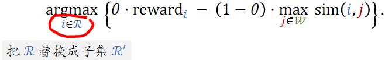
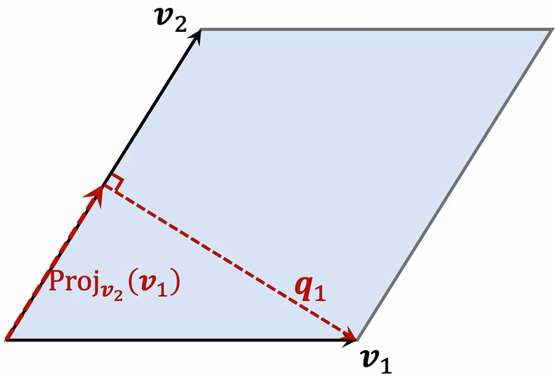
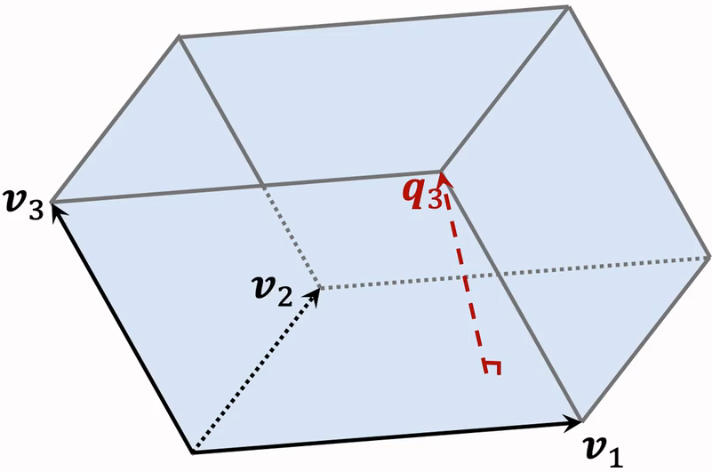

# 6.重排

# 1.推荐系统中的多样性

推荐给用户的物品**两两间不相识**，则说明推荐有多样性。

## 1.1 物品相似性的度量

**基于物品属性标签**：类目、品牌、关键词......

**基于物品向量表征**：

- 用召回的双塔模型学到的物品向量，不适用于多样性问题（不好）
- 基于内容的向量表征（好）（用CV和NLP提取内容特征）

### （1）基于物品属性标签

- 物品属性标签：类目、品牌、关键词......
- 标签通常是通过 CV 或 NLP 算法通过图文推算的，**不一定准确**
- 根据 一级类目、二级类目、品牌 计算相似度
  - 物品 i ：美妆、彩妆、香奈儿
  - 物品 j ：美妆、香水、香奈儿
  - 相似度：$sim_1(i,j)=1$， $sim_2(i,j)=0$，$sim_3(i,j)=1$，意思是一级类目相同，二级类目不同，三级类目相同；
  - 对三个相似度求加权和，其中的权重根据经验来设置

### （2）基于向量表征计算相似度

下图为双塔模型，两个向量的余弦相似度记为用户兴趣；

在多样性问题上，我们只需要物品塔的输出；如果两个向量相似，这物品向量表征的内积比较大；

如果把双塔学到的特征用在多样性问题上，也可以用，但是效果不太好。原因是**推荐系统的头部效应明显，新物品 和 长尾物品 的曝光少，双塔模型学不好 新物品 和 长尾物品 的向量表征**。

### （3）基于图文内容的物品表征

- CNN提取图片特征，BERT提取文字特征，把这两个向量拼起来，就是一篇笔记的向量表征。但是，该如何训练CNN个BERT？

- **CLIP\[1] 是当前公认最有效的预训练方法**
- 思想： 对于 **图片—文本** 二元组，预测图文是否匹配
- 优势：**无需人工标注**。小红书的笔记天然包含图片 + 文字，大部分笔记图文相关
- 做预训练时：同一篇笔记的 图文 作为正样本，它们的向量应该高度相似；来自不同笔记的图文作为负样本（Batch内负样本）。
- 参考文献：Radford et al. Learning transferable visual models from natural language supervision. In ICML, 2021.

- 一个 batch 内有 m对正样本；
- 一张图片和 和m-1条文本组成负样本；
- 这个 batch 内一共有 m(m-1) 对负样本

## 1.2 提升多样性的方法

### （1）粗排和精排

- **粗排和精排用多目标模型对物品做 pointwise 打分**，把每个物品作为独立的个体，准确预估交互、时长等。只考虑打分，而不考虑物品间的关联。
- 对于物品i，模型输出点击率、交互率的预估，融合分数$reward_i$
- $reward_i$表示用户对物品i的兴趣，在排序中就是物品本身的价值。

### （2）后处理

后处理的主要目的就是多样性

给定n个候选物品，排序模型打分$reward_1$,...,reward\_n；

从n个候选物品种选出k个，既**要他们的总分高，也需要他们有多样性**。

- 精排的后处理通常被称为 —— 重排，决定了那k个物品获得曝光；促排之后的多样性也是挺重要的，能显著提高指标。
- **增加多样性可以显著提升推荐系统指标（尤其是时长、留存率）**

# 2.Maximal Marginal Relevance (MMR)

## 2.1 多样性

- 多样性给n个候选物品打分，融合之后的分数为 $reward_1$, ..., $reward_n$
- 把第i和j个物品的相似度记作$sim(i,j)$，他可以是使用相似度计算或是向量表征计算得出。
- 从n个物品中选出k个，既要有高精排分数，也要有多样性。即结合reward和sim这两种分数，从n个物品中选出k个作为曝光的结果。

## 2.2 MMR 多样性算法

给未选中的物品打分：计算集合$R$中每个物品$i$的Marginal Relevance分数：

$$
\operatorname{MR}_{i}=\theta \cdot \operatorname{reward}_{i}-(1-\theta) \cdot \max _{j \in S} \operatorname{sim}(i, j)
$$

- $i$是已选中的物品，$j$是未选中的物品
- $ \max _{j \in S} \operatorname{sim}(i, j)$ ：衡量j于集合s的相似度，如果相似，则这一项较大
- $\theta$：介于0\~1之间的参数，平衡价值和多样性

Maximal Marginal Relevance (MMR)：

对于所有未选中物品i，计算MR分数，并选出分数最高的物品，把这个物品从集合R移到集合S。

### MMR算法小结

1. 已选中的物品$S$初始化为空集，未选中的物品$R$初始化为全集$\{1, ..., n\}$
2. 选择精排分数$reward_i$最高的物品，从集合$R$移动到$S$中；
3. 做$k-1$轮循环：（每次移动一个，重新算MMR分数）
   1. 计算集合$R$中所有物品的的分数 $\{MRR_i\}_{i \in R}$
   2. 选出分数最高的物品，将其从$R$移动到$S$。

## 2.3 滑动窗口

MMR：从物品集合中选出综合精排分数和多样性的物品

$$
MMR : \underset{i \in \mathcal{R}}{\operatorname{argmax}}\left\{\theta \cdot \operatorname{reward}_{i}-(1-\theta) \cdot \max _{j \in \mathcal{S}} \operatorname{sim}(i, j)\right\}
$$

以这样的方式计算MMR，但存在一个缺点：

- **已选中的物品越多（集合**$S$**越大），越难找出物品 **$i\in R$**，使得**$i$**与**$S$**中的物品都不相似**。
- 设sim的取值范围是$[0,1]$。当S很大时，多样性分数 $\max _{j \in \mathcal{S}} \operatorname{sim}(i, j)$总是等于1，导致MMR算法失效。

解决方案：**设置一个滑动窗口**$W$，比如最近选中的10个物品，用$W$代替MMR公式中的$S$。

**用滑动窗口的可解释性**：给用户曝光的连续物品应该不相似，但没必要最新的物品和 30 个之前的物品还不相似

## 2.4小结

- MMR 使用在精排的后处理（重排）阶段
- 根据精排分数和多样性分数给候选物品排序
- MMR 决定了物品的最终曝光顺序
- 实际应用中通常带滑动窗口，这样比标准 MMR 效果更好

# 3.重排的规则

- 工业界的推荐系统一般有很多业务规则，这些规则通常是为了保护用户体验，做重排时这些规则必须被满足
- 下面举例重排中的部分规则，以及这些规则与 MMR 相结合
- **规则的优先级高于多样性算法**

## 3.1重排的规则

### （1）**规则：最多连续出现 k篇某种笔记**

- 小红书推荐系统的物品分为图文笔记、视频笔记
- 最多连续出现 $k=5$篇图文笔记，最多连续出现k=5篇视频笔记
- 如果排i到i+4的全都是图文笔记，那么排在i+5的必须是视频笔记。

### （2）规则：每k篇笔记最多出现1篇某种笔记

- 运营推广笔记的精排分会乘以大于 1 的系数（boost），帮助笔记获得更多曝光。
- 为了防止 boost 影响体验，限制每$k=9$篇笔记最多出现1篇运营推广笔记。
- 如果排第1位的是运营推广笔记，那么排i+1到i+8的不能是运营推广笔记。

### （3）前t篇笔记最多出现k篇某种笔记

- 排名前t篇笔记最容易被看到，对用户体验最重要（小红书的top4为首屏）
- 小红书推荐系统带有电商卡片的笔记，过多可能会影响体验；
- 前t=1篇笔记最多出现k=0篇带电商卡片的笔记；
- 前t=4篇笔记最多出现k=1篇带电商卡片的笔记。

注：不是小红书的真实数据

## 3.2 MMR + 重排规则

- MMR 每一轮选出一个物品：

- **重排结合 MMR 与规则，在满足规则的前提下最大化 MR**
- 每一轮先用规则排除点$R$中部分物品，得到子集$R'$
- MMR公式中的$R$替换成子集$R'$，选中的物品符合规则

# 4.DPP：数学基础

- DPP：行列式点过程
- **DPP 的目标是从一个集合中选出尽量多样化的物品**，契合重排的目标
- 它是**目前推荐系统领域公认的最好多样性算法**

## 4.1超平行体示例

**2 维空间的超平行体为****平行四边形**

- 向量$v_1$和$v_2$是平行四边形的两条边，确定一个平行四边形
- 平行四边形中的点可以表示为：$\boldsymbol{x}=\alpha_{1} \boldsymbol{v}_{1}+\alpha_{2} \boldsymbol{v}_{2}$
- 系数 $\alpha_1$ 和$\alpha_2$的取值范围是$[0,1]$

**3 维空间的超平行体为****平行六面体**

- 平行六面体中的点可以表示为： $\boldsymbol{x}=\alpha_{1} \boldsymbol{v}_{1}+\alpha_{2} \boldsymbol{v}_{2}+\alpha_{3} \boldsymbol{v}_{3}$
- 系数 $\alpha_1$ ,$\alpha_2$，$\alpha_3$的取值范围是$[0,1]$

## 4.2 超平形体数学定义

一个向量 $\boldsymbol{v}_{1}, \cdots, \boldsymbol{v}_{k} \in \mathbb{R}^{d}$可以确定一个k维超平形体；这些向量是超平形体的边，都是d维向量。

$$
\mathcal{P}\left(\boldsymbol{v}_{1}, \cdots, \boldsymbol{v}_{k}\right)=\left\{\alpha_{1} \boldsymbol{v}_{1}+\cdots+\alpha_{k} \boldsymbol{v}_{k} \mid 0 \leq \alpha_{1}, \cdots, \alpha_{k} \leq 1\right\}
$$

要求$k≤ d$，比如d=3维空间中有k=2维平行四边形。

如果$\boldsymbol{v}_{1}, \cdots, \boldsymbol{v}_{k} $线性相关，则体积$\operatorname{vol}(\mathcal{P})=0$。（例：有k=3个向量，落在一个平面上，则平行六面体的体积为0）

## 4.3 平行四边形的面积

$面积 =\| 底 \left\|_{2} \times\right\| 高 \|_{2}$&#x20;

以$v_1$为底，计算高$q_2$，两个向量必须正交。

**以**$v_1$**为底，如何计算高**$q_2$**？**

- 计算$v_2$在$v_1$上的投影：

$$
\operatorname{Proj}_{v_{1}}\left(v_{2}\right)=\frac{v_{1}^{T} v_{2}}{\left\|v_{1}\right\|_{2}^{2}} \cdot v_{1}
$$

- 就算$\boldsymbol{q}_{2}=\boldsymbol{v}_{2}-\operatorname{Proj}_{\boldsymbol{v}_{1}}\left(\boldsymbol{v}_{2}\right)$
- 性质：低$v_1$与高$q_2$正交

**以**$v_2
 $**为底，如何计算高**$q_1
 $**？**

- 计算$v_1$在$v_2$上的投影：

$$
\operatorname{Proj}_{v_{2}}\left(v_{1}\right)=\frac{v_{1}^{T} v_{2}}{\left\|v_{2}\right\|_{2}^{2}} \cdot v_{2}
$$

- 就算$\boldsymbol{q}_{1}=\boldsymbol{v}_{1}-\operatorname{Proj}_{\boldsymbol{v}_{2}}\left(\boldsymbol{v}_{1}\right)$
- 性质：低$v_2$与高$q_1$正交

## 4.4 平行六面体的体积

$$
体积 = 底面积 \times \| 高 \|\left.\right|_{2}
$$

平行四边形 $\mathcal{P}\left(\boldsymbol{v}_{1}, \boldsymbol{v}_{2}\right)$是平行六面体$\mathcal{P}\left(\boldsymbol{v}_{1}, \boldsymbol{v}_{2}, \boldsymbol{v}_{3}\right)$的底。

高$q_3$垂直于底$\mathcal{P}\left(\boldsymbol{v}_{1}, \boldsymbol{v}_{2}\right)$

**体积何时最大化、最小化？**

- 设$v_1,$ $v_2$, $v_3$都是单位向量。
- 当三个向量正交时，平行六面体为正方体，体积最大化，vol=1
- 当三个向量线性相关时，体积最小化，vol=0

## 4.5衡量物品多样性

### （1）体积衡量多样性

给定k个物品，把他们表征为单位向量 $\boldsymbol{v}_{1}, \cdots, \boldsymbol{v}_{k} \in \mathbb{R}^{d}$。（$d≥k$）

用超平行体的体积衡量物品的多样性，体积介于 0 和 1 之间;

如果 $v_{1}, \cdots, v_{k}$两两正交（多样性好），则体积最大化，vol=1

如果 $v_{1}, \cdots, v_{k}$线性相关（多样性差），则体积最大化，vol=0

### （2）行列式衡量多样性

给定k个物品，把他们表征为单位向量 $\boldsymbol{v}_{1}, \cdots, \boldsymbol{v}_{k} \in \mathbb{R}^{d}$。（$d≥k$）

把他们作为矩阵$\boldsymbol{V} \in \mathbb{R}^{d \times k}$的列；

设 $d≥ k$，行列式与体积满足：

$$
\operatorname{det}\left(\boldsymbol{V}^{T} \boldsymbol{V}\right)=\operatorname{vol}\left(\mathcal{P}\left(\boldsymbol{v}_{1}, \cdots, \boldsymbol{v}_{k}\right)\right)^{2}
$$

因此，可以用行列式 $\operatorname{det}\left(\boldsymbol{V}^{T} \boldsymbol{V}\right)$衡量向量 $v_{1}, \cdots, v_{k}$的多样性

- 行列式和体积是等价的

# 5.DPP：多样性算法

## 5.1 多样性问题

精排给n个物品打分：$reward_1, ..., reward_n$

n个物品的向量表征：$\boldsymbol{v}_{1}, \cdots, \boldsymbol{v}_{n} \in \mathbb{R}^{d}$

从n个物品中选出k个物品，组成集合$S$

- **价值大**：分数之和$\sum_{j \in \mathcal{S}} \operatorname{reward}_{j}$ 越大越好
- **多样性好**：S中k个向量组成的超平行体 $\mathcal{P}(\mathcal{S})$的体积越大越好

集合S中的k个物品的向量作为列，组成矩阵 $\boldsymbol{V}_{\mathcal{S}} \in \mathbb{R}^{d \times k}$

以这k个向量作为边，组成超平形体$\mathcal{P}(\mathcal{S})$；体积$vol(\mathcal{P}(\mathcal{S}))$可以衡量S中物品的多样性。

设k≤ d，行列式与体积满足：

$$
\operatorname{det}\left(\boldsymbol{V}_{\mathcal{S}}^{T} \boldsymbol{V}_{\mathcal{S}}\right)=\operatorname{vol}(\mathcal{P}(\mathcal{S}))^{2}
$$

## 5.2 行列式点过程（DPP）

基本思想：**使用行列式衡量多样性**

DPP 是一种传统的统计机器学习方法：&#x20;

$$
\underset{\mathcal{S}:|\mathcal{S}|=k}{\operatorname{argmax}} \log \operatorname{det}\left(\boldsymbol{V}_{\mathcal{S}}^{T} \boldsymbol{V}_{\mathcal{S}}\right)
$$

- 该公式严格来说叫 k-DPP

**Hulu 的论文将 DPP 应用在推荐系统**：&#x20;

$$
\underset{\mathcal{S}:|\mathcal{S}|=k}{\operatorname{argmax}} \theta \cdot\left(\sum_{j \in \mathcal{S}} \operatorname{reward}_{j}\right)+(1-\theta) \cdot \log \operatorname{det}\left(\boldsymbol{V}_{\mathcal{S}}^{T} \boldsymbol{V}_{\mathcal{S}}\right)
$$

- 前半部分计算集合中物品的价值，越大表示选中的物品越符合用户的兴趣
- 后半部分是行列式的对数，测量合集S中的多样性；物品多样性越好，这部分越大
- **Hulu 论文的主要贡献不是提出该公式，而是快速求解该公式**

参考文献：Chen et al. Fast greedy map inference for determinantal point process to improve recommendation diversity. In NIPS, 2018.

## 5.3 DPP 应用在推荐系统：

- 设A为$n\times n$的矩阵，它的(i,j)元素为$a_{i j}=\boldsymbol{v}_{i}^{T} \boldsymbol{v}_{j}$
- 给定向量 $\boldsymbol{v}_{1}, \cdots, \boldsymbol{v}_{n} \in \mathbb{R}^{d}$，需要$O\left(n^{2} d\right)$的时间计算A
- $A_S$为A的一个$k\times k$子矩阵。如果i，则$a_{i,j}$是$A_S$的一个元素

DPP公式可以等价写成以下形式：

DPP是个组合优化问题，从集合$ \{1,...,n\}$中选出一个大小为k的子集S。

用S表示已选中的物品，用R表示未选中的物品，贪心算法求解：

$$
\underset{i \in \mathcal{R}}{\operatorname{argmax}} \theta \cdot \operatorname{reward}_{i}+(1-\theta) \cdot \log \operatorname{det}\left(\boldsymbol{A}_{\mathcal{S} \cup\{i\}}\right)
$$

- ${reward}_{i}$：是物品i的价值，希望下一个物品也有较高的价值
- $\log \operatorname{det}\left(\boldsymbol{A}_{\mathcal{S} \cup\{i\}}\right)$：行列式的对数，括号中是A的一个子矩阵，这个子矩阵比$A_S$多了一行和一列，行列式会发生变化，我们希望添加的物品i能让行列式尽量大，即物品i和行列式中的物品尽量不相似，否则行列式为0.

## 5.4 求解 DPP

贪心算法求解：

$$
\underset{i \in \mathcal{R}}{\operatorname{argmax}} \theta \cdot \operatorname{reward}_{i}+(1-\theta) \cdot \log \operatorname{det}\left(\boldsymbol{A}_{\mathcal{S} \cup\{i\}}\right)
$$

- 初始时$S$中只有一个物品，$A_S$是1$\times1$的矩阵

### （1）暴力算法

- 对于单个$i$，计算$\boldsymbol{A}_{\mathcal{S} \cup\{i\}}$的行列式需要$O\left(|\mathcal{S}|^{3}\right)$时间，因为需要对矩阵$A_S$分解。
- 对于所有的$i \in \mathcal{R}$，计算行列式需要时间$O\left(|\mathcal{S}|^{3} \cdot|\mathcal{R}|\right)$
- 需要求解上式k次才能选出k个物品。如果暴力计算行列式，那么总时间复杂度为：

$$
O\left(|\mathcal{S}|^{3} \cdot|\mathcal{R}| \cdot k\right)=O\left(n k^{4}\right)
$$

- 暴力求解的总时间复杂度为：

$$
O\left(n^{2} d+n k^{4}\right)
$$

- 其中 $n^d$是计算矩阵$A_S$的时间复杂度，$nk^4$是计算行列式时间

n的量级是几百，d和k的量级都是几十。这个时间复杂度看起来不大，但系统留给多样新计算的时间只有十几毫秒，复杂度还是有点高。

### （2）Hulu的快速算法

Hulu的论文设计了一种数值算法，仅需$O\left(n^{2} d+n k^{2}\right)$的时间从n个物品中选出k个物品。

- 给定向量 $\boldsymbol{v}_{1}, \cdots, \boldsymbol{v}_{n} \in \mathbb{R}^{d}$，需要$O\left(n^{2} d\right)$的时间计算A
- 用$O\left(n k^{2}\right)$时间计算所有的行列式（利用**Cholesky分解**）。

Cholesky分解$\boldsymbol{A}_{\mathcal{S}}=\boldsymbol{L} \boldsymbol{L}^{T}$，其中L是下三角矩阵（对角线以上元素全零）

Cholesky分解可供计算$A_S$的行列式：

- 下三角矩阵$L$的行列式$det(L)$等于$L$对角线元素乘积。
- $A_S$的行列式为$\operatorname{det}\left(\boldsymbol{A}_{\mathcal{S}}\right)=\operatorname{det}(\boldsymbol{L})^{2}=\prod_{i} l_{i i}^{2}$

给$A_S$添加一行一列，Cholesky矩阵的变换非常小，能快速算出$\boldsymbol{A}_{\mathcal{S} \cup\{i\}}$的行列式。

已知$\boldsymbol{A}_{\mathcal{S}}=\boldsymbol{L} \boldsymbol{L}^{T}$，则可以快速求出所有$\boldsymbol{A}_{\mathcal{S} \cup\{i\}}$的Cholesky分解，因此可以快速计算出所有$\boldsymbol{A}_{\mathcal{S} \cup\{i\}}$的行列式。

## 5.5 DPP 的扩展

### （1）滑动窗口

用$S$表示已选中的物品，用$R$表示未选中的物品，DPP的贪心算法求解：

$$
\underset{i \in \mathcal{R}}{\operatorname{argmax}} \theta \cdot \operatorname{reward}_{i}+(1-\theta) \cdot \log \operatorname{det}\left(\boldsymbol{A}_{\mathcal{S} \cup\{i\}}\right)
$$

DPP缺点：**随着集合S增大，其中相似物品越来越多，物品向量会趋近线性相关；行列式**$\operatorname{det}\left(\boldsymbol{A}_{\mathcal{S}}\right)$**会坍缩到零，对数趋于负无穷**。

用滑动窗口公式：

$$
\underset{i \in \mathcal{R}}{\operatorname{argmax}} \theta \cdot \operatorname{reward}_{i}+(1-\theta) \cdot \log \operatorname{det}\left(\boldsymbol{A}_{\mathcal{W} \cup\{i\}}\right)
$$

### （2）规则约束

贪心算法每轮从R中选出一个物品：

$$
\underset{i \in \mathcal{R}}{\operatorname{argmax}} \theta \cdot \operatorname{reward}_{i}+(1-\theta) \cdot \log \operatorname{det}\left(\boldsymbol{A}_{\mathcal{W} \cup\{i\}}\right)
$$

有很多规则约束，例如最多连续出 5 篇视频笔记（如果已经连续出了 5 篇视频笔记，下一篇必须是图文笔记）

用规则**排除掉**$R$**中部分笔记，得到子集**$R'$，然后求解：

$$
\underset{i \in \mathcal{R}^{\prime}}{\operatorname{argmax}} \theta \cdot \operatorname{reward}_{i}+(1-\theta) \cdot \log \operatorname{det}\left(\boldsymbol{A}_{\mathcal{W} \cup\{i\}}\right)
$$

