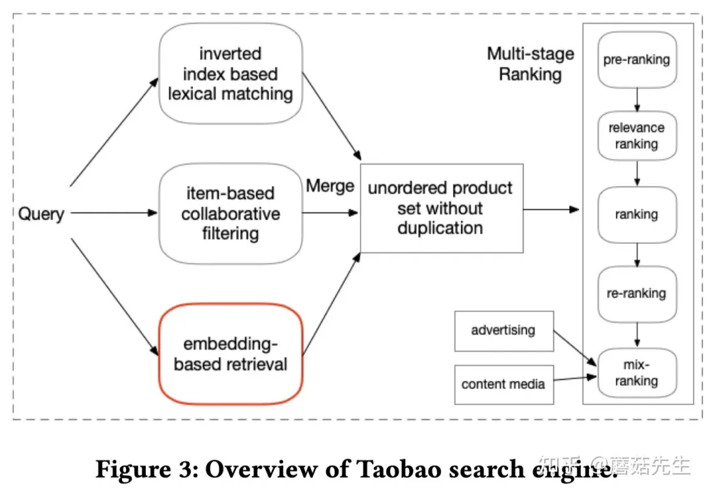

# 1.开篇语

RAG在整个大模型技术栈里的重要性毋庸置疑，而在RAG中，除了大模型之外，另一个不可或缺的部分，就是搜索系统，大模型的正确、稳定、可控生成，离不开精准可靠的搜索系统，大量的实验中都有发现，在搜索系统足够准确的前提下，大模型的犯错情况会骤然下降，因此，更全面、系统地了解搜索系统将很重要。

开篇语主要是和大家介绍一下搜索系统的概况，包括他的具体场景，以及在目前大模型环境下的地位以及使用场景区别。

## 1.搜索系统概念的理解

所谓搜索系统，大家比较普遍认可的概念是，**能从海量的信息中找到所需要的内容的方案，都可以被称为搜索**，除了大家所熟知的百度搜索外，在图书馆里找一本书，在音乐软件里找一首音乐，在美团上找一家外卖，这些背后的事，都可以被称为搜索。有几个角度希望和大家展开说一下。

首先是，搜索并不是一个很新的概念，而是一个发展比较久的学问了。北大有图书馆学情报学系，清华大学也有“信息管理与信息系统专业”，虽说所属方向略有差别，但其内部有一个关键的目标就是对信息的优化管理以及使用，其本质和搜索系统非常匹配，这么看搜索的研究可以说是历史悠久了。

第二，**搜索的内容并非局限，而且各自的技术也非常丰富**。搜索不能局限在百度这样的大搜上（一般而言大搜是指开放域，比较广泛的搜索），刚才提了几个例子，搜图书、搜音乐、搜外卖、搜商品，这些都算是搜索，而且实际上也已经渗透到大家生活的方方面面了，往高端的说法，可以说是“多模态”，当然可能也不局限在多模态，类似商品、外卖这种异构信息的搜索，就已经超出了常规的文本、图片、声音、视频的简单模态范畴了，尽管多模态和异构的研究看似有些陌生或者不成熟，但也已经在自己的领域非常满足用户的需求，因此，在对问题进行研究、分析的时候不能把搜索问题局限在文本之类的简单信息上。

第三，**必要强调搜索和推荐的核心区别**。在SIGIR相关的顶会，有说过搜索和推荐在匹配上的类似点，搜索是文档和query的相似，推荐是物料和用户的相似，但实际从产品层面，用户对匹配的要求是不一样的，在大部分情况下，用户对搜索系统的要求更高更严格，其背后的根本原因是用户在使用搜索系统的时候是有明确目标的，相关都不见的足够，毕竟类似复述query的答案、高频文档不见得有意义，要求要所答即所问，在张俊林比较出名的搜索上书籍《这就是所搜索引擎》里同样也强调了“准”的重要性。

## 2.搜素系统的场景

为了拓宽大家对搜索系统的理解，这里举几个比较典型的搜索系统场景，同时也和大家说一下这几个搜索场景内部具体的业务特性以及应对方法。

### 2.1 泛搜/大搜

比较常用的通用性搜索，常见的如百度、谷歌等，当然现在很多所谓的AI搜索，大都属于这个范畴里。对于早期版本，比较简单的方式就是不做很特别的处理，依赖通用baseline方案直接搜，直接用字面、向量等，当然大模型也是一定程度可依赖的，但实际上，也可能会有很多特别地问题，此时就要分意图、分领域针对性的处理，这个在之前的说法叫做意图识别，现在就是路由（route）或者是更潮的方案就是agent。

当然，不同的系统里面可能会有不同的结果，具体好不好，就见仁见智了。例如同样是搜索“六级词汇”，百度和号称AI搜索的天工AI的结果分别是这样的：

> 百度搜索结果

> 天工AI搜索结果

两者对比下来，可能百度的结果在多样性和有效性上会更高一些，天工的这个结果应该是经过了模型生成处理，内容上没什么毛病，不过基本上没有解决实际的问题，只是把内容拓展解释了一下，没有给出六级词汇表之类的。

### 2.2 音乐/视频搜索

音乐/视频搜索，这种搜索对物料的性质有很高的要求，而且用户在现实的使用上，更多倾向于标签或者某些关键字段的检索，同样举例子吧。

比较常见的，根据歌手返回音乐，下面是网易云音乐的结果：

> 网易云音乐搜索结果 &#x20;

这个没有想象中那么简单，对于用户的输入，我们需要首先识别到他是一个“歌手”，把他从歌名或者歌词中解区分出来，这里就需要大量的实体抽取的技术来实现，显然这不是直接字面检索或者向量检索就能准确稳定的实现的。

当然，音乐还有一种非常特别的技术——听歌识曲，这里的用户输入就很明显和其他的不同，这里输入的是一段音频了，如何把给定的片段表征好然后再曲库里检索，也同样非常有技术含量，这里推荐看这些文章。

- 腾讯音乐的新一代歌曲识别技术：[https://zhuanlan.zhihu.com/p/541450154](https://zhuanlan.zhihu.com/p/541450154 "https://zhuanlan.zhihu.com/p/541450154")
- 这个系列的文章也值得推荐：[https://zhuanlan.zhihu.com/p/75360272](https://zhuanlan.zhihu.com/p/75360272 "https://zhuanlan.zhihu.com/p/75360272")

### 2.3 商品搜索

商品搜索可以说是最接近推荐系统的一种搜索了。我们在淘宝、精通搜索的时候，往往都只会给很简单的一个实体名词，例如“电脑”，顶多会加一些补充说明的关键词，例如“4060”，或者是“i7”，但实际情况下，这些搜索词下都会有大量的商品，典型的还有就是服装类的，如“长裤”、“裙子”等，下面有数不尽符合这个query的产品，此时的排序显然就不能随机了，可以考虑依靠热度、用户偏好、最近活动、新品等信息来进行综合的评判，在这个情况下，就和推荐系统极为相似了。

很早的一篇淘宝的embedding的文章（[KDD21-淘宝向量检索](http://mp.weixin.qq.com/s?__biz=MzIzMzYwNzY2NQ==\&mid=2247487695\&idx=1\&sn=370ac19afbbb2c27a07ed6c3fa8b9b70\&chksm=e8824851dff5c1474f522ef37a17661900fd1494c9043ebc1b94426d219fc0053f098538b4b9\&scene=21#wechat_redirect "KDD21-淘宝向量检索")）来看，这个性质就非常明显，在模型里，要兼顾query信息、短长期行为、产品信息等，综合起来完成表征，这里因地制宜的思想体现的很明确，背后也体现了作者对业务问题的理解深度，简单的生搬硬套向量匹配显然并不能解决这些问题。

在论文内，作者还简单介绍了淘宝搜索的技术架构，技术架构的事先不展开说，下一篇会专门讲，大家可以提前感受一下：

## 3.大模型场景下搜索系统的理解

NLP最常见的两个场景，就是搜索和对话，在大模型的新时代，也是如此，此时，搜索成为一个重要的NLP载体，让大模型上了船，而另一方面，大模型也让搜索系统更新换代，带来很多新的发展。这里，我来说说我的几个理解吧。

首先，要认清这两个名词的性质和所面临的问题。大模型的本质还是一项技术，或者说是一个工具，它能被用在很多场景，但既然是工具，就有被替代、不被选择的可能，直接说“大模型替代了XX”，显然是鲁莽的，相反，在面对实际问题的时候，我们应该把他和原有的方案放在一起，进行严格的对比分析再来进行选择，如果不好分辨，则可以进行相应的实验；而搜索系统，这个和推荐系统类似，都是一个系统，也可以说是一个产品，既然是系统或者产品，内部就是多个技术合力完成的，这里可以放大模型，也可以是别的模型，甚至精排至今还在高频使用估计已经被称为原始时代的机器学习模型，而另一方面类似推荐系统也仍旧有NLP的一席之地——内容理解。而为了成就一个优秀的产品，我们对技术的看法就不能简单的新不新、low不low，而还要考虑具体的算法效果，达成效果所需要的成本，以及用户应用时的性能体验。

其次，RAG是大模型的一个很好的应用，这里的R，可以把他拓展成一个五脏俱全的搜索系统，而在优化他的过程中，一个比较稳的方案，就是直接去参考类似的搜索系统常用方案，这里的架构也可以充分参考来构建，之所以说是稳的，是因为这都是前人已经踩平的路了，其他的可能多少也有尝试。当然，如果要创新，肯定还是要多想多尝试，沿着旧路肯定最多就只能第二了。

第三，在我的视角看，一些所谓的AI搜索，然后把这些东西和之前就有或者有了很久的搜索给割席，在技术视角看就像是一个运营话术，为了破圈让用户尝试而已。从我看的资料来看，不外乎就是用了大模型生成，或者就是用了所谓的自然语言处理技术而已，但这些技术老牌大厂百度、谷歌、必应之类的，就不能用吗，显然不是，而且真不是没有用到，下图就是百度的结果，那这个算不算AI搜索呢？至于自然语言处理技术，就更离谱了，类似的技术早就在搜索圈里广泛使用了，所以做技术的还是尽量不要被这种说法给带偏了，以为只有用啥才是AI，这样技术选型就被无关的内容限制了。

最后，搜索领域发展至今来看，一直是稳定的代表。从搜索的发展历史来看，搜索的顶峰似乎都不是很高，但是每次打的迭代都能让搜索喝到汤，从早年NLP起步，到百度等的搜索系统崛起，再到后续BERT、大模型等，虽并不耀眼，但一直在发光，而且人类对知识检索的需求一直都存在，因此搜索场景可能是一个相对稳定的领域方向吧。

