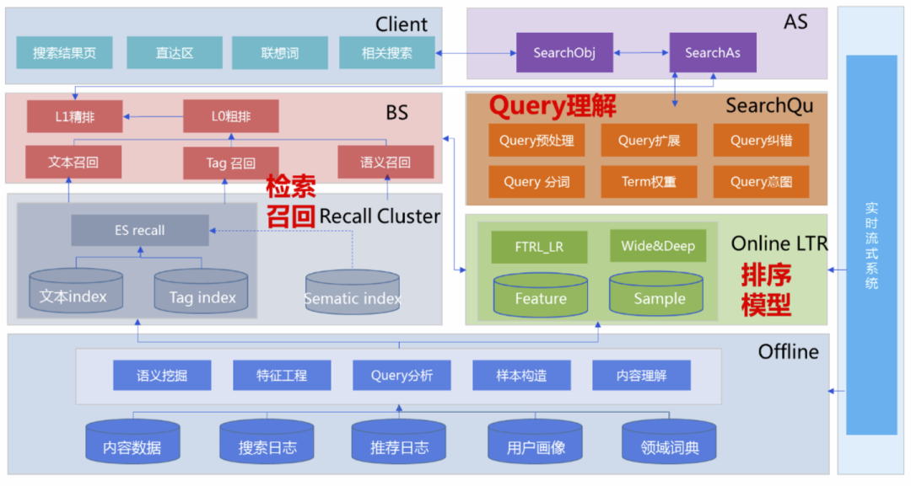
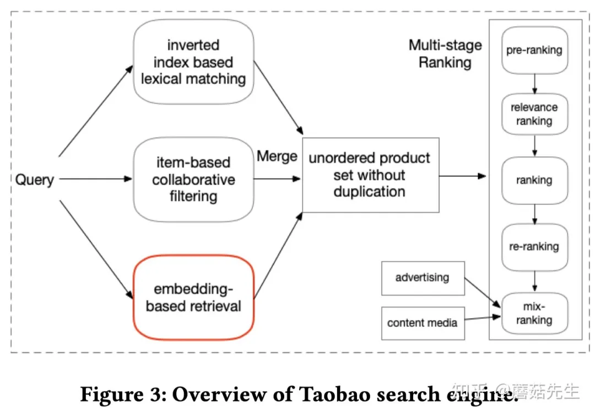
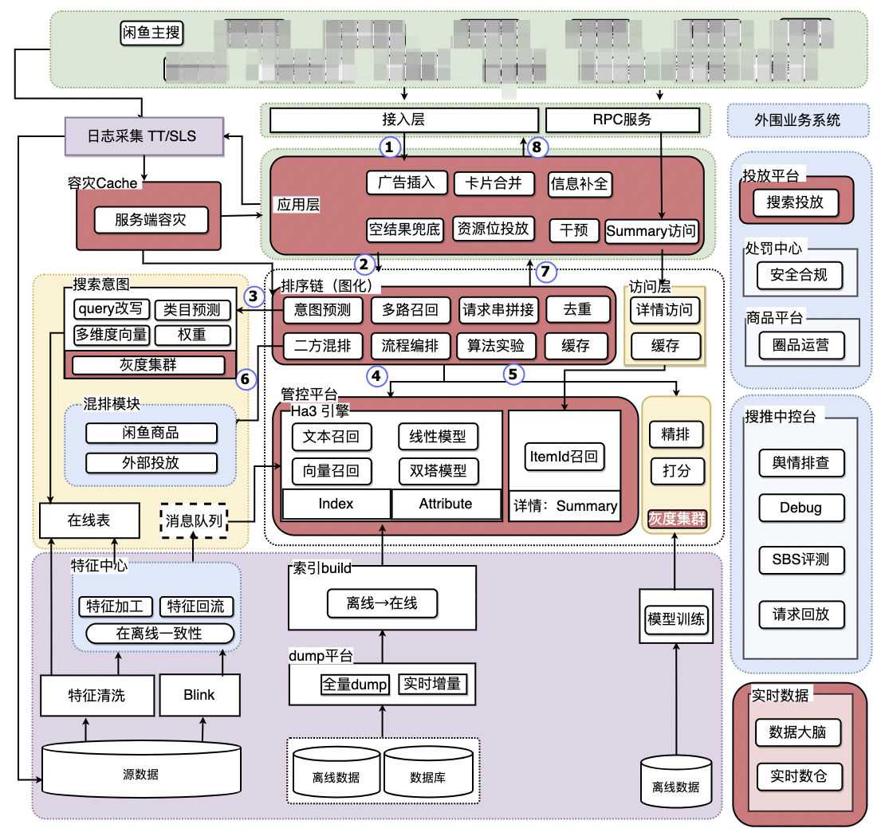
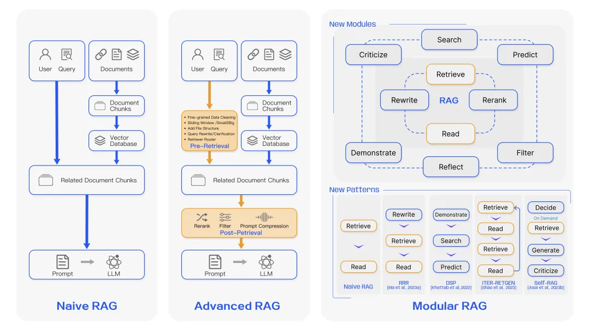
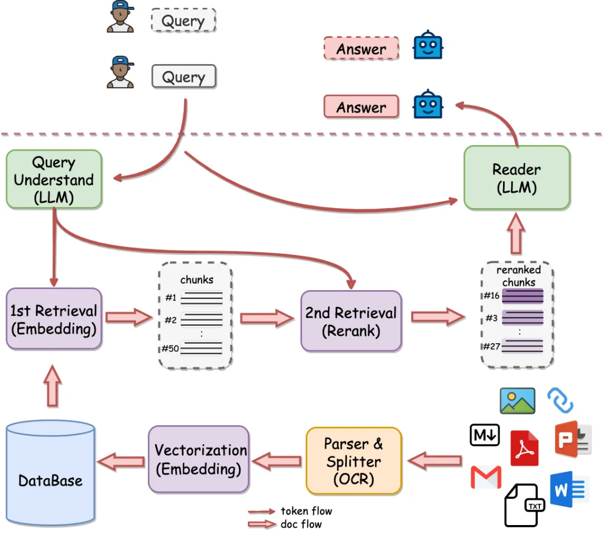
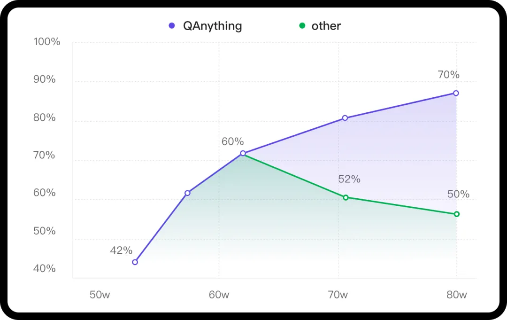

# 2.常见架构

RAG在整个大模型技术栈里的重要性毋庸置疑，而在RAG中，除了大模型之外，另一个不可或缺的部分，就是搜索系统，大模型的正确、稳定、可控生成，离不开精准可靠的搜索系统，大量的实验中都有发现，在搜索系统足够准确的前提下，大模型的犯错情况会骤然下降，因此，更全面、系统地了解搜索系统将很重要。

本期介绍一下目前常见的搜索系统架构，这些架构多半是大厂经过实验探索得到的比较通用的方案，时至今日仍在被广泛使用，而且这些结构很大程度上恒本RAG的应用所借鉴。

## 1.先来几个案例

### 1.1 腾讯搜索架构

首先放出来的是一篇有关腾讯搜索的架构文章（[腾讯搜索的Query理解如何直击心灵](http://mp.weixin.qq.com/s?__biz=MzIzMzYwNzY2NQ==\&mid=2247486139\&idx=1\&sn=ae4e206865676b5171779f30cb69ed62\&chksm=e8825225dff5db33c7c72af05dd2928b60fd4e2904e06cd6315480741ded6696084cf61bd91a\&scene=21#wechat_redirect "腾讯搜索的Query理解如何直击心灵")），在这篇文章中，腾讯搜索给出的架构是这样的。

这里把整个搜索引擎划分为7个模块，分别是**客户端、AS、BS、Query理解、召回组件（搜索引擎）、排序模型和离线**，各有各负责的部分。

- **客户端**是**向用户直接展示搜索功能的窗口**，下属结果页、直达、联想词、相关搜索这几个部分，这也是搜索除了检索内容外的生态下其他内容。
- **AS（高级检索，Advanced Seach）**，**对外提供搜索引擎能力**，在别的一些地方也有成为Center之类的，在我的视角下一般类似BAT之类的厂商或者有关的人员，都会有这个AS的说法，不过其他厂商好像会比较少。
- **Query理解**，**是对用户输入的Query进行完整完善的解析**，熟知的预处理、意图啥的就都放在这个部分，旨在抽取有利于后续召回、排序等步骤的信息。
- **BS（基础检索，Basic Search）**，**完成基本的检索能力**，文本（字面）召回、Tag召回、语义（向量）召回等都是在这个部分，直接面对的就是下面的搜索引擎了，架构上作者把排序，即精排和粗排也放在这里。
- **召回组件**，这里倾向于叫做搜索引擎，主要是因为这个就是工程层面用于加速召回的各种检索的组件了，毕竟对于海量的知识，要快速查询出来，这个并不是一件容易的事。此处提到的是ES，即ElasticSearch，可以支持多种索引，至今仍然是很常用的搜索工具。
- **排序**，这里强调的是在线的LTR（learning to rank），结合更多其他信息来进行综合排序，注意此处不止有语义本身，还有一些额外的信息，例如文档的质量（如点击量）、用户偏好、时间热点等信息，这些信息很多都来源于离线的挖掘（利息按模块负责），此时简单的语义模型肯定办不到的，这里常用的模型和推荐系统很类似，例如LR、XGBoost、Wide\&Deep等，旨在融合多个来源的特征。
- **离线模块**主要是对各种离线数据进行处理，包括搜索文档、推搜日志的处理，这块有大量的工作，单独建立一个模块处理是非常有必要的。

### 1.2 电商搜索

商品搜索给出两个例子，一个是淘宝搜索，另一篇是闲鱼搜索。

先讲淘宝搜索里面的例子，在论文"Embedding-based Product Retrieval in Taobao Search"中，作者给出了淘宝内部检索引擎中的一个初步的架构，这个同样非常有代表性。

商品搜索相比通用搜索带来的特殊性，在上一期也有提到过，商品搜索的用户在习惯上大都是输入简单的品牌、商品名词，这种简单输入下符合检索词的物料就会非常多，为了进行进一步的精筛，就依赖其他信息，例如用户偏好，到了这一步，与其说是搜索，不如说是推荐了，协同过滤之类的招数就直接用上了。

首先对query，作者进行了3个维度的处理：**倒排字面检索、item协同过滤、向量表征检索（论文的重点），而后经历合并去重后，就开始进入排序了**。排序内有相似度、重排，还有考虑内容视频、广告的合并等。

另外这篇论文也写过解读（[KDD21-淘宝向量检索](http://mp.weixin.qq.com/s?__biz=MzIzMzYwNzY2NQ==\&mid=2247487695\&idx=1\&sn=370ac19afbbb2c27a07ed6c3fa8b9b70\&chksm=e8824851dff5c1474f522ef37a17661900fd1494c9043ebc1b94426d219fc0053f098538b4b9\&scene=21#wechat_redirect "KDD21-淘宝向量检索")），商品搜索是通用搜索下非常特别的一个品类，仔细拼读有利于对这个方向的理解。

然后是闲鱼搜索，这篇文章“电商搜索里都有啥？详解闲鱼搜索系统（长文）”，原文在：[https://zhuanlan.zhihu.com/p/568564519](https://zhuanlan.zhihu.com/p/568564519%EF%BC%88%E5%90%8E%E9%9D%A2%E6%9C%89%E7%A9%BA%E6%88%91%E5%BA%94%E8%AF%A5%E4%B9%9F%E4%BC%9A%E4%B8%93%E9%97%A8%E5%86%99%E6%96%87%E7%AB%A0%E8%81%8A%EF%BC%89%EF%BC%8C%E8%BF%99%E9%87%8C%E7%9B%B4%E6%8E%A5%E7%BB%99%E5%87%BA%E4%BB%96%E6%8F%90%E4%BE%9B%E7%9A%84%E6%8A%80%E6%9C%AF%E6%9E%B6%E6%9E%84%E3%80%82 "https://zhuanlan.zhihu.com/p/568564519")

这个结构和前面的腾讯的结构非常接近，基本的query理解、召回等都有，只是划分会有些不一样，与之不同的是搜索相关的组件变得更加丰富。首先，大家应该比较关心的应该是推理的关键流程：

- **请求接入，进入应用层**。应用层实质是内部服务对外的接口层，如H5、APP端的接入。
- **应用层请求排序接入层**，这里的排序接入层是指到达核心搜索引擎内部。
- **意图预测**。此处会进行各种query理解的工作。
- **搜索引擎**。向底层数据库发起请求，进行内容的检索，重点是海选、粗排、精排3个阶段。
- **精排模型打分**。对内容进行最终的筛选。
- **结果返回**。重新返回到排序接入层、应用层、接入层，完成渲染，把结果有序返回给用户。

而其中的不同点，我也整理了出来。

- **容灾**，主要针对服务，虽然没有展开说，不过提出来还是点出了安全的重要性。
- **运营投放平台**，一般是给运营使用的综合性平台，包括安全合规、广告平台等。这个的背后需要和算法等模块通力合作，才能让整个搜索系统更为可控稳定。
- **中控台**。中控此处的概念会有些不同，内容好像比较杂，舆情、debug、评测、请求回放的功能都会放在这，实质看起来像是一个供给开发等职能的工作者进行分析和研究的工具。
- **离线**，即图中的紫色部分，也给出了离线需要做的工作，包括离线的各种特征的处理、物料等内容的理解和入库、模型训练。

### 1.3 RAG架构

特别地，这里把RAG的常见架构也写在文章里，这里我也根据之前看文章的经验，把有关结构这块的讨论给出来。

首先是，在科研界看来，RAG整体模块的划分，目前还在一个研究试验的阶段，无论是从RAG的综述来看（[综述-面向大模型的检索增强生成（RAG）](http://mp.weixin.qq.com/s?__biz=MzIzMzYwNzY2NQ==\&mid=2247489372\&idx=1\&sn=8fc154edac26943a447d596a4e697ede\&chksm=e8824fc2dff5c6d44d8e7a1be4cc1b472e8cdd8e8484bf02d00f78ab708e6340f6f90243cb0c\&scene=21#wechat_redirect "综述-面向大模型的检索增强生成（RAG）")），还是在论文的讨论上看（CRAG：[谷歌中科院新文：CRAG-可矫正的检索增强生成](http://mp.weixin.qq.com/s?__biz=MzIzMzYwNzY2NQ==\&mid=2247489437\&idx=1\&sn=b70db6190484c4056318b8275b014dd6\&chksm=e8824f03dff5c61579c9eeb01c588f3713bbfbb0b7786cc81246144c52d65715ca31d975610f\&scene=21#wechat_redirect "谷歌中科院新文：CRAG-可矫正的检索增强生成")、self-RAG：[self-RAG-大模型决策的典型案例探究](http://mp.weixin.qq.com/s?__biz=MzIzMzYwNzY2NQ==\&mid=2247489393\&idx=1\&sn=1917808697d84cfd17e628d58b3bfd89\&chksm=e8824fefdff5c6f93a322772245c5d4c5c1b22f0f05a45f60d096a99b07bfdb12f54042d5aaf\&scene=21#wechat_redirect "self-RAG-大模型决策的典型案例探究")），都在非常大胆的实验中，其核心原因是，需要**探索Retrieval和大模型如何更好地结合**，希望以更低的消耗成本达到强化效果的效果，在这个原因下，研究的中心不会局限在检索本身，但重点还是离不开优秀的检索模块，在综述来看，RAG在结构上的研究，可以简单地用这个图表示。

显然，模块化应该是高级RAG后续发展的共识，但具体如何划分模块，划分逻辑该是什么样的，有待进一步的实验验证，但归根结底还是离不开“Modular”这个单词。

有意思的是，如何模块化这点，在被深入研究，里面划分的模块在现在比较前沿的搜索系统中还是会出现的，如Rewrite对应的是query的改写，decide、rank、rerank的设计思路和检索模块的粗排、精排、重排的概念也非常相似，大有向现行搜索系统的架构靠近的倾向。

然后让把目光聚焦在开源项目上，之前一连3篇给大家介绍了国产RAG开源项目QAnything的源码：

- [RAG开源项目Qanything源码阅读1-概述+服务](http://mp.weixin.qq.com/s?__biz=MzIzMzYwNzY2NQ==\&mid=2247489671\&idx=1\&sn=564a232c3c7919c70a7a1cf5efa77628\&chksm=e8824019dff5c90f10016ca0fe41c6ba8298375fb6c936f60d0106efccc47f78b923d303e6c3\&scene=21#wechat_redirect "RAG开源项目Qanything源码阅读1-概述+服务") &#x20;
- [RAG开源项目Qanything源码阅读2-离线文件处理](http://mp.weixin.qq.com/s?__biz=MzIzMzYwNzY2NQ==\&mid=2247489699\&idx=1\&sn=95dc387b8935163b41035354518a182f\&chksm=e882403ddff5c92bb25d1741848503b91fe2cd1dc7fdd804684f888415a9acbb2fd17deab5f6\&scene=21#wechat_redirect "RAG开源项目Qanything源码阅读2-离线文件处理") &#x20;
- [RAG开源项目Qanything源码阅读3-在线推理](http://mp.weixin.qq.com/s?__biz=MzIzMzYwNzY2NQ==\&mid=2247489733\&idx=1\&sn=4477014efe1c7b97af7c2c54fd5afdfe\&chksm=e882405bdff5c94dce9d365a0fcc241ce3796a50e117e9cd4e640c3089331b7d3307e243f980\&scene=21#wechat_redirect "RAG开源项目Qanything源码阅读3-在线推理") &#x20;

其主要架构如图所示：

里面的架构是比较接近综述内所提及的Advanced RAG的概念，主要就是分了3块：

- **offline**：离线的文档切分梳理模块，该内容最终会入库。
- **embedding\&search**：向量模型和检索服务，内部提到了milvus向量检索服务和经典的Elasticsearch。
- **LLM服务**。

这里的检索，使用的**两阶段排序**，这个也和现在比较完整的搜索系统架构也非常接近，有关这点，作者在README内有专门进行解释。

> 知识库数据量大的场景下两阶段优势非常明显，如果只用一阶段embedding检索，随着数据量增大会出现检索退化的问题，如下图中绿线所示，二阶段rerank重排后能实现准确率稳定增长，即数据越多，效果越好。

## 2.搜索架构

纵观上述多个不同场景搜索系统的案例，可以看到，比较统一的划分方式，通常有如下部分：

- **离线部分**：主要是内容理解工作，另外还有用户画像等工作，按需增加。
- **Query理解**：负责对用户query进行处理，并提取下游检索、排序所需要的信息。
- **检索召回**：从数据库中快速找出合适的内容，并进行阶段。
- **排序**：对内容进行精筛，找到最优的TOPN内容。

总结下来，这4个应该是成熟的搜索系统比较关键的4个模块，里面的功能模块组可能并不一致，但是基本都会按照这个结构来划分工作，内部的功能也相对独立。

- 搜索不可或缺的一部分就是**物料**，即被人检索出来的材料，这个内容无论是为了展示还是**方便检索，都需要离线进行各种处理，例如清洗、合规性检测、标签实体抽取、embedding等**，另外还有一些类似用户画像、模型训练的操作也是放在这里，这些都是不可避免、且不方便放在在线做的工作，这些流程不需要或者不方便跟随整个用户query请求流程做，此时就要离线或定时或实时地处理。
- **Query理解**是逐步从检索流程拆解出来的模块，要**对领域划分分别处理需要意图识别，要抽取实体进行精准匹配需要实体抽取，要进行向量召回要向量化**，这些本质上都是为了下游检索、精排而做的准备，同时又是针对输入query进行的针对性处理，Query理解就由此诞生。这个可以说是传统搜索在字面检索时代的产物，时至今日向量化已经蓬勃发展，但因为向量化仍无法一统江湖，所以完整的Query理解甚至是内部的意图、实体抽取工作，仍有作用，而且还是不可或缺的作用，甚至到后续的Agent崛起，例如“路由”模块的作用，仍和Query理解里的意图识别很接近。
- **检索召回**，指**从海量的数据库里找到符合要求的内容**，这里关键依赖的是搜索引擎，内部的通过多种数据结构的方式，把检索的时间复杂度降到最低，尽可能要求检索速度和库内数据量的关系降低，从而达到快速查询的效果，一般比较牛的检索引擎能让速度降低到几ms的级别，大大提升效率，把时间留给其他部分，如精排、生成等。
- **排序模块的核心目标**，是**把检索召回的内容进行精筛，筛选出最符合用户要求的内容推送给用户**，尽管不同的系统排序的逻辑不同，甚至还有多次排序，但排序模块作为确保搜索精准的最后一道防线，在架构设计上一直屹立不倒。

## 3.搜索架构设计逻辑

回归搜索的核心目标，**给出符合用户query表达需求最佳的结果**，要分裂出两个方向：

- **内容**，即物料，要足量，要处理好。
- **充分理解用户需求**，即对应用户query，要照着用户query提供的信息查询内容。

**对前者，要求内容的完整性、真实性，且为了更方便检索，需要构造索引**，就跟图书馆要有索书号一样，而且为了多个角度都充分找到，需要对内容进行尽可能多角度的表征，就这点要求而言，一般的向量，尤其是一个向量，很难完成这事，传统的结构化方案反而更容易、且可解释地找到，例如作者、年份、类目、标签、书名，都能提取，则对于用户而言，这几个方向都能轻松定位到具体内容，因此，内容理解成为非常必要的部分。

**后者，这里首要的一个内容就是query的理解，而理解query是为了后面的查询用的**，同样以图书检索为例，用户可能搜书名、作者、年份、标签，我们需要充分提取这些信息，以便更快从对应字段中搜出来，这就是query理解。

在理解以后，则需要根据query理解检索内容进行查询了，对早期项目，查询出来根据初步的相似度排序截断即可，而为了更加精准，可能会有更严格的二次排序，亦或者根据用户偏好进行更有针对性的筛选，例如同样是“统计”，可能是数学类、金融类的统计，可以根据用户的研究背景来精筛，此时就有从检索中分裂出了召回和精排两个工作。

有关召回和排序的拆分，在几年前也对这个现象进行了分析和解释（[准招分治效果调优方案](http://mp.weixin.qq.com/s?__biz=MzIzMzYwNzY2NQ==\&mid=2247486484\&idx=1\&sn=94b5fd9397616690daae093d1052f0d6\&chksm=e882548adff5dd9cb398bb2fe7d542c0264c83fd49a376e1c2b1e4c3c08deabbeba22fe9e319\&scene=21#wechat_redirect "准招分治效果调优方案")），提出过一个概念——**准招分治**，即**对准确率和召回率都比较高的时候，可以通过拆分这两者到两个模块中来进行的方式来分别调优**，召回阶段负责从多角度召回大量的结果，这里也维护了搜索系统的多样性，很好地避免了召回单一内容的尴尬，提升召回率的同时，一定程度也控制了准确率不至于太低（这里指不相关的肯定不在这一轮漏斗里），而准确率的提升可以来后面的排序，借助更多维度的信息来分析那几个更适合排到前面，当然拿了，可以通过打散等方式来增加多样性，于是起到了提升准确率而控制召回率的问题，控制召回率过低的情况。

另外有关多阶段排序的进一步解释，参考前面QAnything的讨论，从模型层面也可以初见端倪，一般的两阶段排序下的模型负责的任务并不相同，第一阶段的排序要负责区分“相关”和“不相关”，这本质是个二分类的问题，用简单的0-1样本基本都能做得很好，但是大量的实验表明，对于前排的几个，区分度其实并不会很高，因为相似的物料相似度基本都集中在0.9+，甚至0.95+，这块的排序效果并不是很好，此时如果再有一个模型可以优中选优，则会更加理想，这一步本质是个“排序”问题，区分的是“谁更好”，此时LTR，即learning to rank会更优秀，如果需要样本，在线的点击或者人工标注的排序样本会更加合适，虽然难度更高但是效果会很明显。

## 4.架构和项目阶段的关系

> 抛开需求谈架构绝对是不合适的。

放在搜索系统里亦然，如果是项目初步建立的阶段，搜索系统并不需要上面的所有内容，只需要满足一个baseline即可。即可以没有意图识别之类的模块，检索部分非常简单，就是一个向量推理+FAISS检索就完事了，对于搜索系统就是差不多这样子。

下面结合项目发展阶段讲讲各个阶段的迭代建议。

### 4.1 0-1版本

早期的搜索系统，可以直接把query扔进检索引擎进行检索就可以，这里一般是两条路，是目前很常用的做法：

- ElasticSearch之类的系统搭建起检索模块，query可以直接进行字面检索，ES自带BM25排序后直接截断即可。
- 用通用的向量召回模型对物料和query都做向量化，然后走类似Milvus、FAISS的方式向量召回。

个人建议优先考虑前者，前者虽然泛化能力不行，但是准确率是比较可控的，甚至可以配合cqr+ctr（[无监督字面相似度cqr/ctr源码](http://mp.weixin.qq.com/s?__biz=MzIzMzYwNzY2NQ==\&mid=2247489205\&idx=1\&sn=94442b88c055fe33a20bf11247f4bdbb\&chksm=e8824e2bdff5c73dcb19860d8348bda86c98da66ba2bdfb88ef899866361f5fc21b57cad8279\&scene=21#wechat_redirect "无监督字面相似度cqr/ctr源码")）的方式进行精排再把控一层，至少能出的内容还是相对可靠的，这符合搜索中的关键要素——准确。

后者虽然泛化能力强，但是后者对不对称内容的能力并不突出（即类似QA匹配的相似度），而且即使内容对称，细节内容的不稳定性也比较难把控，这个相比泛化能力而言还是比较致命的，可以考虑会上，而并不要着急第一个版本上，有可能为第一版上线带来风险。

注意，第一版往往需要把大量时间花在基础结构、基础代码、中间件的建立上，且发版存在工程和算法上的风险很大，因此在算法层面，需要用更稳定、可预见、可控的方案，尽可能降低这方面的风险。

### 4.2 中期

等到baseline完成后，就已经到中期了，中期可以开始结合用户反馈、第一版遗留问题开始，以最终架构为蓝图逐步搭建完整的搜索体系。

**query理解模块可以逐步建立起来**，有目的性地、分门别类地处理问题，能显著地在关键问题上得到提升（时刻注意bad case分析，具体可参考bad case系列：[bad case治疗术：解决篇](http://mp.weixin.qq.com/s?__biz=MzIzMzYwNzY2NQ==\&mid=2247487368\&idx=1\&sn=5daee4556d98a029d74bdcba26876970\&chksm=e8825716dff5de003e5f4044410421d283be7b0f2e853a78277fee3a5236a618a12e798daac2\&scene=21#wechat_redirect "bad case治疗术：解决篇")）。

**多路召回**，配合现有的召回缺失问题（一般不会那么快暴露），开始增加召回链路，并以多路召回融合为契机，开始规划精排，从早期的规则精排开始，逐步过渡到模型精排，记得保留一定的可控可配置能力。

### 4.3 后期

后期的整体架构逐步完整，场景特异化问题开始逐步突出，即出现自己场景所特有的一些问题，这时候就会转为研究型或者探索型的任务了，例如前文有提到的淘宝搜索，对用户画像等行为的表征和处理，另一方面，可以开始平台化或者通用化的沉淀，形成通用的NLP、运营平台，降低业务拓展成本，再者，也可以考虑做类似query推荐、相关搜索、多轮搜索等内容。

## 5.小结

本文通过多个成熟的案例，分析了搜索系统常见的架构，提炼出搜索系统目前比较常见的拆分模式，并在最后给了迭代思路。
