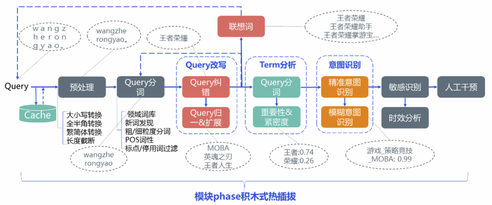

# 4.query理解

RAG在整个大模型技术栈里的重要性毋庸置疑，而在RAG中，除了大模型之外，另一个不可或缺的部分，就是搜索系统，大模型的正确、稳定、可控生成，离不开精准可靠的搜索系统，大量的实验中都有发现，在搜索系统足够准确的前提下，大模型的犯错情况会骤然下降，因此，更全面、系统地了解搜索系统将很重要。

query理解在之前的文章里可以说写的非常多了，但是随着技术发展，这个模块无论是所需要做的事，还是完成任务的方法，都已经发生了很大的变化，本期我会在原有技术体系的同时，也放入一些比较新的思路和技术方案。往期提及的可能有这些：

- [前沿重器\[23\] | 聊聊对话系统：query理解](http://mp.weixin.qq.com/s?__biz=MzIzMzYwNzY2NQ==\&mid=2247488093\&idx=1\&sn=446b6b2ee51feebf56d16b852f0c8471\&chksm=e8824ac3dff5c3d57f9079b66387b6e8a709652afdeb44cc2f16fbc7112330812fc893b335b8\&scene=21#wechat_redirect "前沿重器\[23] | 聊聊对话系统：query理解")
- [心法利器\[34\] | 报告小结：query理解概述](http://mp.weixin.qq.com/s?__biz=MzIzMzYwNzY2NQ==\&mid=2247487273\&idx=1\&sn=1b7cf49f906942b145815532582efdee\&chksm=e88257b7dff5dea15b9471cf97c481514e3461505a3e29688927b484edf10d871ee71680dc30\&scene=21#wechat_redirect "心法利器\[34] | 报告小结：query理解概述")
- [前沿重器\[4\] | 腾讯搜索的Query理解如何直击心灵](http://mp.weixin.qq.com/s?__biz=MzIzMzYwNzY2NQ==\&mid=2247486139\&idx=1\&sn=ae4e206865676b5171779f30cb69ed62\&chksm=e8825225dff5db33c7c72af05dd2928b60fd4e2904e06cd6315480741ded6696084cf61bd91a\&scene=21#wechat_redirect "前沿重器\[4] | 腾讯搜索的Query理解如何直击心灵")
- [R\&S\[24\] | 浅谈Query理解和分析](http://mp.weixin.qq.com/s?__biz=MzIzMzYwNzY2NQ==\&mid=2247485241\&idx=1\&sn=a4ecae4a076ab89702bfb1f5e6361747\&chksm=e8825fa7dff5d6b1043e2b82a0de55adc591d33d8bcbc18d0534876890d2778beea370a826d5\&scene=21#wechat_redirect "R\&S\[24] | 浅谈Query理解和分析") &#x20;

## 1.query理解目标

query理解是**对query内容的处理并进行信息抽取**，query是用户最直接表达的需求，毋庸置疑，尤其是搜索场景，在用户已经明确提出需求的情况下，只有充分理解用户的需求，才能得到正确的结构。

显然，query理解，处理对象就是query，而**具体需要做什么，是要根据下游需求来定的**，例如如果需要特定的实体，则query理解要抽实体，如果下游要做向量召回，则query理解需要做向量化。

拍脑袋想或者是扩大需求范围、难度都是无意义的。有些时候我们考虑的比较多也比较深入，例如多意图、不连续实体、指代之类的问题，在特定项目或者特定阶段下并非高频、重点问题时，可以暂时跳过，优先处理高频、重点问题，等后续类似这些问题逐步明显再来考虑，这个错误很容易在做query理解时犯，所以特别提醒一下。常见的问题一般是实体说法覆盖度、分类边界、长句短句等的问题会比较多。

写的过程中回忆起，在大模型出来不久后就对query理解的地位和意义做了一些分析（[chatgpt下query理解是否还有意义](http://mp.weixin.qq.com/s?__biz=MzIzMzYwNzY2NQ==\&mid=2247488762\&idx=1\&sn=f38df281092cda169e090e0f3b02142a\&chksm=e8824c64dff5c5721990df99de0b2f0ae54247e113ff2dbb36c094d4ee310a9c6e232ed05326\&scene=21#wechat_redirect "chatgpt下query理解是否还有意义")），现在回头看一些技术判断还是正确的，随着大模型系统的逐渐成熟，某些关键部位还是得以保留，大模型逐渐成为更底层基础的能力，但是架构设计考虑的可能更加多元化，可维护性、性能、成本等，在探索后还是重新收敛回目前的状态，形成共识。

## 2.主要工作概述

主要是新技术逐步引入和迭代，此处分为基础工作和拓展工作，

- 基础工作主要聚焦传统的信息抽取，如意图、实体之类的基础工作；
- 拓展工作则更多是向量化、改写（特指类似大模型拓展之类的工作）等比较新的工作。

### 2.1 基础工作

query理解是需要**对query内容进行处理并进行信息抽取**。

来从下面一张腾讯搜索给出的图，粗略地看query理解需要经历哪些流程（这张图来自[全面理解搜索Query：当你在搜索引擎中敲下回车后，发生了什么？](https://zhuanlan.zhihu.com/p/112719984 "全面理解搜索Query：当你在搜索引擎中敲下回车后，发生了什么？")，同时也对该文章进行过解读 [腾讯搜索的Query理解如何直击心灵](http://mp.weixin.qq.com/s?__biz=MzIzMzYwNzY2NQ==\&mid=2247486139\&idx=1\&sn=ae4e206865676b5171779f30cb69ed62\&chksm=e8825225dff5db33c7c72af05dd2928b60fd4e2904e06cd6315480741ded6696084cf61bd91a\&scene=21#wechat_redirect "腾讯搜索的Query理解如何直击心灵")）。

query理解过程

从图中可以看到，主要有下面几个工作：

- **预处理**：大小写、全半角、繁简体、长度截断。
- **分词**：领域词库、新词发现、多粒度、词性、停用词等。
- **query改写**：纠错（[NLP.TM\[37\] | 深入讨论纠错系统](http://mp.weixin.qq.com/s?__biz=MzIzMzYwNzY2NQ==\&mid=2247485846\&idx=1\&sn=c1afbd844f9464753ac7879c82201274\&chksm=e8825108dff5d81ea13818328ce574d304754c2e18039b4708162ff8c6df35c3a393cfdb96ee\&scene=21#wechat_redirect "NLP.TM\[37] | 深入讨论纠错系统")）、归一、拓展。
- **Term分析**：分词、重要性（[NLP.TM\[20\] | 词权重问题](http://mp.weixin.qq.com/s?__biz=MzIzMzYwNzY2NQ==\&mid=2247484979\&idx=1\&sn=5bfb68d7347b57f0f0e2caf13014e4f7\&chksm=e8825eaddff5d7bb9899ef50043a852886999a3f20c7c22661879c6214093fbf2b4c8f61aa79\&scene=21#wechat_redirect "NLP.TM\[20] | 词权重问题")、[心法利器\[33\] | 快速的关键词抽取baseline](http://mp.weixin.qq.com/s?__biz=MzIzMzYwNzY2NQ==\&mid=2247487163\&idx=1\&sn=2079c31eb0bcbe2fe419c5e22a22caba\&chksm=e8825625dff5df33f159f5d504587057646258e023fc807d6ef41382c767f1d0dcfba9d48374\&scene=21#wechat_redirect "心法利器\[33] | 快速的关键词抽取baseline")）、紧密度。（这里我要补充一个NER，我理解NER应该属于这个位置且不可或缺）
- **意图识别**（[R\&S\[25\] | 搜索中的意图识别](http://mp.weixin.qq.com/s?__biz=MzIzMzYwNzY2NQ==\&mid=2247485259\&idx=3\&sn=712712b3d350d9ddfce4637429b78f92\&chksm=e8825fd5dff5d6c32d1bfeb317bd0423b6ea74c7671c5b13d0066e1127f92b19e00f5a3d1f48\&scene=21#wechat_redirect "R\&S\[25] | 搜索中的意图识别")、[前沿重器\[20\] | 文本分类和意图识别调研思考](http://mp.weixin.qq.com/s?__biz=MzIzMzYwNzY2NQ==\&mid=2247488016\&idx=1\&sn=840dcd8585c294a5611e99888a27ae1b\&chksm=e8824a8edff5c39821117112b85636411d53b312440f070aeb5e31d4f79ef2a5d5fb443324fe\&scene=21#wechat_redirect "前沿重器\[20] | 文本分类和意图识别调研思考")）：精准&模糊。
- **敏感识别、时效分析、人工干预**等。

从这个流程来看，大到意图识别、改写、term分析这些常见且精力花费比较多的模块，小到大小写、新词发现之类的小操作，都被放在了query理解里面，这些工作尽管历史已经非常悠久（其实也就十来年吧），但目前，无论是历史同样悠久的成熟搜索系统，还是新建的搜索系统（甚至包括multiagent），都仍有他们的影子，还是非常重要。

### 2.2 拓展工作

拓展工作因为还处于探索阶段，所以并没有体系化，从现在的视角看，有两个非常重要的工作要提及。

第一是**向量化**。向量化是随着向量表征模型以及向量索引的发展而逐步成为了一个基本操作，对现在的很多系统而言，向量检索都是大家很容易想到的方法，而他的便捷性也让他最近的选型优先级超过字面检索成为了重要的baseline。

第二是**改写**。与其说是新工作，不如说是原有改写工作的升级。**大模型的出现让句子改写这一任务的门槛降低，且用户对性能的容忍度提高**。改写能让下游检索和相似度计算更加简单，且prompt工程能让bad case修复变得更加简单，所以也成为query理解中的宠儿。

下面我就展开讲几个比较重要。通用的query理解模块。

## 3.意图识别

什么是意图识别。**从用户需求出发，意图识别是为了识别用户具体要什么，以便系统给出适当的回应；而对于系统而言，他是拆分后续处理模式的一个分流器**，举个例子，用户是想查天气，系统是通过query来理解到这层信息，让下游去执行查天气这个动作，这个分流动作在现实应用并不罕见，语音助手里可以叫技能识别，多轮下要做对话决策，大模型里的function call需要决策用哪个function，Agent领域里有路由，本质上都是类似的工作，细品这里面的关系，可以发现领域不同叫法不同罢了。

有关意图识别的技术方案，目前已经形成比较稳定的几个技术流派：

- **词典/规则/正则**：（词典匹配可以参考这个：[我常说的词典匹配到底怎么做](http://mp.weixin.qq.com/s?__biz=MzIzMzYwNzY2NQ==\&mid=2247487674\&idx=1\&sn=d7c37cffab4b61ce08d0ddd8c26c0934\&chksm=e8824824dff5c132b530e6bc36fd980064be421cbc58f13fd77c5d76efa6234d669ea2123e5b\&scene=21#wechat_redirect "我常说的词典匹配到底怎么做")）顾名思义不多解释，技术落地非常简单，而且准确率高，比较适合特征明显、名词性很强的领域，另外对变化频繁的领域也适合（因为可以配置词典）。但是众所周知的泛化能力低，所以挺多人不喜欢用吧（我自己其实还挺喜欢的。。。）
- **分类模型**：看成是分类问题，然后用分类模型来做，textcnn、bert都可以，甚至用大模型（特指训练这种模式）也是可以的。是通用性最高的方案了，所以被很多场景选用。而且大家研究的深度也比较深，已经探索到OOD域外识别（[域外意图检测——解决“没见过”的问题](http://mp.weixin.qq.com/s?__biz=MzIzMzYwNzY2NQ==\&mid=2247488750\&idx=1\&sn=2a2ed73023e3bd555d1e85b2ca4c649a\&chksm=e8824c70dff5c566363799bec2b5d4be15cc020ad8a004ee579e79f2fdcedb650a908b2c1794\&scene=21#wechat_redirect "域外意图检测——解决“没见过”的问题")）、超多分类（[文本多分类问题经验](http://mp.weixin.qq.com/s?__biz=MzIzMzYwNzY2NQ==\&mid=2247488146\&idx=1\&sn=8dee9218fa6042ab997e647428fc3123\&chksm=e8824a0cdff5c31a824532441674b799a3f021dabddbea48eda3e18cdbb74b99b0168d9ac198\&scene=21#wechat_redirect "文本多分类问题经验")）等搜索比较常见的问题也有被拿来研究。但是因为模型的分类信息来源于训练数据，根据业务发展变化的敏捷性可能会不足。（[文本分类日常提点技巧](http://mp.weixin.qq.com/s?__biz=MzIzMzYwNzY2NQ==\&mid=2247488603\&idx=1\&sn=0f3ed1b1089d172445d95e454678e938\&chksm=e8824cc5dff5c5d3a64d7b60ccbe217b2dbfefbf1ccd90283e8a7e2b0c43a01151b0212783bf\&scene=21#wechat_redirect "文本分类日常提点技巧")、[开放域文本分类技术思考](http://mp.weixin.qq.com/s?__biz=MzIzMzYwNzY2NQ==\&mid=2247487944\&idx=1\&sn=091d4a6647e7cf70fa6d813376f1cb57\&chksm=e8824956dff5c040e3c7ffa8c0301bc839eb9d832f77663bc4f5bc4f49a3ae178287aade4303\&scene=21#wechat_redirect "开放域文本分类技术思考")、[把文本分类任务做成一个系统](http://mp.weixin.qq.com/s?__biz=MzIzMzYwNzY2NQ==\&mid=2247487101\&idx=1\&sn=f511c12331fb7c2b33bdd973efd4e2a7\&chksm=e88256e3dff5dff57393ea70a09544c5e949cefb6b2c25588ea4069008e52387a279e34fb815\&scene=21#wechat_redirect "把文本分类任务做成一个系统")、[把文本分类任务做成一个系统](http://mp.weixin.qq.com/s?__biz=MzIzMzYwNzY2NQ==\&mid=2247487101\&idx=1\&sn=f511c12331fb7c2b33bdd973efd4e2a7\&chksm=e88256e3dff5dff57393ea70a09544c5e949cefb6b2c25588ea4069008e52387a279e34fb815\&scene=21#wechat_redirect "把文本分类任务做成一个系统")）
- **以搜代分**（[以搜代分：文本多分类新思路](http://mp.weixin.qq.com/s?__biz=MzIzMzYwNzY2NQ==\&mid=2247487022\&idx=1\&sn=8d4637014107c76c895cbed2e3d6f81b\&chksm=e88256b0dff5dfa61c3b8fe5b7041b7b2a172ca5df4aca02decec6abfcff2b61b48e7687d1df\&scene=21#wechat_redirect "以搜代分：文本多分类新思路")、[从长尾问题到以搜代分的机理探索](http://mp.weixin.qq.com/s?__biz=MzIzMzYwNzY2NQ==\&mid=2247488192\&idx=1\&sn=34c58a1035d3521d10ea7d4001d27d82\&chksm=e8824a5edff5c3484acb9a891d8ac936df89504ab78138fb5828cd602c55bb795b5887f2909f\&scene=21#wechat_redirect "从长尾问题到以搜代分的机理探索")、[以搜代分的生效机理](http://mp.weixin.qq.com/s?__biz=MzIzMzYwNzY2NQ==\&mid=2247488263\&idx=1\&sn=9d0cc44ddd621fe56731eabbaecf3990\&chksm=e8824b99dff5c28f7723688c924e67519b40a78e61d051f983318c34ce037a187cb3aa724f5b\&scene=21#wechat_redirect "以搜代分的生效机理")）：用检索来进行分类识别。相比分类模型，他对模型的依赖会更小，只要一个语义表征问题就能有优化，而且面对few-shot、变化频繁的任务也非常适合，不过效果上限对样本，即入库的数据依赖性很大，复杂场景就有可能会逐步退化为词典方案（仔细想词典匹配本身也属于一种搜索）。
- **大模型**：常规的大模型已经具有一定的推理能力，在简单场景，通过prompt描述规则或者通过in-context learning的方式，能较快完成基础操作，属于快速启动的一种方案，大大降低了在数据挖掘、标注方面的成本，但性能、资源消耗还是大模型固有的问题，而且上限并未和传统分类模型拉开差距，因此只能是其中一种选择。

我在意图识别做的时间比较久了，斗胆在这里提几个可能比较经常遇到的难题以及解决方案吧。

- **高频类目体系变化的问题**。对于一个还在发展建设的搜索提供，意图增加是很正常，如果用一个分类模型来做所有的意图识别（多分类），越到后面越会觉得力不从心，此时可以考虑多个小的二分类模型或者长尾的意图，用以搜代分来处理，然后定期对稳定且比较大的类目用多分类模型管理起来，这套方案会更合适。
- **超多分类**。在电商搜索、成熟开放域推荐系统、复杂对话系统等常见可能会遇到，成百上千的分类，而且类目样本数据很不均衡，对于高频的类目，可以考虑用多分类模型（预留other类），低频类目在这个多分类模型下会被分到other类，再用以搜代分处理，毕竟样本很少分类模型也不好学。
- **兜底问题**。无意义、超纲query出现的概率很低，在各个分类模型下，需要预留other类来作为“垃圾桶”放这些东西，否则模型会自己选一个已有的类作为这个“垃圾桶”，从而出现无法观测的bad case。
- **短句问题**。类似手机场景，用户对长句输入一般是反感的，所以短句非常常见，但短句是模型容易失效的部分，没有上下文信息，无法推测，而词典规则则很好处理，如果大部分样本都是3-5字以内的短句，推荐大家优先考虑词典之类的方式来做。
- **长句问题**。长句也是模型容易出问题的部分，一方面在训练集里容易比较低频，另一方面长句信息多容易造成干扰、丢失和稀释。针对这个问题，一般可以升级（使用更大size的）模型、增加长句样本、句子截断等方式来做。(之前我有专门聊过长短句的问题：[心法利器\[51\] | 长短句语义相似问题探索](http://mp.weixin.qq.com/s?__biz=MzIzMzYwNzY2NQ==\&mid=2247487992\&idx=1\&sn=a07de64da1588ee3ede499413966409d\&chksm=e8824966dff5c070089da72c3e3bf15d2057386f71a92451ebb972998ec96443102cf9abebeb\&scene=21#wechat_redirect "心法利器\[51] | 长短句语义相似问题探索")）

## 4.Term分析

如果说意图识别是对整个query进行分析，那**Term分析就是对query内部的内容进行分析了**，常规的工作有这些：

- **实体抽取**。方便下游进行结构化检索，用实体去查实体，具有很高的准确性。
- **词权重**（[词权重问题](http://mp.weixin.qq.com/s?__biz=MzIzMzYwNzY2NQ==\&mid=2247484979\&idx=1\&sn=5bfb68d7347b57f0f0e2caf13014e4f7\&chksm=e8825eaddff5d7bb9899ef50043a852886999a3f20c7c22661879c6214093fbf2b4c8f61aa79\&scene=21#wechat_redirect "词权重问题")、[心法利器\[33\] | 快速的关键词抽取baseline](http://mp.weixin.qq.com/s?__biz=MzIzMzYwNzY2NQ==\&mid=2247487163\&idx=1\&sn=2079c31eb0bcbe2fe419c5e22a22caba\&chksm=e8825625dff5df33f159f5d504587057646258e023fc807d6ef41382c767f1d0dcfba9d48374\&scene=21#wechat_redirect "心法利器\[33] | 快速的关键词抽取baseline")）。词权重配合BM25或者是cqr/ctr之类的字面相似度计算方案（[cqr\&ctr：文本匹配的破城长矛](http://mp.weixin.qq.com/s?__biz=MzIzMzYwNzY2NQ==\&mid=2247486726\&idx=1\&sn=370c5304d270517ce0cc27fc9e21d01c\&chksm=e8825598dff5dc8ebabb9f9454d83a37dacbfbe6b54cb399325b63e0cb36e393ed5c43b55f07\&scene=21#wechat_redirect "cqr\&ctr：文本匹配的破城长矛")、[无监督字面相似度cqr/ctr源码](http://mp.weixin.qq.com/s?__biz=MzIzMzYwNzY2NQ==\&mid=2247489205\&idx=1\&sn=94442b88c055fe33a20bf11247f4bdbb\&chksm=e8824e2bdff5c73dcb19860d8348bda86c98da66ba2bdfb88ef899866361f5fc21b57cad8279\&scene=21#wechat_redirect "无监督字面相似度cqr/ctr源码")），能提升字面相似度计算的效果。
- **紧密度**。也是字面检索阶段的产物，配合字面相似度，能解决“雪花牛肉”误召回“雪花啤酒、红烧牛肉”的问题。

这里重点讲一下实体抽取，有两个需要强调的内容。

- **实体抽取的重要性**。向量召回不太好解决的常见，往往用实体抽取配合字面检索有很好的效果，例如数字相关的召回（1962年出生的人）、严格名词相关的召回（搜“周杰”容易误召“周杰伦”）
- **大模型对实体抽取的提升是很大的**。早年用实体抽取模型，尽管纸面指标比较好，但是仍然会出现归一化、不连续实体之类的问题，需要配合分类模型或者魔改模型来做，但是大模型这种生成式的方案，能很大程度解决上述的问题。

## 5.改写

改写也是搜索中常见的手段，主要目标是**通过改写，改成适合下游进行检索、相似度计算的说法**，例如KFC改成肯德基，能很大程度方便直接字面检索，向量检索上也有很大收益（毕竟向量模型也会很大程度参考字面的相似度）。有些时候，也会把纠错放在这个模块里（[深入讨论纠错系统](http://mp.weixin.qq.com/s?__biz=MzIzMzYwNzY2NQ==\&mid=2247485846\&idx=1\&sn=c1afbd844f9464753ac7879c82201274\&chksm=e8825108dff5d81ea13818328ce574d304754c2e18039b4708162ff8c6df35c3a393cfdb96ee\&scene=21#wechat_redirect "深入讨论纠错系统")），因为两者性质还是接近的。

**常见的改写手段，就是挖掘同义词然后同义词替换**，然后就是纠错了，当然有些场景会训练一些seq2seq的方式来做，之前也分享过知乎的改写工作（[query改写思路启示](http://mp.weixin.qq.com/s?__biz=MzIzMzYwNzY2NQ==\&mid=2247487149\&idx=1\&sn=9554931fa7e5b1049531366adbaf9ac3\&chksm=e8825633dff5df25c37887a211f68331e1cb8b98f681d4b62298cf530c7a56a1caff8b222500\&scene=21#wechat_redirect "query改写思路启示")），但在实践上这么操作还是比较少，主要是因为改写一般业务定制的要求会比较高，他的输出对下游计算的影响很大，但可控性又比较尴尬，因此也会相对谨慎。

然而大模型的出现，生成任务的启动成本降低，类似换个说法、风格迁移之类的问题能很快解决，因此改写能做的事产生了一定的变化，有些时候甚至可以帮忙做拓展了，而不只是改写那么简单。例如我之前分享过的query2doc（[微软新文query2doc：用大模型做query检索拓展](http://mp.weixin.qq.com/s?__biz=MzIzMzYwNzY2NQ==\&mid=2247489295\&idx=1\&sn=fcb269e47dc27fcaf31201aa1c75dafb\&chksm=e8824f91dff5c687a3a95d18490c8d2ba9b18d1b7cd5bc614e01ef3d7dd6d72aa62bcc0c2b0d\&scene=21#wechat_redirect "微软新文query2doc：用大模型做query检索拓展")）以及在此之前的HyDE论文都有提到，**可以通过让大模型提前回复用户的问题，用大模型的答案来做检索提升召回率的方案**，这个在我自己的场景下也有重大收益，非常推荐大家尝试，尤其是早期各种数据都不太够的情况下，同时大家也能继续发挥想象，看看这个领域还有什么可以尝试的创新点。

## 6.向量化

向量化这事并不是最近一两年就有，而是很久之前就已经有了，而且也被广泛应用在多个领域。（[前沿的向量召回都是怎么做的](http://mp.weixin.qq.com/s?__biz=MzIzMzYwNzY2NQ==\&mid=2247488338\&idx=1\&sn=d38ab9ee03cc70aef25e74ef5e2d4ca5\&chksm=e8824bccdff5c2da04706c93223e6a306d8c91e51ffbdff7215924e18bce1ced3debc0130402\&scene=21#wechat_redirect "前沿的向量召回都是怎么做的")、[KDD21-淘宝向量检索](http://mp.weixin.qq.com/s?__biz=MzIzMzYwNzY2NQ==\&mid=2247487695\&idx=1\&sn=370ac19afbbb2c27a07ed6c3fa8b9b70\&chksm=e8824851dff5c1474f522ef37a17661900fd1494c9043ebc1b94426d219fc0053f098538b4b9\&scene=21#wechat_redirect "KDD21-淘宝向量检索")）

搜索里**比较常见的向量化目标，大都是基于语义**，即对用户query进行语义表征，从早年的孪生网络到sentence-bert，再到对比学习为代表的simcse，以及目前比较流行的BGE等，都是各个时代的优秀代表。 &#x20;

之前的研究都聚焦在对称相似度上，即query和doc都在同一语义空间，两个句子在语义层面就是相同的，这种方式方便标注和训练，因此这类型的问题在三四年前就已经比较成熟，随着对比学习的发展，simcse成为那时候的版本答案，但现实中很难抽到很合适的样本做在线推理，更多时候只有文档而没有问题，此时对称相似度就很尴尬，因此大家的目标会转向不对称相似度。 &#x20;

**不对称相似度强调两个句子并不在语义空间**，例如问答对，早年都依赖样本训练，在后续的发展中，如BGE等，在prompt和类似RetroMAE模型架构升级下，不对称相似度模型的通用能力得到大幅加强，即使不进行训练也有不错的效果。

