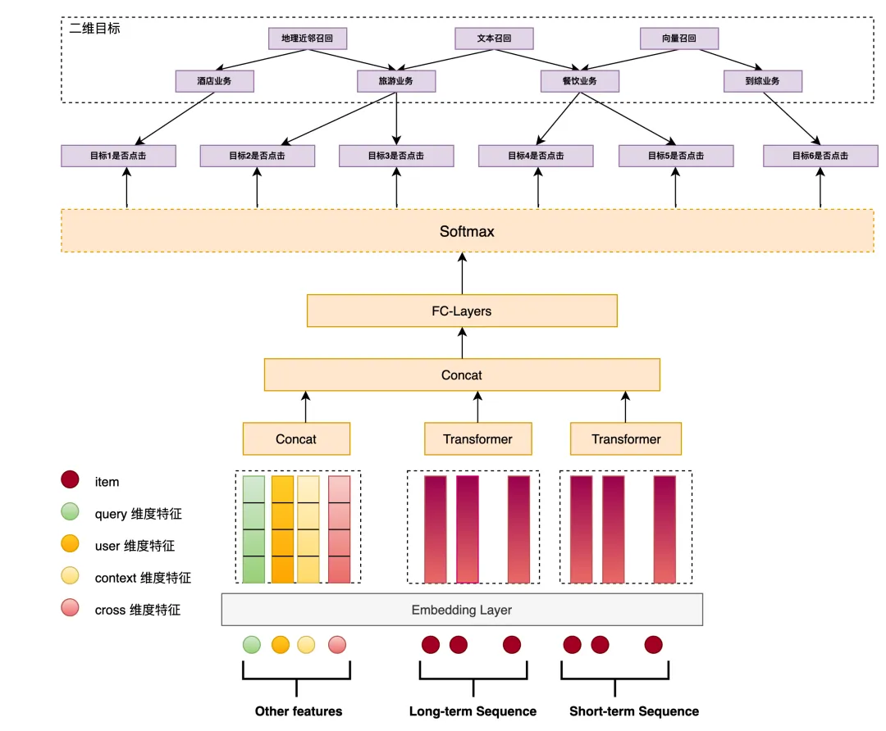
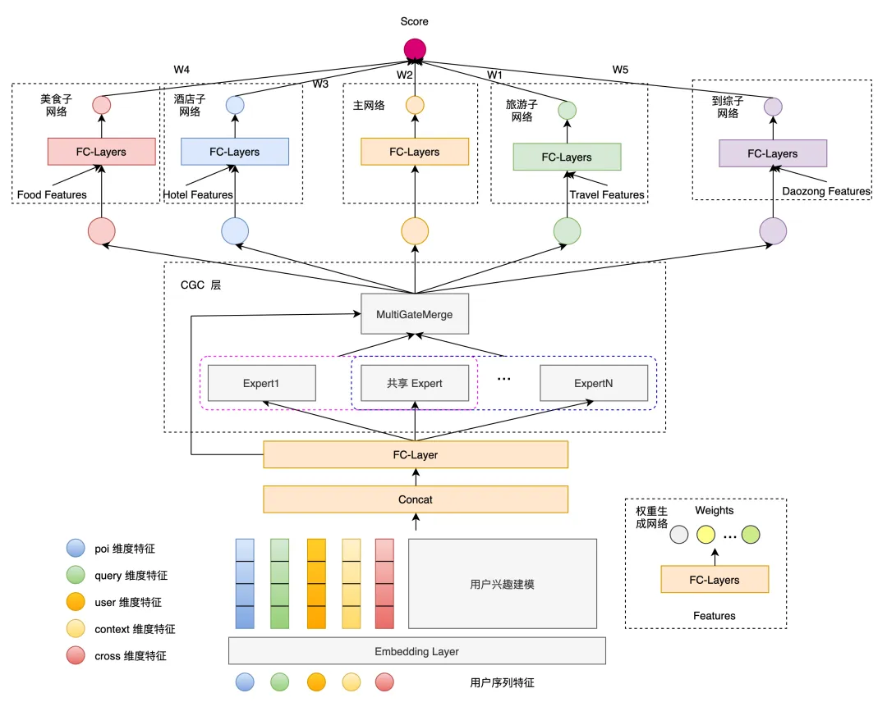
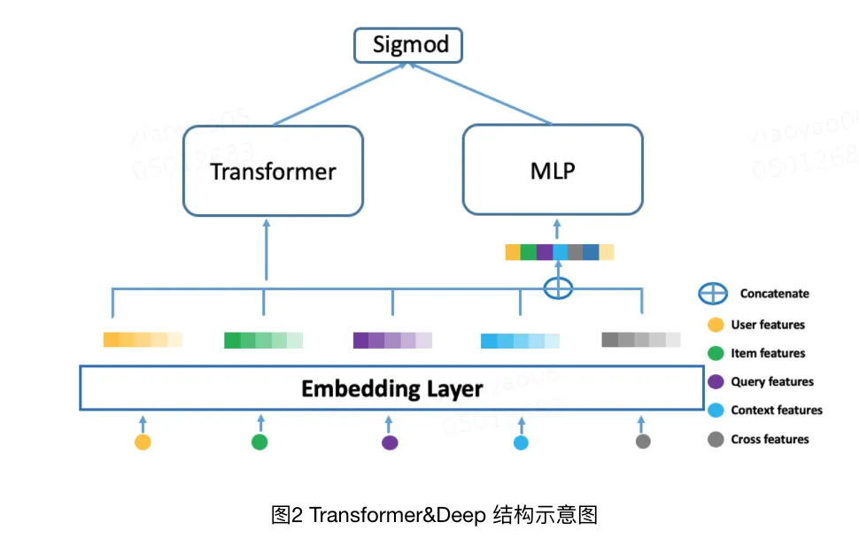
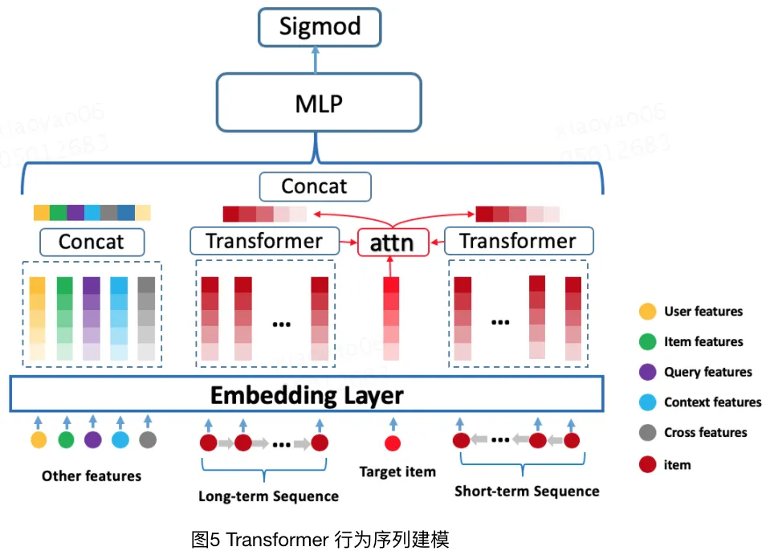
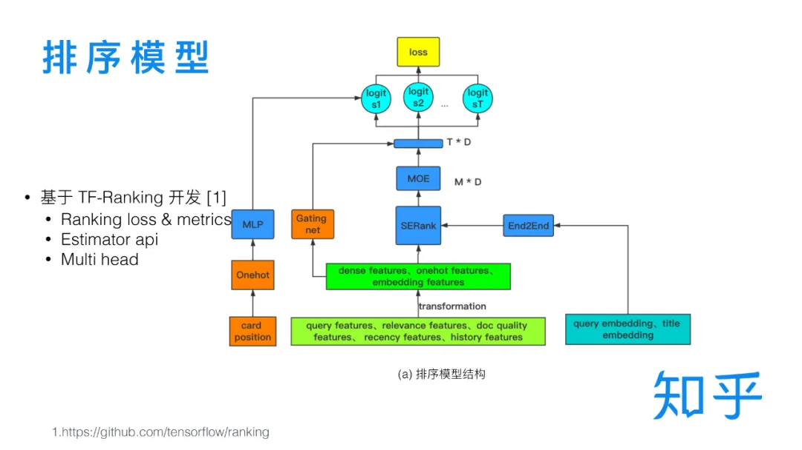

# 6.精排

RAG在整个大模型技术栈里的重要性毋庸置疑，而在RAG中，除了大模型之外，另一个不可或缺的部分，就是搜索系统，大模型的正确、稳定、可控生成，离不开精准可靠的搜索系统，大量的实验中都有发现，在搜索系统足够准确的前提下，大模型的犯错情况会骤然下降，因此，更全面、系统地了解搜索系统将很重要。

本期的内容是精排，即对召回的内容进行进一步筛选，从而得到更好的结果。

这个可以说是最百花齐放的模块了，在实践过程中，搜索发展到后期这部分的花活就会变得异常多，无论是论文还是各种分享，但我发现论文和各种分享多半是从自身面对的场景出发的，因地制宜的成分很多，因此这次换个说法，先从思路下手，先把这部分的整体逻辑讲明白，然后再用一些案例来进行讲解。

## 1.精排的意义

所谓的精排，在整个搜索里，**核心功能是在获得召回结果的基础上，整理出精准的结果。**这里有一个前提，那就是在召回结果的基础上，没有召回的精排是没有意义的。

这里就要引出一个问题，就是两者会有什么区别。这个问题谈清楚了，大家就会明白精排在整个搜索过程中的作用。

最直接的，**召回和精排的对象是不一样的。召回面对的是整个数据库里的所有数据，而精排面对的是召回已经找回来的少量数据**，这是两者处理思路不同的核心原因。

**召回是大海捞针，精排是百里挑一**。召回的过程类似筛简历，用一些比较粗暴的方式快速过滤很多“一定不对的内容”，从而得到相对不那么离谱的答案。类似向量召回之类的，要通过把句子向量化才能进行快速匹配和筛选，其本质就是在空间中以query为中心画个圈，只把圈内的内容拿出来；精排则像是面试，对几个简历还算不错的人进行进一步的筛选，这一步因为是进行深入面试和理解，尽管精排的准确性高但是速度慢，所以需要召回来进行配合。

**精排的性质是优中选优**。继续从对象触发，精排面对的是召回已经找出的数据，这些数据从某个角度而言，已经被判为和query存在一定关系，但是随着物料的增加，“有一点关系”并不足够满足用户需求，所以要进行更精确的比对，因此此处要做的是进一步提升召回物料之间的差距。

另外，精排的综合性要求更高。召回层是可以基于很多不同的依据来分别做的，而精排则不然，需要尽可能把多个因素放一起综合地来做。

## 2.精排需要考虑的因素

前文有提到，**精排的综合性要求很高**，就需要考虑很多因素，相比召回，在这一步就要求考虑的很全面，现在先把需要考虑的因素用比较笼统的方式列举出来，然后再逐个剖析他们如何表征以及怎么放入模型中。

- **和query的相关性**。这点毫无疑问应该排在前列，毕竟用户进行搜索的核心目标就是要解决query描述的问题，不相关的话搜索无从谈起。
- **物料质量**。在物料已经比较多的情况下，就要开始考虑把质量比较高的物料放到前面。
- **用户偏好**。在有用户信息的搜索系统下，或者因为业务需求，就需要将结合考虑到用户的偏好，比较典型的像音乐、电商等搜索场景，对个性化的要求就会比较高。

**和query的相关性**，主要可以从这几个角度来去看。

- **语义相似度**。这个大家应该都比较容易想到，早年比较流行的方式就是类似ESIM之类的方案来做（[ESIM：语义相似度领域小模型的尊严](http://mp.weixin.qq.com/s?__biz=MzIzMzYwNzY2NQ==\&mid=2247486697\&idx=2\&sn=186f232ff36593033e1e64b16043d3b6\&chksm=e8825477dff5dd615f67646a5690aa99155ceac4c150fa6d74bdb77bc3afe5b4170a73d6bc3a\&scene=21#wechat_redirect "ESIM：语义相似度领域小模型的尊严")），效果确实比非交互的相似度效果好，后续基于bert的句子对相似度也是不错的，而且训练的模式会比较简单，直接用‘q-d-label’的模式就能训练一个还可以的结果，在后续的版本中，迭代到learning to rank方案也比较丝滑。
- **用户行为体现的相似度**。这个思路和推荐中用的点击率预估是非常相似的，用户搜Q点D，本质就是对内容一定程度的认可，甚至是更为直接的相似度信息，毕竟用户是对这个结果认可的。当然了，有些内容，即使不相关用户也可能点进去，例如某些猎奇或者不合规的内容。

至于**物料的质量**，这个可以从两个角度出发。

- **物料本身的质量**。如话题、文案的合规性、丰富度、新鲜度等，这个会比较简单。
- **用户群体对物料的评价**。如点击率、单位时间点击量、命中query丰富度、停留时间、点击离开率等，这些是基于用户行为对物料的评价。

最后就是**用户偏好**，应该也是后期需要花费时间比较多的一部分。

- **多个维度的协同过滤的方式**。例如搜索这个query的用户更倾向于点击的内容、某个画像的用户更倾向于点击的内容（群体特征）、该用户平时的点击偏好（个人直接特征）等。

尽管上述的因素在生产实践中并不是按照这个来应用的，但因为特征来源广泛，往往还充斥着很多无效的信息。我所提出的上述思路更多是为了让大家更加结构化地理解整个精排内部所需要的信息，不容易错漏，相比一个一个比对，根据特定结构化思维来整理效率会更高。

当然，这只是我们常说的考虑因素，而**在实践过程，需要把上面考虑的因素，结合信息来源和使用方法，构造成适合应用的模式，即特征**，从而应用在精排模型中，于是就能推导出精排方案的框架。

## 3.精排方案的框架

常规的算法建模，不外乎要考虑的就是三点：**数据、特征、模型**。早期数据可以通过语义相似度或者是人工标注数据快速构造baseline，后续则逐步切换为在线用户的行为数据，此处不赘述，本章重点讲解后面两种。

在前面一章节讲到了需要考虑的因素，在实际应用情况，会把内容根据信息来源以及后续使用方法进行有机组合构建。

一般地，从数据来源来看，会把所有特征按照**4个维度**来构造。

- **Query侧**：通过query理解来获取，常见的意图、实体包括某些关键词等。
- **Doc侧**：即文档信息，一般通过内容理解，即在文档内容处理模块处理构造（[聊聊搜索系统3：文档内容处理](http://mp.weixin.qq.com/s?__biz=MzIzMzYwNzY2NQ==\&mid=2247489797\&idx=1\&sn=842095bf602758dd3d56fb1297c59ded\&chksm=e882419bdff5c88d02634ced0a8bd2fbb497de9bf93cd6e2060919cb7c96087ec3aec5f88814\&scene=21#wechat_redirect "聊聊搜索系统3：文档内容处理")），这里包括一些类似物料质量、文档摘要等的内容。
- **用户侧**：用户偏好信息，这个一般是在用户出现行为的过程就能记录，在推理过程一般只需要读取。
- **交互特征**：Query和Doc之间的匹配度特征，注意这里是一些小特征，如某些计算得到的相似度，语义相似度、字面相似度等，还有一些统计得到的特征，如如历史的曝光点击率等，再者还有一些召回层带下来的信息，多种粗排的相似度特征，召回链路及其个数等。

有了这些特征就可以**开始构造模型把他们融合起来了**。合并的链路喜欢分为3个流派。

- **规则加分模式**。在前期数据不足不好训练的情况下，直接对几个特征用规则进行简单组合即可使用，别小看这个方法，这个方案在很长一段时间都可以拿来使用。
- **机器学习组合模式**。通过机器学习模型，例如比较有名的xgboost，可以快速把这些特征进行组合构造。
- **深度学习及其变体**。因为特别的特征需要用特别的结构来吸纳，所以出现了多种魔改的特征，但效果确实在对应场景有所提升。

于是，便有了所期待的模型。

这便是我想聊的框架，数据、特征、模型的基础框架，构成搜索精排在实践过程的重要组成部分。在这个框架下，我们可以结合搜索当前的状态以及目前可获得的资源，来灵活设计自己目前需要的方案。

- **数据是模型学习的基础**，是特征的原料。借助数据能发现可解释的规律，各种突出区分度的特征则是从数据筛选、分析而来。
- **特征是数据依据的表达**，是query和doc匹配的信息来源。只有构造合理的特征，模型才会生效，所以他是数据依据的表达，同时q和d所谓的是否匹配，
- **模型是数据的通用表示**，是特征有机组合完成推理的桥梁。

## 4.案例分析

相比列举方法，案例在这里可能会更合适，通过案例分析，尤其对他们面对的问题分析，让大家进一步理解“因地制宜”的重要性。

### 4.1 美团

美团的分享一直都维持的很好，在搜索方面也涌现了很多优秀的文章，具体可以在这里翻阅：[美团技术团队](https://www.zhihu.com/org/mei-tuan-dian-ping-ji-shu-tuan-dui "美团技术团队")。

本次要讲的精排，并非作为一个专题来讲，而是分布在很多文章内部，通过多篇文章的阅读才梳理出内部的一些细节。涉及这些关键文章：

- 搜索广告召回技术在美团的实践：[https://zhuanlan.zhihu.com/p/707169501](https://zhuanlan.zhihu.com/p/707169501 "https://zhuanlan.zhihu.com/p/707169501")
- 大众点评内容搜索算法优化的探索与实践：[https://zhuanlan.zhihu.com/p/688404734](https://zhuanlan.zhihu.com/p/688404734 "https://zhuanlan.zhihu.com/p/688404734")
- 多业务建模在美团搜索排序中的实践：[https://zhuanlan.zhihu.com/p/388211657](https://zhuanlan.zhihu.com/p/388211657 "https://zhuanlan.zhihu.com/p/388211657")
- Transformer 在美团搜索排序中的实践：[https://zhuanlan.zhihu.com/p/131590390](https://zhuanlan.zhihu.com/p/131590390 "https://zhuanlan.zhihu.com/p/131590390")

美团搜索毫无疑问是一个非常具有特点的场景，结合众多技术文章的分析来看，美团搜索在场景上，具有如下的特点：

- 特殊的多业务场景。美食、电影、机票、酒店等个典型场景聚合，显然这种聚合和一般地百度开放域搜索还不太一样，业务场景各异，且各自之间存在高低频的差异，再者不同业务还可能有不同的子目标。
- 和电商类似，用户在输入习惯上，可能有大量的内容聚焦在特定的专有名词或者tag上，如“烧烤”、“麦当劳”等。
- 检索需要很大程度以来用户画像信息。典型的例子——地点，美团是一个高度依赖地点的场景，美团的几乎所有场景在用户检索时都很大程度依赖地点信息，用户搜索的“烧烤”就需要很大程度地参考地点信息，当然还有别的类似用户个人偏好等也有结合实际场景的依赖，例如美食对口味有依赖等。

结合上面特点，美团也进行了大量的特别设计。

首先是特殊的多业务场景，构造了**多业务配额模型（Multi-Business Quota Model，MQM）**以确认综合搜索下各个业务的配额，有利于他们的有机组合。下面提供了MQM-V2的结构图，从图中可以看到：

- 采用多目标的建模方式，以每一路召回是否被点击为目标进行建模，并计算他们整体的联合概率。
- 引入了按业务拆分的召回方式，同时这些召回方式在精排内存在一定冷启动需求，所以构造了二维目标应对这种冷启动问题。
- 此处的特征考虑了query、user、context、cross等特征。
- 用户行为建模上，使用的是transformers结构。

> MQM-V2 模型结构图

另外，**多业务的精排模型（Multi-Business Network，MBN）**也根据这个场景问题进行了特别的优化，下面给出的是精排模型V4的结构。可以看到有如下特点：

- 最下游子模块各自建模，应对不同的业务需求，形成快速、独立迭代能力。
- 此处特殊的是CGC层，这是一种多任务学习下的思路，来源于腾讯提出的PLE（Progressive Layered Extraction (PLE): A Novel Multi-Task Learning (MTL) Model for Personalized Recommendations），考虑多个专家的模式应对不同场景的问题。（补充，在V3版本中有考虑过MMOE（Modeling Task Relationships in Multi-task Learning with Multi-gate Mixture-of-Experts））（再补充，注意这篇文章的时间线是21年7月，即3年前）
- 值得注意的是，这里单独把POI特征给单独拿了出来做表征。

> MBN-V4 模型结构图

至于第二点，就是用户比较喜欢输入tag、专名的问题，其实在特征工程上就能发现，在query特征之外，还考虑到了大量其他的特征，尤其是user、poi等特征，特别地针对用户兴趣建模，也是有专门的设计。这里比较有特点的是考虑了transformers结构，此处给出一个美团曾经使用过的一种结构（Transformer\&Deep），这篇一定程度参考了AutoInt（Automatic Feature Interaction Learning via Self-Attentive Neural Networks）

> Transformer\&Deep

至于最后一点，就是用户画像信息的使用，这点承接第二点，从上述模型来看，美团在用户信息表征上做了很多研究工作，尤其是用户的个人行为，毕竟用户行为很大程度反映了用户的偏好，这里给出第三版本的用户行为建模网络。同时友好的是，作者在文章里讲述了很多transformer应用的经验。

- 实验表明Transformer能更好地对用户行为（item序列）进行有效建模，甚至由于相对简单的Attention-pooling。
- 长序列下Transformer对比GRU优势会更明显，短序列尽管会缩小但仍旧优秀。
- 位置编码对长序列有一定效果，但如果已经切分，则效果会被大幅度削弱。
- Transformer编码层不需要太多。
- “头”的个数影响不大。

> 用户行为建模网络-V3

### 4.2 知乎

相比美团，知乎更像是传统意义的搜索，其主要的物料基本是用户UGC的问答和博客文章，知乎在搜索精排上的迭代发展，也表现出这一特点，而且这个过程会更加纯粹，对用户的参考会更少一些，通过分析可以看到比较纯粹的搜索精排优化，我们来看一起看看。[https://mp.weixin.qq.com/s/DZZ\_BCiNw0EZg7V0KvhXVw](https://mp.weixin.qq.com/s/DZZ_BCiNw0EZg7V0KvhXVw "https://mp.weixin.qq.com/s/DZZ_BCiNw0EZg7V0KvhXVw")

直接从整个优化历程来逐个分析。

GBDT。GBDT具备比较基础的特征融合能力，也是比较高的baseline。这应该是很多搜索系统常见的基础工作了。

TF-Ranking。考虑特征容量和技术迭代，以及多目标排序原因，而升级DNN，同时形成了比较规范的特征输入模块、特征转化模块和主网络部分。

> TF-Ranking

主网络下，开始考虑多目标排序，权衡阅读时长、点赞、收藏、分享、评论等反馈行为，简单的考虑共享参数层+任务独立参数层的结构来完成（文章中使用Hard sharing来表示）（类似前面美团提到的多业务配额模型），该方式需要通过实验的方式来权衡多目标之间的关系，后面则优化升级为MMOE（Modeling task relationships in multi-task learning with multi-gate mixture-of-experts.），即多个expert加权的方式，权重任务间共享又让任务之间存在独立性。

考虑搜索中常见的位置偏差（用户浏览行为是从上到下，因此靠前的更容易得到点击），这方面推荐中也是有的，因此优化方案上也存在一些推荐系统的影子，此处考虑两个策略：

- 降低头部样本权重，如硬编码位置权重、自学习位置权重等。该方案收益不高。
- 通过一个独立的 shallow tower 对 Position Bias 进行建模（Recommending what video to watch next: a multitask ranking system）。如前面的TF-Ranking的图中提到的（Card position）部分。

**学习排序问题**。前面一再强调，精排是一个优中选优的对比问题，而这类型的问题，在学术界也有专门的研究，即learning to rank（LTR，之前我竟然还写过点简单的入门，很早之前了 [学习排序入门级概述](http://mp.weixin.qq.com/s?__biz=MzIzMzYwNzY2NQ==\&mid=2247484897\&idx=1\&sn=18f855802c0a82c15e2c8b30623d81d2\&chksm=e8825d7fdff5d4697efcbcb2ac9fe71b0774704b0bafe9419b6e7ba0b45530cfb532ebf4f2eb\&scene=21#wechat_redirect "学习排序入门级概述")），此处考虑使用List wise loss方案（综合效果最优），在推理阶段同样要考虑到list wise，即在对单条打分的同时也要考虑其他被召回的文档，此处使用的是SE Block的结构（Squeeze-and-excitation networks.）。

文本特征也是需要考虑的。比较简单的方式就是先计算一个语义相似度然后把语义相似度当做特征放入模型，而比较详细的方案就是直接把语义模型（如bert）放入到LTR中进行训练，甚至是整体模型中进行训练。

另外还有一些诸如个性化、GBDT编码特征、生成对抗模型、在线学习等思路在文中也有简单提到，不赘述。

## 5.重排

重排是基于业务的一个特殊排序阶段，和推荐类似，很多时候精排考虑的更多的还是query+用户画像和doc之间的匹配度，但在**重排阶段还需要考虑实际的业务需求**，如多样性、内容连贯性等，例如常规的相似度的排序结果在搜索里面很可能会出现同质化，此时就需要通过重排来一定程度实现更符合业务目标的排序。

这里提3个比较常用的重排策略（[https://www.zhihu.com/question/462539445/answer/3079023802）。](https://www.zhihu.com/question/462539445/answer/3079023802%EF%BC%89%E3%80%82 "https://www.zhihu.com/question/462539445/answer/3079023802）。")

- **全局排序**：listwise策略，这个同样是LTR的内容，采用诸如序列生成的方式，输出一个用户体验最好的内容序列。
- **流量调控**：在重排层，借助流量的调控，把热门、新品等有利因素的物料往前倾斜。
- **打散策略**：在一定窗口下，通过惩罚的方式把某些过于同质的内容往后调整。

当然，这里的策略都有提到一个点，这些重排策略或多或少都有提到目标，从目标出发解决问题才更直接，不能因为的新颖性或者自己新学到而迫切考虑使用。

## 6.大模型精排

有关大模型的精排部分，是有在阅读一些论文并进行一些常识。不过在实践上收益其实并不高，初步结论是“用处不大没必要硬用”，当然这个也有待进一步探索。目前是发现在精排层会有如下问题。

- 由于特征的稀疏性、表征连续性、上下文信息等问题，这些特征很难通过prompt的形式有效输入，尤其是后期比较完善的系统。
- 实验表现上，输入大模型的数据顺序对最终决策的影响还是比较大。
- 上限很难打过现有比较完善的精排模型。
- 老生常谈了，大模型的成本和更新敏捷度问题。

但值得注意的是，在比较早期，特征不多也不复杂的情况下，可以暂时充当精排模块，但也只是暂时，在同一时期只要有比较好的语义相似度模型（甚至粗排的语义表征相似度），也有可能超过简单基于prompt的大模型。

## 7.小结

精排是搜索后期优化的重点部分了，结合大厂走在前面的先决条件，精排方面的分享、论文都很多，所以本文聊下来挺容易刹不住车的，但我还是聚焦于精排研发的常用思路，方便大家把零散的内容给串起来，同时，精排以及重排是最接近用户的一部分了，因此和用户习惯、业务需求关系最为紧密，我们在进行分析的过程，还是需要多看case，多剖析用户习惯，从而实现更优秀的精排效果。

