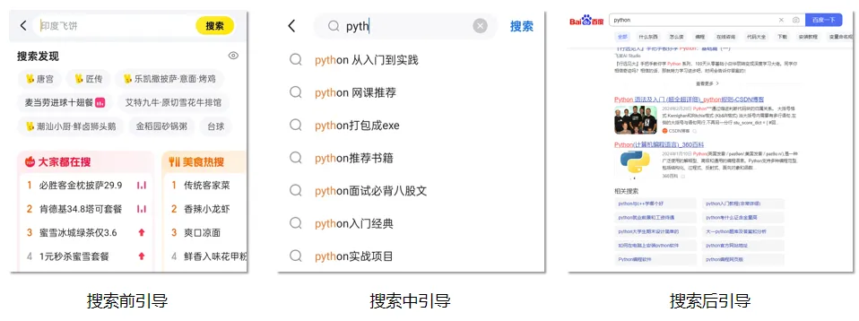
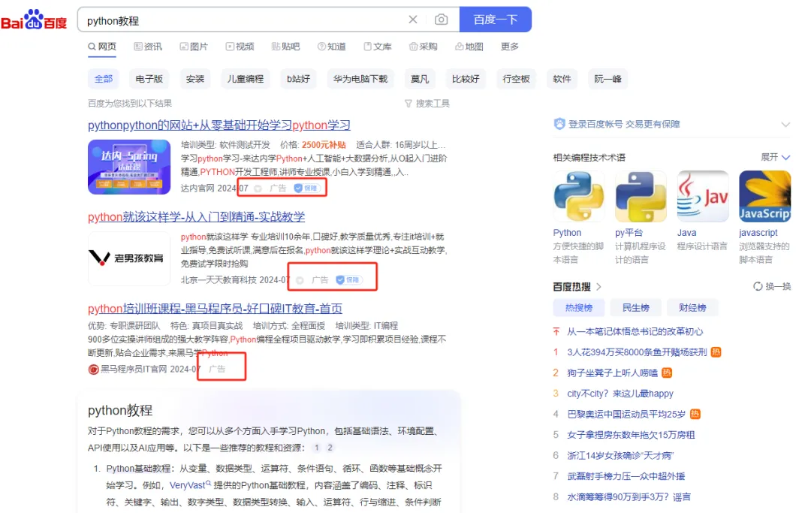

# 7.补充模块

RAG在整个大模型技术栈里的重要性毋庸置疑，而在RAG中，除了大模型之外，另一个不可或缺的部分，就是搜索系统，大模型的正确、稳定、可控生成，离不开精准可靠的搜索系统，大量的实验中都有发现，在搜索系统足够准确的前提下，大模型的犯错情况会骤然下降，因此，更全面、系统地了解搜索系统将很重要。

本期的内容是搜索的其他附加模块，重点讲几个和搜索有关的场景以及常见的解决方案。这篇文章比较轻松，都是一些概念和思路解释，只是补充说明一些可能会被忽略的内容。

## 1.搜索引导

搜索引导在很早之前我有讲过：[美团搜索引导技术启示](http://mp.weixin.qq.com/s?__biz=MzIzMzYwNzY2NQ==\&mid=2247487129\&idx=1\&sn=0c8a249b365caca3715123a7a9afc894\&chksm=e8825607dff5df1166865c3e867ef3edff6f4a338544626dbdc4b35a8a7c49b7aba1da8eb855\&scene=21#wechat_redirect "美团搜索引导技术启示")，这个内容比较完整的讲解，可以参考《美团机器学习实践》的8.3。

搜索引导是指在用户搜索过程中给用户提供引导的统称，具体可以分为3种，搜索前、搜索中、搜索后引导，3个的内部所用的技术因为信息不同所以具体的技术方案会有所不同。这个“引导”，简单的理解，就是给用户进行query推荐。

- 搜索前，往往是根据用户的画像以及目前的新热内容进行推荐，常见的在搜索框下“猜你喜欢”、或者是预填在搜索框内的内容。
- 搜索中，指搜索过程中，用户输入一半时，下方出现的推荐内容，主要是根据用户已经输入的内容进行预想。
- 搜索后，指用户点击确定后，还给他推荐的一些相关的query。

下面展开聊一聊这3个内容的具体场景细节和常见技术，只是简单聊不会展开。

### 1.1 搜索前

搜索前引导是没什么先验信息的，因此**更多是推荐性质的**，再者搜索界面往往比较空，里面会放很多东西。主要思路如下：

- 新、热信息，推荐常态了。
- 根据用户画像进行推荐，就当做推荐系统来做。
- 用户搜索历史。

### 1.2 搜索中

搜索过程中，用户已经输入了部分内容，此时的用户注意力基本聚焦在自己想输入的query上，所以这个时候没必要做太多复杂多样的工作，**给出比较贴合目前用户输入内容的提示会比较好**，主要思路如下：

- 用前缀树等方式，基于前缀召回一些高度相关、高质量、高点击的内容。
- 可以适当进行个性化。
- 但是请注意，此处的时延要求很高，必须尽快出，卡顿的时间内用户可能已经输入很多内容，尤其是pc端web段。

### 1.3 搜索后

搜索后，又回到了类似搜索前的状态，但与之不同的是此时用户已经有用户query，所以**可以结合用户query做一些额外的尝**试：

- 给出一些和用户query相似的句子，但检索出来的内容质量比较高（例如高有点率，即别的用户有点击的概率）。
- 搜了这些query的用户还搜了XX，用这个思路来找回，类似协同过滤了。

这个搜索引导的任务会挺适合做一种训练，就是根据问题思考问题特点并提出特定技术方案的训练，整个产品快速理解产品需求、用户习惯等，这些分析和探索的思维模式，非常值得吸收，大家也可以循着我的思路再过一遍。

## 2.搜索广告

广告是现在互联网非常常见的模式，搜索广告应该也不少见。

搜索广告目前需要考虑的内容：

- 搜索广告和推荐广告，跟搜索和推荐的类似，搜索广告是需要结合用户query的，给出的内容大概率要和query比较相关。这个是核心点。
- 相比搜索和推荐，广告本质是3方的权衡，用户、平台和广告方，而当考虑广告方收益后，用户的利益大概率要被一定程度牺牲。
- 广告商要求精准投放，对特定用户投放才会有效，用户视角对相关的内容反感度也不会很高，因此在匹配度和精准度上，各方的目标还是相对一致的。

因此，在权衡全局利益下，搜索广告的整体思路如下：

- **搜索广告考虑一定程度query相似度**，否则投放质量和用户体验都会下降明显，所以query理解的相关工作仍旧需要做。
- **广告物料肯定远不如用户生成或者已有文档的数量多，所以搜索广告在召回层的要求需要一定程度下降。**
- 精排和重排层，结合广告投放价值等进行综合排序。

## 3.大模型

大模型时代来临，大模型想必是大家关心的重点，所以也单独拿出来说说自己的理解。大模型能助力搜索系统进行进一步提升，同时对于新的搜索系统，也很大程度降低早期启动时间。下面分几个情况来讨论大模型在搜索中的应用情况。

- **离线文档处理**：大模型的核心优势是few-shot甚至zero-shot的高baseline能力，在文档处理内，需要对文档内进行特定的关键词、实体、摘要进行抽取，大模型是一个非常快速的方案。
- **query理解**：用大模型来做分类、实体抽取之类的任务已经是不是一个困难的事了，至少能省去很多标注的成本，或者是通过大模型来做粗标，无论如何从这个角度来讲，算是一个启动捷径。另外，大模型来做query拓展，收益也不低（[微软新文query2doc：用大模型做query检索拓展](http://mp.weixin.qq.com/s?__biz=MzIzMzYwNzY2NQ==\&mid=2247489295\&idx=1\&sn=fcb269e47dc27fcaf31201aa1c75dafb\&chksm=e8824f91dff5c687a3a95d18490c8d2ba9b18d1b7cd5bc614e01ef3d7dd6d72aa62bcc0c2b0d\&scene=21#wechat_redirect "微软新文query2doc：用大模型做query检索拓展")）。
- **召回**：召回层一般是直接做检索，在相似度上大模型的工作还需要探究，当然借助大模型做向量化的工作也不是没有，不过类似BGE-M3之类的操作，可能收益会比较高，直接用大模型的收益不如转为用大模型做拓展然后向量化。
- **精排**：大模型做精排在早期还是可以尝试的，不过到了后期，还是不如特征之类比较成熟的方式，特征的有机组合和迭代节奏上有优势，且上限也不低。大模型在多特征多信息的环境下还是有些难度，可能会吃不下或者理解不了。

总的来说，大模型在这里的应用有如下特点：

- 有比较高的baseline，在数据匮乏，无法训练自有模型的时候，可以考虑大模型启动。
- 但是到了后期，很多问题可以用小模型替代，效果和性能可能还能提升，成本下降。

这里再补充一个点，可能会有人问到RAG，这里可以看出，大模型和搜索系统是相辅相成互相帮助的关系了，大模型用在搜索系统里能对搜索系统产生正面作用，而反过来，搜索系统在RAG中能快速查出对大模型有用的信息。

## 4.小结

本文主要对系列内没提到但比较重要的部分进行补充说明，主要讲的是搜索引导、搜索广告、大模型相关部分。

